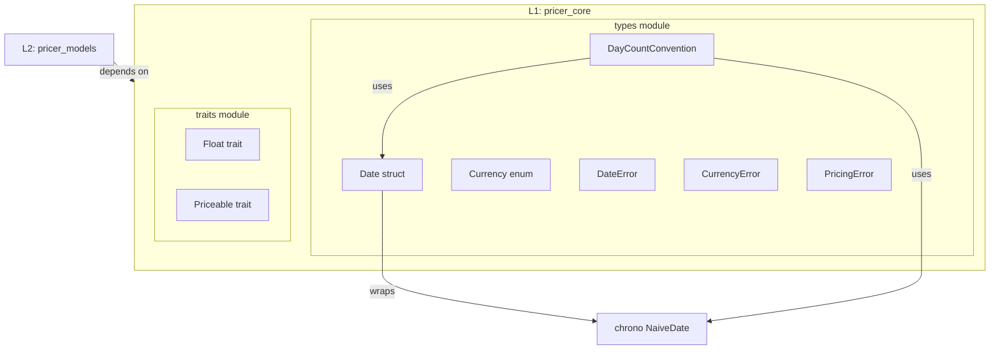
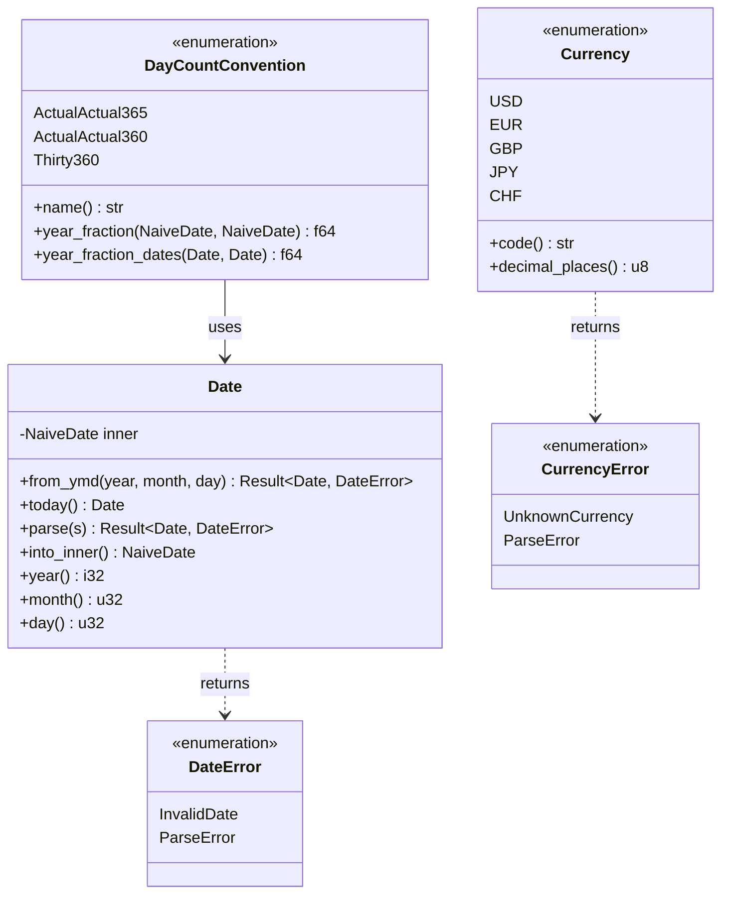

# Technical Design: Core Traits & Types Phase 2

## Overview

**Purpose**: pricer_core クレートに Date 構造体、Currency 列挙型、および serde シリアライゼーション対応を追加し、金融計算の基盤型を完成させる。

**Users**: 量的開発者が日付演算、通貨情報、日数計算規約を型安全に扱うために使用する。

**Impact**: 既存の `DayCountConvention` と `types/` モジュールを拡張し、L2 (pricer_models) 以上のレイヤーで使用される基盤型を提供する。

### Goals

- chrono をラップした型安全な `Date` 構造体を提供
- 静的ディスパッチ可能な `Currency` 列挙型を実装
- 既存 `DayCountConvention` にシリアライゼーションと `name()` メソッドを追加
- serde 依存をオプショナル feature flag で制御

### Non-Goals

- 営業日カレンダー（Business Day Convention）の実装
- 通貨換算レートや為替計算
- 複合日数計算規約（ACT/ACT ISDA など）
- Date の時刻サポート（NaiveDateTime）

## Architecture

### Existing Architecture Analysis

**Current State**:
- `DayCountConvention` は `chrono::NaiveDate` を直接使用
- `PricingError` は手動で `Display` と `Error` を実装
- `Float` トレイトは `num_traits::Float` の re-export
- serde は workspace 依存として存在するが feature 制御なし

**Integration Points**:
- `types/time.rs`: Date 型追加、DayCountConvention 拡張
- `types/mod.rs`: 新モジュール公開
- `types/error.rs`: DateError, CurrencyError 追加
- `Cargo.toml`: serde feature flag 追加

### Architecture Pattern & Boundary Map



**Architecture Integration**:
- **Selected pattern**: Newtype Pattern（Date は NaiveDate のゼロコストラッパー）
- **Domain boundaries**: types/ モジュール内に全基盤型を集約
- **Existing patterns preserved**: エラー型の手動実装パターン、enum-based 静的ディスパッチ
- **New components rationale**: Date は型安全性と API 一貫性のため、Currency は Enzyme 最適化互換性のため
- **Steering compliance**: Static dispatch via enum、4-Layer Architecture

### Technology Stack

| Layer | Choice / Version | Role in Feature | Notes |
|-------|------------------|-----------------|-------|
| Foundation | Rust stable | 全コンポーネント | L1 は stable Rust のみ |
| Date/Time | chrono ^0.4 | 内部日付表現 | workspace 依存として既存 |
| Serialisation | serde ^1.0 | JSON/YAML 対応 | feature flag で optional |

## Requirements Traceability

| Requirement | Summary | Components | Interfaces | Flows |
|-------------|---------|------------|------------|-------|
| 1.1-1.7 | Date 構造体 | Date, DateError | Date::from_ymd, Date::today, Sub trait | - |
| 2.1-2.7 | Currency 列挙型 | Currency, CurrencyError | Currency::code, Currency::decimal_places | - |
| 3.1-3.5 | DCC シリアライゼーション | DayCountConvention | Serialize, Deserialize, name() | - |
| 4.1-4.4 | Year Fraction 計算 | DayCountConvention | year_fraction_dates() | - |
| 5.1-5.4 | Float トレイト維持 | Float, Priceable | 変更なし | - |
| 6.1-6.4 | serde Feature Flag | Cargo.toml | cfg_attr | - |
| 7.1-7.5 | エラー型拡張 | DateError, CurrencyError | Display, Error | - |
| 8.1-8.4 | ドキュメント | 全コンポーネント | doc comments | - |

## Components and Interfaces

| Component | Domain/Layer | Intent | Req Coverage | Key Dependencies | Contracts |
|-----------|--------------|--------|--------------|------------------|-----------|
| Date | types | chrono ラッパー日付型 | 1.1-1.7 | chrono (P0) | Service |
| Currency | types | 通貨列挙型 | 2.1-2.7 | - | Service |
| DayCountConvention | types | 日数計算規約（拡張） | 3.1-3.5, 4.1-4.4 | Date (P0), serde (P1) | Service |
| DateError | types | 日付エラー型 | 7.1, 7.3, 7.4 | - | - |
| CurrencyError | types | 通貨エラー型 | 7.2, 7.3, 7.5 | - | - |

### types Module

#### Date

| Field | Detail |
|-------|--------|
| Intent | chrono::NaiveDate をラップした型安全な日付構造体 |
| Requirements | 1.1, 1.2, 1.3, 1.4, 1.5, 1.6, 1.7 |

**Responsibilities & Constraints**
- ISO 8601 形式での日付表現と解析
- 日付間の減算による日数計算
- NaiveDate への変換（`into_inner()`）

**Dependencies**
- External: chrono::NaiveDate — 内部日付表現 (P0)
- External: serde — シリアライゼーション (P1, optional)

**Contracts**: Service [x]

##### Service Interface

```rust
/// Type-safe date wrapper around chrono::NaiveDate.
///
/// Provides ISO 8601 serialisation and standard date arithmetic.
#[derive(Copy, Clone, Debug, PartialEq, Eq, PartialOrd, Ord, Hash)]
#[cfg_attr(feature = "serde", derive(serde::Serialize, serde::Deserialize))]
#[cfg_attr(feature = "serde", serde(transparent))]
pub struct Date(NaiveDate);

impl Date {
    /// Creates a Date from year, month, and day components.
    ///
    /// # Errors
    /// Returns `DateError::InvalidDate` if the date is invalid.
    pub fn from_ymd(year: i32, month: u32, day: u32) -> Result<Self, DateError>;

    /// Returns today's date.
    pub fn today() -> Self;

    /// Parses a date from ISO 8601 format string (YYYY-MM-DD).
    ///
    /// # Errors
    /// Returns `DateError::ParseError` if parsing fails.
    pub fn parse(s: &str) -> Result<Self, DateError>;

    /// Returns the underlying NaiveDate.
    pub fn into_inner(self) -> NaiveDate;

    /// Returns the year component.
    pub fn year(&self) -> i32;

    /// Returns the month component (1-12).
    pub fn month(&self) -> u32;

    /// Returns the day component (1-31).
    pub fn day(&self) -> u32;
}

impl Sub for Date {
    type Output = i64;

    /// Returns the number of days between two dates.
    fn sub(self, other: Self) -> i64;
}

impl FromStr for Date {
    type Err = DateError;

    fn from_str(s: &str) -> Result<Self, DateError>;
}

impl Display for Date {
    /// Formats as ISO 8601 (YYYY-MM-DD).
    fn fmt(&self, f: &mut Formatter<'_>) -> fmt::Result;
}
```

- Preconditions: year, month, day は有効な日付を構成
- Postconditions: Date は常に有効な日付を保持
- Invariants: 内部 NaiveDate は常に valid

**Implementation Notes**
- Integration: `#[serde(transparent)]` で NaiveDate のシリアライゼーションに委譲
- Validation: chrono の `from_ymd_opt` を使用し、None の場合 `DateError::InvalidDate` を返す
- Risks: `today()` はシステム時刻に依存（テスト時は注意）

---

#### Currency

| Field | Detail |
|-------|--------|
| Intent | ISO 4217 準拠の通貨列挙型 |
| Requirements | 2.1, 2.2, 2.3, 2.4, 2.5, 2.6, 2.7 |

**Responsibilities & Constraints**
- 主要通貨（USD, EUR, GBP, JPY, CHF）の表現
- ISO 4217 コードでのシリアライゼーション
- 通貨ごとの小数点以下桁数の提供

**Dependencies**
- External: serde — シリアライゼーション (P1, optional)

**Contracts**: Service [x]

##### Service Interface

```rust
/// ISO 4217 currency codes with decimal precision metadata.
///
/// Designed for static dispatch (enum-based) for Enzyme AD compatibility.
#[non_exhaustive]
#[derive(Copy, Clone, Debug, PartialEq, Eq, Hash)]
#[cfg_attr(feature = "serde", derive(serde::Serialize, serde::Deserialize))]
pub enum Currency {
    /// United States Dollar
    USD,
    /// Euro
    EUR,
    /// British Pound Sterling
    GBP,
    /// Japanese Yen
    JPY,
    /// Swiss Franc
    CHF,
}

impl Currency {
    /// Returns the ISO 4217 three-letter currency code.
    ///
    /// # Examples
    /// ```
    /// use pricer_core::types::Currency;
    /// assert_eq!(Currency::USD.code(), "USD");
    /// ```
    pub fn code(&self) -> &'static str;

    /// Returns the standard number of decimal places for this currency.
    ///
    /// # Examples
    /// ```
    /// use pricer_core::types::Currency;
    /// assert_eq!(Currency::USD.decimal_places(), 2);
    /// assert_eq!(Currency::JPY.decimal_places(), 0);
    /// ```
    pub fn decimal_places(&self) -> u8;
}

impl FromStr for Currency {
    type Err = CurrencyError;

    /// Parses ISO 4217 currency code (case-insensitive).
    fn from_str(s: &str) -> Result<Self, CurrencyError>;
}

impl Display for Currency {
    /// Formats as ISO 4217 code.
    fn fmt(&self, f: &mut Formatter<'_>) -> fmt::Result;
}
```

- Preconditions: N/A（enum は常に valid）
- Postconditions: code() は 3 文字、decimal_places() は 0-4
- Invariants: `#[non_exhaustive]` により将来の variant 追加が可能

**Implementation Notes**
- Integration: serde は derive マクロで ISO 4217 コードをそのまま使用
- Validation: `FromStr` で大文字小文字を無視してパース
- Risks: 新しい通貨追加時は `#[non_exhaustive]` により破壊的変更なし

---

#### DayCountConvention (拡張)

| Field | Detail |
|-------|--------|
| Intent | 既存の日数計算規約にシリアライゼーションと Date 統合を追加 |
| Requirements | 3.1, 3.2, 3.3, 3.4, 3.5, 4.1, 4.2, 4.3, 4.4 |

**Responsibilities & Constraints**
- 業界標準名称でのシリアライゼーション
- Date 型を使用した year fraction 計算
- 既存 `year_fraction(NaiveDate)` API の後方互換性維持

**Dependencies**
- Inbound: Date — 新 API での日付入力 (P0)
- External: serde — シリアライゼーション (P1, optional)

**Contracts**: Service [x]

##### Service Interface

```rust
// 既存の enum 定義に追加
impl DayCountConvention {
    /// Returns the standard convention name.
    ///
    /// # Examples
    /// ```
    /// use pricer_core::types::DayCountConvention;
    /// assert_eq!(DayCountConvention::ActualActual365.name(), "ACT/365");
    /// ```
    pub fn name(&self) -> &'static str;

    /// Calculates year fraction using Date type.
    ///
    /// Unlike `year_fraction`, this method returns negative values
    /// when start > end instead of panicking.
    ///
    /// # Examples
    /// ```
    /// use pricer_core::types::{Date, DayCountConvention};
    ///
    /// let start = Date::from_ymd(2024, 1, 1).unwrap();
    /// let end = Date::from_ymd(2024, 7, 1).unwrap();
    /// let yf = DayCountConvention::ActualActual365.year_fraction_dates(start, end);
    /// ```
    pub fn year_fraction_dates(&self, start: Date, end: Date) -> f64;
}

// Custom serde implementation for industry-standard names
#[cfg(feature = "serde")]
impl Serialize for DayCountConvention {
    fn serialize<S: Serializer>(&self, serializer: S) -> Result<S::Ok, S::Error>;
}

#[cfg(feature = "serde")]
impl<'de> Deserialize<'de> for DayCountConvention {
    fn deserialize<D: Deserializer<'de>>(deserializer: D) -> Result<Self, D::Error>;
}

/// Convenience function using Date type.
pub fn time_to_maturity_dates(start: Date, end: Date) -> f64;
```

- Preconditions: N/A
- Postconditions: `year_fraction_dates` は start > end でも負の値を返す
- Invariants: 結果は既存 `year_fraction(NaiveDate)` と同等

**Implementation Notes**
- Integration: カスタム serde で "ACT/365", "ACT/360", "30/360" 形式を使用
- Validation: デシリアライゼーションは case-insensitive、エイリアス（"Actual/365"）もサポート
- Risks: 既存 API (`year_fraction`) は panic するが、新 API は負の値を返す（動作の違いをドキュメント化）

---

#### DateError

| Field | Detail |
|-------|--------|
| Intent | 日付関連エラーの構造化表現 |
| Requirements | 7.1, 7.3, 7.4 |

**Contracts**: Service [x]

##### Service Interface

```rust
/// Date-related errors.
#[derive(Debug, Clone, PartialEq, Eq)]
pub enum DateError {
    /// Invalid date components (e.g., February 30th).
    InvalidDate {
        year: i32,
        month: u32,
        day: u32,
    },
    /// Failed to parse date string.
    ParseError(String),
}

impl Display for DateError { ... }
impl Error for DateError { }
```

---

#### CurrencyError

| Field | Detail |
|-------|--------|
| Intent | 通貨関連エラーの構造化表現 |
| Requirements | 7.2, 7.3, 7.5 |

**Contracts**: Service [x]

##### Service Interface

```rust
/// Currency-related errors.
#[derive(Debug, Clone, PartialEq, Eq)]
pub enum CurrencyError {
    /// Unknown currency code.
    UnknownCurrency(String),
    /// Failed to parse currency string.
    ParseError(String),
}

impl Display for CurrencyError { ... }
impl Error for CurrencyError { }
```

## Data Models

### Domain Model



### Data Contracts & Integration

**Serialisation Formats**:

| Type | Format | Example |
|------|--------|---------|
| Date | ISO 8601 | `"2024-01-15"` |
| Currency | ISO 4217 | `"USD"`, `"JPY"` |
| DayCountConvention | Industry name | `"ACT/365"`, `"30/360"` |

**DayCountConvention Aliases** (deserialisation only):
- `"ACT/365"`, `"Actual/365"`, `"Act365"` → `ActualActual365`
- `"ACT/360"`, `"Actual/360"`, `"Act360"` → `ActualActual360`
- `"30/360"`, `"Thirty360"`, `"30360"` → `Thirty360`

## Error Handling

### Error Strategy

**Pattern**: 既存 `PricingError` に倣い、enum-based エラーを手動実装

### Error Categories and Responses

| Error Type | Cause | Response |
|------------|-------|----------|
| `DateError::InvalidDate` | 無効な日付コンポーネント | エラーメッセージに year/month/day を含める |
| `DateError::ParseError` | 文字列パース失敗 | 入力文字列をエラーメッセージに含める |
| `CurrencyError::UnknownCurrency` | 未知の通貨コード | 入力コードをエラーメッセージに含める |
| `CurrencyError::ParseError` | 文字列パース失敗 | 入力文字列をエラーメッセージに含める |

## Testing Strategy

### Unit Tests

- `Date::from_ymd` 正常系・異常系（2月29日閏年、2月30日）
- `Date` 減算で日数が正しく計算される
- `Currency::code()` と `decimal_places()` の正確性
- `DayCountConvention::name()` の正確性
- `DayCountConvention::year_fraction_dates` と `year_fraction` の結果一致

### Integration Tests

- Date/DayCountConvention 統合: `year_fraction_dates` が `year_fraction` と同じ結果
- serde 往復: Date, Currency, DayCountConvention のシリアライズ→デシリアライズ
- エラー型の Display フォーマット検証

### Property-Based Tests

- `Date::from_ymd` で作成した日付は常に valid
- 任意の Date ペアで `year_fraction_dates` は有限値
- Currency パース往復: `Currency::from_str(c.code()) == Ok(c)`
- DayCountConvention パース往復: `DayCountConvention::from_str(c.name()) == Ok(c)`

### Feature Flag Tests

- `--no-default-features` でコンパイル成功（serde なし）
- `--features serde` で serde derive が有効
