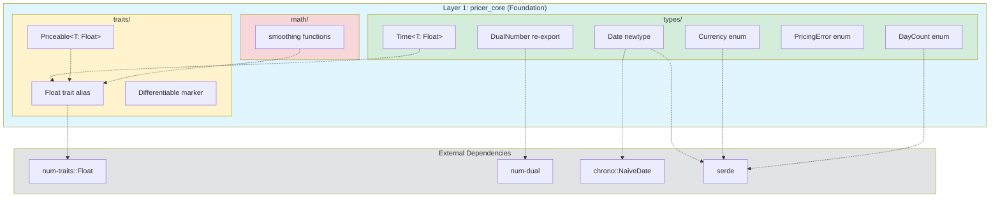

# 技術設計書

## 概要

本機能は、Layer 1 (pricer_core) の基盤となる型システムとトレイト定義を提供し、XVA価格計算ライブラリ全体の数学的基礎を確立する。ジェネリックな浮動小数点型抽象化、enum dispatchによる静的ディスパッチ、chrono基盤の日付型、標準的なシリアライゼーション対応により、価格計算可能な金融商品のための包括的なインターフェースを実現する。

**目的**: Layer 1の型安全性とEnzyme LLVM最適化互換性を確保し、f64（本番環境）とdual number（AD検証モード）の両方をサポートする汎用的な価格計算基盤を提供する。

**ユーザー**: クオンツ開発者、AD開発者、固定利付債券開発者、マルチ通貨価格計算開発者がこの基盤層を利用して、Layer 2以降の金融商品モデル、Enzyme ADエンジン、XVAポートフォリオ分析を構築する。

**影響**: 既存のpricer_core/src/の一部実装（types/time.rs、traits/priceable.rs）を拡張し、新たなDate、Currency、DayCount、Time、PricingError型とFloat、Differentiableトレイトを追加する。既存のDayCountConvention実装を業界標準に準拠した命名規則に更新する。

### ゴール

- ジェネリックFloat抽象化によるf64とdual numberの統一インターフェース
- Enum dispatchによる静的ディスパッチでEnzyme LLVM最適化を最大化
- chrono基盤のDate型でISO 8601標準シリアライゼーション
- 業界標準Day Count Convention (ACT/365, ACT/360, 30/360, ACT/ACT ISDA)
- 型安全なTime<T: Float>ラッパーで満期計算のセマンティクス保証
- 構造化されたPricingErrorで網羅的エラーハンドリング
- British Englishドキュメントコメントとproperty-basedテスト

### 非ゴール

- Layer 2の金融商品実装（VanillaOption、BarrierOptionなど）は対象外
- Enzyme ADエンジン統合（Layer 3）は本フェーズの範囲外
- ポートフォリオレベルXVA計算（Layer 4）は将来フェーズ
- カスタム通貨ペアや動的Day Count追加機能は初期バージョン外
- リアルタイム市場データ統合は本基盤層の責務外

## アーキテクチャ

> 詳細な調査ノートは`research.md`に記載。本設計書は自己完結型でレビュー可能。

### 既存アーキテクチャ分析

**現在の構造**:
- `crates/pricer_core/src/lib.rs`: Layer 1エントリポイント
- `crates/pricer_core/src/math/`: 平滑化関数（smooth_max、smooth_indicatorなど）
- `crates/pricer_core/src/types/`: dual.rs (num-dual統合)、time.rs (DayCountConvention)
- `crates/pricer_core/src/traits/`: priceable.rs (Priceable trait stub)

**既存パターン制約**:
- Zero Dependency Principle: 他のpricer_*クレートへの依存禁止
- Stable Rust Toolchain: nightly不要（EnzymeはLayer 3に隔離）
- Feature Flags: `num-dual-mode` (デフォルト) vs `enzyme-mode`
- 静的ディスパッチ優先: `enum` > `Box<dyn Trait>`

**統合ポイント維持**:
- 既存のDayCountConventionをリネーム・拡張（後方互換性なし、初期開発段階）
- num-dual統合は継続（types/dual.rs）
- math/smoothingモジュールは変更不要
- traits/モジュールにFloat、Differentiableを追加

**技術的負債対応**:
- DayCountConvention命名を業界標準に修正（ActualActual365 → Act365Fixed）
- year_fractionメソッドをジェネリック化（f64 → T: Float）
- Priceableトレイトの完全定義（現在はstub）

### アーキテクチャパターンと境界マップ

**アーキテクチャ統合**:
- **選択パターン**: Newtype Pattern + Enum Dispatch
- **理由**: 型安全性（Date、Time）とパフォーマンス（Currency、DayCount）の両立
- **ドメイン境界**:
  - `types/`: 具体型の定義（Date、Currency、DayCount、Time、PricingError）
  - `traits/`: 抽象化インターフェース（Float、Priceable、Differentiable）
  - `math/`: 既存の平滑化関数（本フェーズで変更なし）
- **既存パターン保持**:
  - Zero Dependency Principle (Layer 1は他pricer_*への依存なし)
  - Static Dispatch (enumでEnzyme最適化維持)
  - Feature Flag Isolation (num-dual-mode vs enzyme-mode)
- **新コンポーネント理由**:
  - Date: chrono依存のカプセル化、ドメイン特化メソッド
  - Currency/DayCount: enum dispatchでEnzyme互換性
  - Time<T>: 型安全な時間値（価格などと混同防止）
  - PricingError: 構造化エラーで網羅的ハンドリング
- **Steering準拠**: `structure.md` Layer 1原則（依存ゼロ、純粋基盤）、`tech.md` 型安全性とstatic dispatch



### テクノロジースタック

| Layer | Choice / Version | Role in Feature | Notes |
|-------|------------------|-----------------|-------|
| Language | Rust Edition 2021 (stable) | 型安全な基盤実装 | nightly不要、Layer 3のみnightly |
| Numeric Traits | num-traits 0.2.x | ジェネリックFloat抽象化 | 事実上の標準、f64/DualNumber互換 |
| Dual Numbers | num-dual 0.7.x | num-dual-mode検証用AD | 既存統合継続 |
| Date/Time | chrono 0.4.x | 日付演算とISO 8601 | serde feature有効化 |
| Serialization | serde 1.0.x, serde_derive | JSON/TOML設定対応 | デフォルトfeature |
| Testing | proptest 1.x, approx 0.5.x | property-basedとISDA検証 | 数学的不変条件テスト |
| Error Handling | thiserror 2.x (optional) | エラー型のDisplay自動導出 | 将来的な追加検討 |

> **Rationale要約**: num-traitsはRust数値エコシステムの標準、chronoはISO 8601デフォルト対応、serdeは汎用シリアライゼーション。詳細なベンチマークとAPI調査は`research.md`参照。

## Requirements Traceability

| Requirement | Summary | Components | Interfaces | Flows |
|-------------|---------|------------|------------|-------|
| 1.1, 1.2, 1.3, 1.4 | ジェネリックFloat抽象化 | Float trait alias | traits::Float | - |
| 2.1, 2.2, 2.3, 2.4, 2.5 | Priceableトレイト | Priceable<T: Float> | traits::Priceable::price | - |
| 3.1, 3.2, 3.3, 3.4 | Differentiableマーカー | Differentiable trait | traits::Differentiable | - |
| 4.1, 4.2, 4.3, 4.4, 4.5, 4.6 | Date型 | Date newtype | types::Date, From/Into, Serialize | Date construction & serialization |
| 5.1, 5.2, 5.3, 5.4, 5.5 | Currency enum | Currency enum | types::Currency, Serialize | - |
| 6.1, 6.2, 6.3, 6.4, 6.5 | DayCount enum | DayCount enum | types::DayCount::year_fraction | Year fraction calculation |
| 7.1, 7.2, 7.3, 7.4, 7.5 | Time<T>型 | Time<T: Float> | types::Time, Add/Sub/Mul/Div | Time arithmetic |
| 8.1, 8.2, 8.3, 8.4 | PricingErrorエラー型 | PricingError enum | types::PricingError, Error/Display | Error propagation |
| 9.1, 9.2, 9.3, 9.4, 9.5 | モジュール構造 | types/, traits/, prelude | lib.rs re-exports | - |
| 10.1, 10.2, 10.3, 10.4, 10.5 | テストとドキュメント | Unit tests, proptest | - | Test execution |
| 11.1, 11.2, 11.3, 11.4, 11.5 | Serdeシリアライゼーション | Date/Currency/DayCount | Serialize/Deserialize | JSON round-trip |
| 12.1, 12.2, 12.3, 12.4, 12.5 | Enzyme互換性 | Enum dispatch (Currency, DayCount) | - | Static dispatch flow |

## Components and Interfaces

### Summary Table

| Component | Domain/Layer | Intent | Req Coverage | Key Dependencies (P0/P1) | Contracts |
|-----------|--------------|--------|--------------|--------------------------|-----------|
| Float trait | traits/ | ジェネリック浮動小数点抽象化 | 1.1-1.4 | num-traits::Float (P0) | [X] Service |
| Priceable<T> | traits/ | 価格計算可能インターフェース | 2.1-2.5 | Float (P0), PricingError (P1) | [X] Service |
| Differentiable | traits/ | 微分可能マーカー | 3.1-3.4 | - | [ ] |
| Date | types/ | 日付型（chrono wrapper） | 4.1-4.6 | chrono::NaiveDate (P0), serde (P0) | [X] Service [ ] API [ ] State |
| Currency | types/ | 通貨enum | 5.1-5.5 | serde (P0) | [ ] |
| DayCount | types/ | Day Count Convention enum | 6.1-6.5 | Date (P0), Float (P0) | [X] Service |
| Time<T> | types/ | 型安全時間ラッパー | 7.1-7.5 | Float (P0), Date (P1), DayCount (P1) | [X] Service |
| PricingError | types/ | 構造化エラー型 | 8.1-8.4 | std::error::Error (P0) | [ ] |
| prelude module | lib.rs | 便利なre-export | 9.5 | All public types (P0) | [ ] |

### Layer 1: Foundation Types and Traits

#### Float Trait

| Field | Detail |
|-------|--------|
| Intent | num-traits::Floatのre-exportによるジェネリック浮動小数点抽象化 |
| Requirements | 1.1, 1.2, 1.3, 1.4 |

**責務と制約**:
- num-traits::Floatトレイトの型エイリアスまたはsupertrait boundとしてre-export
- f64、f32、num-dual::DualNumberなどの実装型をサポート
- 不変条件: Copy, Clone, Debug, PartialOrdを含むsupertrait

**依存関係**:
- Inbound: Priceable, Time, DayCount — ジェネリック型パラメータとして使用 (P0)
- Outbound: num-traits::Float — supertrait bound (P0)
- External: num-traits 0.2.x — Rustエコシステム標準 (P0)

**Contracts**: [X] Service

##### Service Interface

```rust
// Re-export as type alias or supertrait bound
pub use num_traits::Float;

// または supertrait bound pattern:
pub trait Float: num_traits::Float + Copy + Clone + Debug + PartialOrd {}
impl<T: num_traits::Float + Copy + Clone + Debug + PartialOrd> Float for T {}
```

- **Preconditions**: 実装型はnum_traits::Floatを満たす
- **Postconditions**: ジェネリック数値計算でf64とDualNumberが透過的に使用可能
- **Invariants**: Copy + Clone + Debug + PartialOrd保証

**Implementation Notes**:
- **Integration**: num-traitsクレートからの単純なre-export、カスタム実装不要
- **Validation**: f64とnum-dual::DualNumberでコンパイルテスト
- **Risks**: num-traits API変更リスク（緩和策: 0.2.x固定、リリースノート監視）

---

#### Priceable<T: Float> Trait

| Field | Detail |
|-------|--------|
| Intent | 価格計算可能な金融商品のための統一インターフェース |
| Requirements | 2.1, 2.2, 2.3, 2.4, 2.5 |

**責務と制約**:
- ジェネリックpriceメソッドでT: Floatを返却
- 市場データとモデルパラメータを入力として受容
- エラー処理はResult<T, PricingError>
- トレイトオブジェクト安全性（将来のBox<dyn Priceable>対応）

**依存関係**:
- Inbound: Layer 2金融商品（VanillaOption, BarrierOption） — impl Priceable (P0)
- Outbound: Float trait — ジェネリック型パラメータ (P0)
- Outbound: PricingError — エラー型 (P1)

**Contracts**: [X] Service

##### Service Interface

```rust
/// Trait for financial instruments that can be priced.
///
/// # Type Parameters
/// - `T`: Generic floating-point type (f64 or DualNumber)
///
/// # Examples
/// ```
/// use pricer_core::traits::{Priceable, Float};
/// use pricer_core::types::PricingError;
///
/// struct SimpleInstrument;
///
/// impl<T: Float> Priceable<T> for SimpleInstrument {
///     fn price(&self, spot: T, rate: T) -> Result<T, PricingError> {
///         Ok(spot * rate.exp())
///     }
/// }
/// ```
pub trait Priceable<T: Float> {
    /// Calculate the fair value of the instrument.
    ///
    /// # Arguments
    /// - Market data (spot, rates, volatility, etc.)
    /// - Model parameters (smooth_epsilon, etc.)
    ///
    /// # Returns
    /// `Result<T, PricingError>` containing the price or an error.
    ///
    /// # Errors
    /// - `PricingError::InvalidInput`: Invalid market data or parameters
    /// - `PricingError::NumericalInstability`: Computation failed to converge
    /// - `PricingError::ModelFailure`: Model assumptions violated
    fn price(&self, /* market data params */) -> Result<T, PricingError>;
}
```

- **Preconditions**: 市場データとパラメータの妥当性（Layer 2で検証）
- **Postconditions**: 有効な価格値またはエラー
- **Invariants**: ジェネリック型TはFloat traitを満たす

**Implementation Notes**:
- **Integration**: Layer 2金融商品がこのトレイトを実装
- **Validation**: f64とDualNumberで価格計算が型安全に動作
- **Risks**: Layer 2統合時のAPI設計調整が必要

---

#### Differentiable Trait

| Field | Detail |
|-------|--------|
| Intent | 滑らかで微分可能な計算を保証するマーカートレイト |
| Requirements | 3.1, 3.2, 3.3, 3.4 |

**責務と制約**:
- マーカートレイト（メソッドなし）
- 実装型はFloat値に対するif分岐禁止（滑らか近似使用）
- smoothing_epsilonパラメータで近似精度設定

**依存関係**:
- Inbound: Layer 2金融商品 — impl Differentiable (P1)
- Outbound: Float trait — 文書化制約 (P0)

**Contracts**: [ ] (Marker trait, no methods)

##### Service Interface

```rust
/// Marker trait for types that guarantee smooth, differentiable computations.
///
/// # Requirements
/// - All operations on `Float` values must use smooth approximations
/// - No conditional branches (`if`) on Float values
/// - Use `smooth_max`, `smooth_indicator` from `pricer_core::math::smoothing`
///
/// # Smoothing Epsilon
/// Types implementing this trait should provide a `smoothing_epsilon` parameter
/// for configurable approximation precision (typically 1e-6 to 1e-8).
pub trait Differentiable {}
```

- **Preconditions**: 実装型の全操作が滑らか関数使用
- **Postconditions**: EnzymeおよびNum-dual ADバックエンドで微分可能
- **Invariants**: Float値に対する不連続関数禁止

**Implementation Notes**:
- **Integration**: Layer 2でDifferentiable実装時にsmoothing関数使用を強制
- **Validation**: ドキュメントレビューと手動コード検査
- **Risks**: コンパイル時強制不可（文書化制約）

---

### Layer 1: Core Types

#### Date

| Field | Detail |
|-------|--------|
| Intent | chrono::NaiveDateのnewtype wrapper、ISO 8601シリアライゼーション |
| Requirements | 4.1, 4.2, 4.3, 4.4, 4.5, 4.6 |

**責務と制約**:
- chrono::NaiveDateをカプセル化
- ISO 8601 (YYYY-MM-DD) シリアライゼーション
- Day count計算メソッド（year_fraction）
- 不変条件: Copy, Clone, Debug, PartialOrd, Ord, PartialEq, Eq

**依存関係**:
- Inbound: DayCount — year_fraction計算の入力 (P0)
- Inbound: Time<T> — 構築メソッド (P1)
- Outbound: chrono::NaiveDate — 内部表現 (P0)
- External: chrono 0.4.x (serde feature) — 日付演算とシリアライゼーション (P0)

**Contracts**: [X] Service

##### Service Interface

```rust
use chrono::NaiveDate;
use serde::{Deserialize, Serialize};

/// Date type for financial calculations.
///
/// Wraps `chrono::NaiveDate` with domain-specific methods and ISO 8601 serialisation.
///
/// # Serialisation Format
/// ISO 8601: `"YYYY-MM-DD"` (e.g., `"2025-12-29"`)
///
/// # Examples
/// ```
/// use pricer_core::types::Date;
/// use chrono::NaiveDate;
///
/// let date = Date::from(NaiveDate::from_ymd_opt(2025, 12, 29).unwrap());
/// let json = serde_json::to_string(&date).unwrap();
/// assert_eq!(json, r#""2025-12-29""#);
/// ```
#[derive(Debug, Clone, Copy, PartialEq, Eq, PartialOrd, Ord, Hash, Serialize, Deserialize)]
#[serde(transparent)]
pub struct Date(NaiveDate);

impl Date {
    /// Create a Date from year, month, day.
    pub fn from_ymd(year: i32, month: u32, day: u32) -> Option<Self> {
        NaiveDate::from_ymd_opt(year, month, day).map(Date)
    }
    
    /// Get the underlying `NaiveDate`.
    pub fn inner(&self) -> NaiveDate {
        self.0
    }
}

impl From<NaiveDate> for Date {
    fn from(date: NaiveDate) -> Self {
        Date(date)
    }
}

impl From<Date> for NaiveDate {
    fn from(date: Date) -> Self {
        date.0
    }
}
```

- **Preconditions**: 有効なyear/month/day値
- **Postconditions**: ISO 8601形式でシリアライズ可能なDate
- **Invariants**: 内部NaiveDateは常に有効

**Implementation Notes**:
- **Integration**: chrono serde featureで自動ISO 8601シリアライゼーション
- **Validation**: ラウンドトリップシリアライゼーションテスト（JSON/TOML）
- **Risks**: chrono API変更（緩和策: 0.4.x固定、安定版）

---

#### Currency

| Field | Detail |
|-------|--------|
| Intent | 通貨をenum dispatchで表現、静的ディスパッチ |
| Requirements | 5.1, 5.2, 5.3, 5.4, 5.5 |

**責務と制約**:
- 主要通貨のenum variant (USD, EUR, GBP, JPY, CHF, AUD, CAD)
- 文字列表現でシリアライゼーション（例: "USD"）
- 不変条件: Copy, Clone, Debug, PartialEq, Eq, Hash

**依存関係**:
- Inbound: Layer 2マルチ通貨商品 — 通貨識別 (P0)
- External: serde 1.0.x — シリアライゼーション (P0)

**Contracts**: [ ] (Pure enum, no methods beyond trait impls)

##### Type Definition

```rust
use serde::{Deserialize, Serialize};

/// Currency enumeration for static dispatch.
///
/// Optimised for Enzyme LLVM by avoiding `Box<dyn>` dynamic dispatch.
///
/// # Serialisation Format
/// String representation (e.g., `"USD"`, `"EUR"`).
///
/// # Examples
/// ```
/// use pricer_core::types::Currency;
///
/// let usd = Currency::USD;
/// let json = serde_json::to_string(&usd).unwrap();
/// assert_eq!(json, r#""USD""#);
/// ```
#[derive(Debug, Clone, Copy, PartialEq, Eq, Hash, Serialize, Deserialize)]
#[non_exhaustive]
pub enum Currency {
    /// United States Dollar
    USD,
    /// Euro
    EUR,
    /// British Pound Sterling
    GBP,
    /// Japanese Yen
    JPY,
    /// Swiss Franc
    CHF,
    /// Australian Dollar
    AUD,
    /// Canadian Dollar
    CAD,
}
```

- **Preconditions**: 列挙された通貨のみ
- **Postconditions**: 文字列形式でシリアライズ可能
- **Invariants**: #[non_exhaustive]で将来拡張可能

**Implementation Notes**:
- **Integration**: Layer 2で通貨ペア識別に使用
- **Validation**: 各variantのシリアライゼーションラウンドトリップテスト
- **Risks**: 新通貨追加時のAPI拡張（#[non_exhaustive]で対応）

---

#### DayCount

| Field | Detail |
|-------|--------|
| Intent | Day Count Convention enum、業界標準準拠 |
| Requirements | 6.1, 6.2, 6.3, 6.4, 6.5 |

**責務と制約**:
- 業界標準conventions: Act365Fixed, Act360, Thirty360, ActActISDA
- ジェネリックyear_fraction<T: Float>メソッド
- 不変条件: Copy, Clone, Debug, PartialEq, Eq

**依存関係**:
- Inbound: Time<T> — コンストラクタで使用 (P1)
- Outbound: Date — year_fraction入力 (P0)
- Outbound: Float trait — 戻り値の型 (P0)

**Contracts**: [X] Service

##### Service Interface

```rust
use crate::types::Date;
use crate::traits::Float;

/// Day count convention for year fraction calculations.
///
/// # Variants
/// - `Act365Fixed`: Actual/365 Fixed (derivatives, UK gilts)
/// - `Act360`: Actual/360 (money markets, USD LIBOR)
/// - `Thirty360`: 30/360 US Bond Basis (corporate bonds)
/// - `ActActISDA`: Actual/Actual ISDA (swaps, fixed income)
///
/// # Examples
/// ```
/// use pricer_core::types::{Date, DayCount};
/// use chrono::NaiveDate;
///
/// let start = Date::from(NaiveDate::from_ymd_opt(2024, 1, 1).unwrap());
/// let end = Date::from(NaiveDate::from_ymd_opt(2024, 7, 1).unwrap());
///
/// let yf: f64 = DayCount::Act365Fixed.year_fraction(start, end);
/// // 182 days / 365.0 ≈ 0.4986
/// ```
#[derive(Debug, Clone, Copy, PartialEq, Eq, Serialize, Deserialize)]
#[non_exhaustive]
pub enum DayCount {
    /// Actual/365 Fixed: actual_days / 365.0
    Act365Fixed,
    
    /// Actual/360: actual_days / 360.0
    Act360,
    
    /// 30/360 US Bond Basis
    Thirty360,
    
    /// Actual/Actual ISDA
    ActActISDA,
}

impl DayCount {
    /// Calculate year fraction between two dates.
    ///
    /// # Arguments
    /// - `start`: Start date
    /// - `end`: End date (must be >= start)
    ///
    /// # Returns
    /// Year fraction as generic `T: Float`
    ///
    /// # Panics
    /// Panics if `start > end`.
    pub fn year_fraction<T: Float>(&self, start: Date, end: Date) -> T {
        // Implementation delegates to match on self
    }
}
```

- **Preconditions**: start <= end（panic if violated）
- **Postconditions**: 業界標準に準拠した年分数
- **Invariants**: 決定論的計算、ISDA/ICMA標準準拠

**Implementation Notes**:
- **Integration**: 既存types/time.rsのDayCountConventionをリネーム・拡張
- **Validation**: ISDA参照値テスト、property-basedテスト（単調性、加法性）
- **Risks**: ActActISDA実装複雑性（緩和策: QuantLib C++参照実装）

---

#### Time<T: Float>

| Field | Detail |
|-------|--------|
| Intent | 型安全な時間値ラッパー、算術演算対応 |
| Requirements | 7.1, 7.2, 7.3, 7.4, 7.5 |

**責務と制約**:
- ジェネリックT: Float値をラップ
- 非負値制約（コンストラクタで検証）
- 算術演算: Add, Sub, Mul, Div
- 不変条件: Copy, Clone, Debug, PartialOrd

**依存関係**:
- Inbound: Layer 2金融商品 — 満期計算 (P0)
- Outbound: Float trait — 内部表現 (P0)
- Outbound: Date, DayCount — From<(Date, Date, DayCount)> (P1)

**Contracts**: [X] Service

##### Service Interface

```rust
use crate::traits::Float;
use crate::types::{Date, DayCount};
use std::ops::{Add, Sub, Mul, Div};

/// Type-safe wrapper for time values (in years).
///
/// # Type Parameters
/// - `T`: Generic floating-point type (f64 or DualNumber)
///
/// # Invariants
/// - Value represents years (non-negative)
///
/// # Examples
/// ```
/// use pricer_core::types::Time;
///
/// let t1 = Time::new(1.0); // 1 year
/// let t2 = Time::new(0.5); // 6 months
/// let sum = t1 + t2;       // 1.5 years
/// ```
#[derive(Debug, Clone, Copy, PartialEq, PartialOrd)]
pub struct Time<T: Float>(T);

impl<T: Float> Time<T> {
    /// Create a new Time value.
    ///
    /// # Panics
    /// Panics if value is negative.
    pub fn new(value: T) -> Self {
        assert!(value >= T::zero(), "Time value must be non-negative");
        Time(value)
    }
    
    /// Get the inner value in years.
    pub fn as_years(&self) -> T {
        self.0
    }
}

impl<T: Float> From<(Date, Date, DayCount)> for Time<T> {
    /// Create Time from date pair using day count convention.
    fn from((start, end, dcc): (Date, Date, DayCount)) -> Self {
        Time(dcc.year_fraction(start, end))
    }
}

// Arithmetic trait implementations (Add, Sub, Mul, Div)
impl<T: Float> Add for Time<T> { /* ... */ }
impl<T: Float> Sub for Time<T> { /* ... */ }
impl<T: Float> Mul<T> for Time<T> { /* ... */ }
impl<T: Float> Div<T> for Time<T> { /* ... */ }
```

- **Preconditions**: 非負値（コンストラクタで検証）
- **Postconditions**: 型安全な時間演算
- **Invariants**: 内部値は常に非負

**Implementation Notes**:
- **Integration**: Layer 2で満期計算に使用
- **Validation**: 算術演算のproperty-basedテスト（交換律、結合律）
- **Risks**: オーバーフロー（文書化、検証はLayer 2責務）

---

#### PricingError

| Field | Detail |
|-------|--------|
| Intent | 価格計算エラーの構造化型 |
| Requirements | 8.1, 8.2, 8.3, 8.4 |

**責務と制約**:
- エラーカテゴリ: InvalidInput, NumericalInstability, ModelFailure, UnsupportedInstrument
- 文脈情報付きエラーメッセージ
- 不変条件: std::error::Error, Debug, Display実装

**依存関係**:
- Inbound: Priceable trait — Result<T, PricingError> (P0)
- Outbound: std::error::Error — 標準エラートレイト (P0)

**Contracts**: [ ] (Error type, no service methods)

##### Type Definition

```rust
use std::fmt;

/// Categorised pricing errors.
///
/// # Variants
/// - `InvalidInput`: Invalid market data or parameters
/// - `NumericalInstability`: Computation failed to converge
/// - `ModelFailure`: Model assumptions violated
/// - `UnsupportedInstrument`: Instrument type not supported by model
///
/// # Examples
/// ```
/// use pricer_core::types::PricingError;
///
/// let err = PricingError::InvalidInput("Negative spot price".to_string());
/// println!("{}", err);
/// ```
#[derive(Debug, Clone, PartialEq, Eq)]
pub enum PricingError {
    /// Invalid input data or parameters
    InvalidInput(String),
    
    /// Numerical instability during computation
    NumericalInstability(String),
    
    /// Model failed to produce valid result
    ModelFailure(String),
    
    /// Instrument type not supported
    UnsupportedInstrument(String),
}

impl fmt::Display for PricingError {
    fn fmt(&self, f: &mut fmt::Formatter<'_>) -> fmt::Result {
        match self {
            PricingError::InvalidInput(msg) => write!(f, "Invalid input: {}", msg),
            PricingError::NumericalInstability(msg) => write!(f, "Numerical instability: {}", msg),
            PricingError::ModelFailure(msg) => write!(f, "Model failure: {}", msg),
            PricingError::UnsupportedInstrument(msg) => write!(f, "Unsupported instrument: {}", msg),
        }
    }
}

impl std::error::Error for PricingError {}
```

- **Preconditions**: エラー発生時の文脈情報
- **Postconditions**: 構造化されたエラー情報
- **Invariants**: 網羅的matchで処理可能

**Implementation Notes**:
- **Integration**: Layer 2価格計算で使用
- **Validation**: 各variantのDisplay出力テスト
- **Risks**: 将来的なthiserror導入検討（自動Display導出）

---

### Module Structure and Re-exports

#### lib.rs Prelude

| Field | Detail |
|-------|--------|
| Intent | 便利なワイルドカードimport用preludeモジュール |
| Requirements | 9.1, 9.2, 9.3, 9.4, 9.5 |

**責務と制約**:
- types/とtraits/から主要型・トレイトをre-export
- `use pricer_core::prelude::*;`で一括import可能
- 不変条件: 公開APIの安定性

**依存関係**:
- Outbound: All public types and traits — re-export (P0)

**Contracts**: [ ] (Re-export module)

##### Module Structure

```rust
// lib.rs
pub mod math;
pub mod traits;
pub mod types;

/// Prelude module for convenient wildcard imports.
///
/// # Examples
/// ```
/// use pricer_core::prelude::*;
///
/// let date = Date::from_ymd(2025, 12, 29).unwrap();
/// let dcc = DayCount::Act365Fixed;
/// ```
pub mod prelude {
    pub use crate::traits::{Float, Priceable, Differentiable};
    pub use crate::types::{Date, Currency, DayCount, Time, PricingError};
    
    #[cfg(feature = "num-dual-mode")]
    pub use crate::types::dual::DualNumber;
}
```

**Implementation Notes**:
- **Integration**: ユーザーコードでpreludeを使用
- **Validation**: preludeからの型使用例をdoctestで検証
- **Risks**: 破壊的変更時のAPI安定性（SemVer遵守）

## データモデル

### ドメインモデル

**集約と境界**:
- **Date集約**: NaiveDate + ドメインメソッド（単一エンティティ）
- **DayCount値オブジェクト**: 不変enum、year_fraction計算
- **Currency値オブジェクト**: 不変enum、通貨識別
- **Time<T>値オブジェクト**: ジェネリックnewtype、時間値
- **PricingError**: エラー情報のカプセル化

**ビジネスルールと不変条件**:
- Date: 有効な日付値（chrono保証）
- DayCount: start <= end（panic if violated）
- Time<T>: 非負値（コンストラクタ検証）
- Currency: 列挙された通貨のみ
- PricingError: 構造化された4カテゴリ

**Mermaid図** (シンプルなため省略)

### 論理データモデル

**構造定義**:
- Date: newtype wrapper (1:1 with NaiveDate)
- Currency/DayCount: enum (7 variants / 4 variants)
- Time<T>: ジェネリックnewtype
- PricingError: enum (4 variants with String context)

**整合性と完全性**:
- トランザクション境界: 単一値操作（不変型）
- カスケードルール: なし（値オブジェクト）
- 時間的側面: 不変型のためバージョニング不要

### 物理データモデル

**該当なし**: Layer 1は永続化を扱わない（Layer 2/4の責務）

### データコントラクトと統合

**APIデータ転送**:
- Date: ISO 8601文字列 (`"2025-12-29"`)
- Currency: 文字列表現 (`"USD"`)
- DayCount: 文字列表現 (`"Act365Fixed"`)
- シリアライゼーション: serde JSON/TOML

**スキーマ例**:
```json
{
  "date": "2025-12-29",
  "currency": "USD",
  "day_count": "Act365Fixed",
  "time_to_maturity": 1.0
}
```

**バックワード/フォワード互換性**:
- #[non_exhaustive] attributeで将来のenum variant追加に対応
- 破壊的変更は回避（SemVer 1.0.0まではマイナーバージョンで許容）

## エラーハンドリング

### エラー戦略

**具体的なエラーハンドリングパターンとリカバリメカニズム**:

| エラータイプ | 検出箇所 | ハンドリング | リカバリ |
|-------------|---------|-------------|---------|
| InvalidInput | Priceable::price入力検証 | Err(PricingError::InvalidInput(...)) | 呼び出し側でパラメータ修正 |
| NumericalInstability | 数値計算収束失敗 | Err(PricingError::NumericalInstability(...)) | smooth_epsilon調整または代替モデル |
| ModelFailure | モデル前提条件違反 | Err(PricingError::ModelFailure(...)) | モデル選択再評価 |
| UnsupportedInstrument | 未対応商品タイプ | Err(PricingError::UnsupportedInstrument(...)) | Layer 2で商品タイプ拡張 |
| Date validation | Date::from_ymd | Option::None | 呼び出し側でunwrap_or処理 |
| Time validation | Time::new | panic! | 非負値保証（契約違反） |
| DayCount validation | year_fraction | panic! (start > end) | 呼び出し側で順序保証 |

### エラーカテゴリとレスポンス

**ユーザーエラー** (Layer 2/4で4xxマッピング):
- `InvalidInput` → フィールドレベル検証エラー、パラメータガイド
- Date/Time構築失敗 → 入力値検証、有効範囲説明

**システムエラー** (Layer 2/4で5xxマッピング):
- `NumericalInstability` → リトライ、代替計算パス
- `ModelFailure` → モデル選択ロジック再評価

**ビジネスロジックエラー** (422相当):
- `UnsupportedInstrument` → 対応商品リスト提示、機能拡張提案

### モニタリング

**該当なし**: Layer 1はライブラリ層、ロギング/メトリクスはLayer 4の責務

## テスト戦略

### ユニットテスト
1. **Float trait**: f64とDualNumberでコンパイルテスト
2. **Date**: from_ymd、From/Into変換、シリアライゼーションラウンドトリップ
3. **Currency**: 各variant、serdeラウンドトリップ
4. **DayCount**: Act365Fixed、Act360、Thirty360、ActActISDA参照値
5. **Time<T>**: 算術演算（加算、減算、乗算、除算）、from (Date, Date, DayCount)
6. **PricingError**: 各variantのDisplay出力、std::error::Error実装

### 統合テスト（クレート境界）
1. **prelude module**: `use pricer_core::prelude::*;`での型使用
2. **Float + DayCount**: ジェネリックyear_fractionがf64/DualNumberで動作
3. **Date + DayCount + Time**: 日付ペアから時間値生成
4. **Priceable stub**: Layer 2統合準備（ダミー実装）

### プロパティベーステスト（proptest）
1. **DayCount**: 非負性、単調性（start <= mid <= end）、加法性（yf(a,c) ≈ yf(a,b) + yf(b,c)）
2. **Time<T> arithmetic**: 交換律（a + b = b + a）、結合律（(a + b) + c = a + (b + c)）
3. **DayCount ratio**: Act/365 / Act/360 ≈ 360/365
4. **Date serialization**: ラウンドトリップ（任意の有効日付）

### パフォーマンステスト
1. **Enum dispatch**: CurrencyとDayCountのマッチングオーバーヘッド（criterionベンチマーク）
2. **Time<T> arithmetic**: f64 vs DualNumberでの算術演算コスト
3. **DayCount year_fraction**: 各conventionの計算時間（ISDA vs Act/365）

**目標メトリクス**:
- ユニットテストカバレッジ: 90%以上
- proptest実行: 1000ケース/テスト
- ベンチマーク: criterion、リグレッション検出

## Optional Sections

### Security Considerations

**該当なし**: Layer 1は純粋な数値計算層、認証/認可/データ保護は上位層の責務

### Performance & Scalability

**パフォーマンスターゲット**:
- Enum dispatch: vtableオーバーヘッドなし（静的ディスパッチ）
- ジェネリック関数: 単相化による最適化（Enzyme互換）
- シリアライゼーション: serde zero-copy deserialization

**スケーラビリティアプローチ**:
- Layer 1は状態なし、並列処理はLayer 4（rayon）
- enum variant追加は#[non_exhaustive]で対応

### Migration Strategy

**該当なし**: 新規実装（既存types/time.rsのリネームは破壊的変更だが初期開発段階）

**後方互換性考慮**:
- DayCountConvention → DayCount（リネーム）
- year_fractionシグネチャ変更（f64 → T: Float）
- Layer 2への影響: 型名更新、ジェネリック型パラメータ追加

## Supporting References

**該当なし**: 全決定事項は本設計書に記載済み

---

**設計書完了**: 2025-12-29T15:38:49Z
