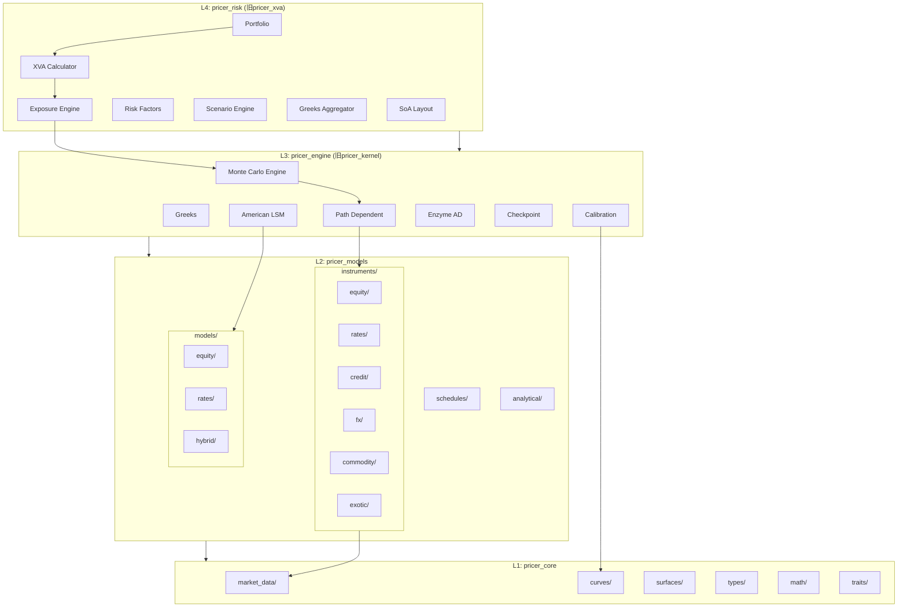
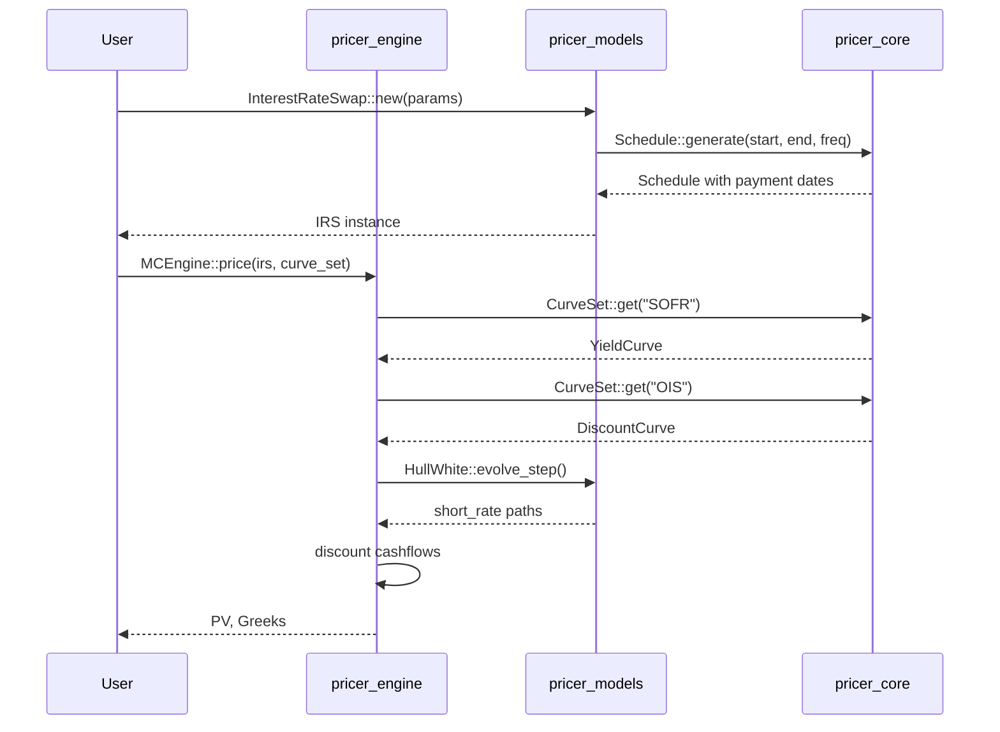
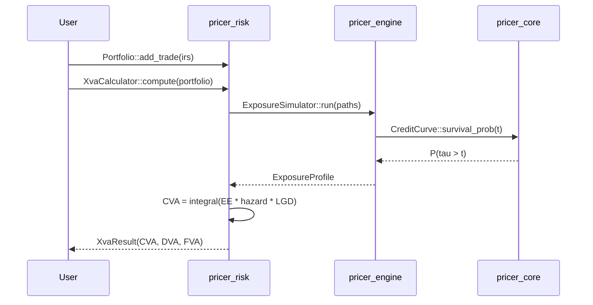
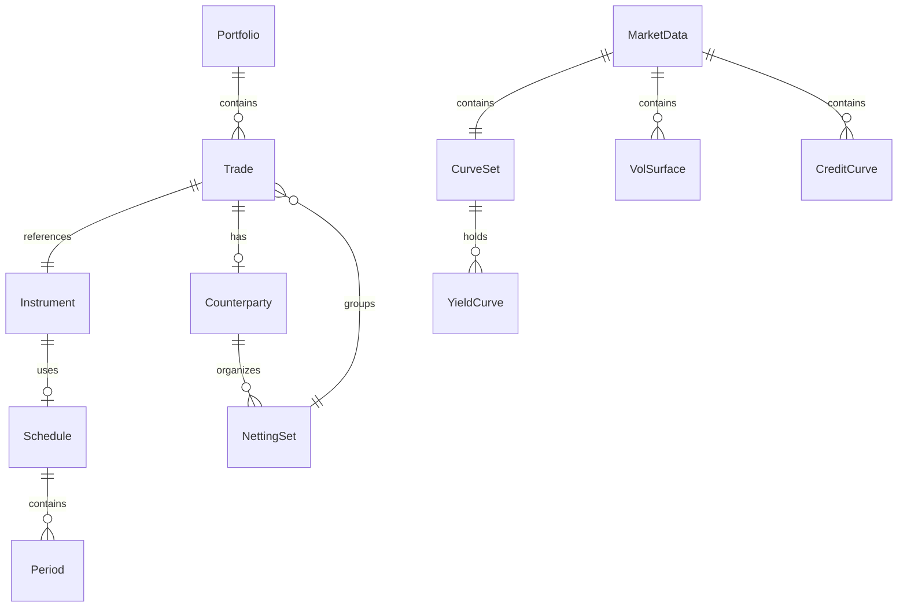

# Technical Design: crate-architecture-redesign

## Overview

**Purpose**: 本設計は、neutryx-rustライブラリのクレート構成を全デリバティブ評価に対応できるよう再設計する。既存の4層アーキテクチャを基盤としつつ、株式デリバティブに加えて金利・クレジット・為替・コモディティ・エキゾチックデリバティブをカバーする拡張性を確保する。

**Users**: クオンツ開発者、リスク管理者、金利トレーダー、クレジットアナリスト、ストラクチャラーが、統一されたAPIで多様なデリバティブ商品の評価とリスク計算を実行する。

**Impact**: 既存のpricer_kernel→pricer_engine、pricer_xva→pricer_riskへの名称変更、instruments/models配下のアセットクラス別サブモジュール再構成、新規市場データ基盤（CurveSet、CreditCurve）の追加。

### Goals

- アセットクラス非依存の商品階層設計により、新規商品追加が既存コードに影響を与えない
- 複数イールドカーブ・クレジットカーブの統一管理（CurveSet、CreditCurve）
- Hull-White、CIR等の金利モデル追加とキャリブレーションフレームワーク
- Enum dispatchパターンによるEnzyme AD互換性の維持
- Feature flagによるアセットクラス別条件付きコンパイル

### Non-Goals

- LIBOR Market Model（LMM）のフル実装（将来フェーズ）
- リアルタイムマーケットデータフィード統合
- GUI/Web UIの提供
- 外部データベース連携

## Architecture

### Existing Architecture Analysis

現行アーキテクチャは4層構造を採用し、Enzyme AD（nightly Rust）をL3に隔離している。

**現行の制約と維持すべきパターン**:

- **Enum Dispatch**: `Instrument<T>`、`StochasticModelEnum` — trait objectsを避け静的ディスパッチ
- **Generic Float**: 全型が `T: Float` でジェネリック（AD互換性）
- **依存方向**: L1→L2→L3→L4の一方向のみ
- **SoA Layout**: L4でベクトル化最適化

**現行の課題**:

- 商品がflat構造で分類されていない（instruments/直下にVanilla, Forward, Swap）
- 金利商品に必要なSchedule、マルチカーブ対応が不足
- クレジットカーブ（ハザードレート）の基盤が未整備

### Architecture Pattern & Boundary Map



**Architecture Integration**:

- **Selected pattern**: 4層アーキテクチャ継続、アセットクラス別サブモジュール追加
- **Domain boundaries**: 各アセットクラス（equity, rates, credit, fx, commodity, exotic）が独立モジュール
- **Existing patterns preserved**: Enum dispatch、Generic Float、Builder pattern、SoA layout
- **New components rationale**: CurveSet（マルチカーブ管理）、CreditCurve（ハザードレート）、Calibrator（キャリブレーション）、RiskFactor（感応度計算）
- **Steering compliance**: 4層分離維持、Enzyme隔離継続、静的ディスパッチ優先

### Technology Stack

| Layer | Choice / Version | Role in Feature | Notes |
|-------|------------------|-----------------|-------|
| Language | Rust Edition 2021 | 全層 | nightly-2025-01-15 (L3) |
| AD Backend | Enzyme LLVM 18 | L3 Greeks計算 | L3のみ |
| Numeric | num-traits 0.2 | Float trait bounds | 全層で使用 |
| Parallelism | rayon 1.10 | L4 Portfolio並列処理 | |
| Time | chrono 0.4 | Schedule生成、日付計算 | L1 types |
| RNG | rand 0.8 | Monte Carlo | L3 |
| Serialization | serde 1.0 | Currency、設定 | optional feature |
| Testing | criterion, proptest | ベンチマーク、property testing | |

## System Flows

### IRS評価フロー



### XVA計算フロー



## Requirements Traceability

| Requirement | Summary | Components | Interfaces | Flows |
|-------------|---------|------------|------------|-------|
| 1.1-1.5 | アセットクラス別商品階層 | InstrumentEnum, equity/, rates/, credit/, fx/, exotic/, Schedule | Instrument trait | - |
| 2.1-2.5 | マルチカーブ市場データ | CurveSet, CreditCurve, HazardRateCurve, FxVolSurface | YieldCurve, CreditCurve traits | - |
| 3.1-3.5 | 確率モデル拡張 | HullWhite, CIR, CorrelatedModels, Calibrator | StochasticModel trait | - |
| 4.1-4.5 | 金利デリバティブ | InterestRateSwap, Swaption, CapFloor, Schedule | - | IRS評価フロー |
| 5.1-5.5 | クレジットデリバティブ | CDS, HazardRateCurve, WWR | CreditCurve trait | XVA計算フロー |
| 6.1-6.5 | 為替デリバティブ | FxOption, FxForward, CurrencyPair, GarmanKohlhagen | - | - |
| 7.1-7.6 | レイヤー構成・フォルダ | Crate renaming, submodules, feature flags | - | - |
| 8.1-8.5 | キャリブレーション | Calibrator, LevenbergMarquardt, CalibrationError | Calibrator trait | - |
| 9.1-9.5 | リスクファクター管理 | RiskFactor, GreeksAggregator, ScenarioEngine | RiskFactor trait | - |
| 10.1-10.5 | パフォーマンス | SoA, Rayon, Workspace, Checkpoint | - | - |
| 11.1-11.8 | エキゾチック | VarianceSwap, Cliquet, Autocallable, Rainbow, LSM | - | - |

## Components and Interfaces

### Component Summary

| Component | Domain/Layer | Intent | Req Coverage | Key Dependencies | Contracts |
|-----------|--------------|--------|--------------|------------------|-----------|
| InstrumentEnum | L2 Models | 全商品の静的ディスパッチ | 1.1-1.3 | pricer_core (P0) | Service |
| CurveSet | L1 Core | マルチカーブ管理 | 2.1-2.2 | YieldCurve (P0) | Service |
| CreditCurve | L1 Core | クレジットカーブ抽象化 | 2.3, 5.3 | - | Service |
| StochasticModelEnum | L2 Models | 確率モデルディスパッチ | 3.1-3.4 | pricer_core (P0) | Service |
| Calibrator | L3 Engine | モデルキャリブレーション | 3.5, 8.1-8.5 | Solvers (P0) | Service |
| Schedule | L2 Models | 支払日生成 | 1.4, 4.5 | chrono (P0) | Service |
| InterestRateSwap | L2 Models | IRS商品定義 | 4.1-4.2 | Schedule (P0), CurveSet (P1) | State |
| CDS | L2 Models | CDS商品定義 | 5.1-5.2 | CreditCurve (P0) | State |
| RiskFactor | L1 Core | リスクファクター抽象化 | 9.1-9.2 | - | Service |
| GreeksAggregator | L4 Risk | ポートフォリオGreeks集計 | 9.3 | GreeksResult (P0) | Service |
| LSM | L3 Engine | Longstaff-Schwartz法 | 11.7 | MC (P0) | Service |

### L1: pricer_core

#### CurveSet

| Field | Detail |
|-------|--------|
| Intent | 複数のイールドカーブを名前付きで管理し、ディスカウント/フォワードカーブの分離を可能にする |
| Requirements | 2.1, 2.2 |

**Responsibilities & Constraints**

- 名前付きカーブ（OIS, SOFR, TONAR等）の登録・取得
- ディスカウントカーブとフォワードカーブの分離管理
- `T: Float`でジェネリック（AD互換性）

**Dependencies**

- Inbound: pricer_models instruments — カーブ取得 (P0)
- Internal: YieldCurve trait — カーブ実装 (P0)

**Contracts**: Service [x]

##### Service Interface

```rust
pub struct CurveSet<T: Float> {
    curves: HashMap<CurveName, CurveEnum<T>>,
}

#[derive(Clone, Copy, PartialEq, Eq, Hash)]
pub enum CurveName {
    Ois,
    Sofr,
    Tonar,
    Euribor,
    Forward,
    Discount,
    Custom(&'static str),
}

impl<T: Float> CurveSet<T> {
    pub fn new() -> Self;
    pub fn insert(&mut self, name: CurveName, curve: CurveEnum<T>);
    pub fn get(&self, name: CurveName) -> Option<&CurveEnum<T>>;
    pub fn discount_curve(&self) -> Option<&CurveEnum<T>>;
    pub fn forward_curve(&self, name: CurveName) -> Option<&CurveEnum<T>>;
}
```

- Preconditions: name must be valid CurveName variant
- Postconditions: Returns curve reference if exists, None otherwise
- Invariants: All curves in set share same Float type T

#### CreditCurve Trait

| Field | Detail |
|-------|--------|
| Intent | ハザードレート・生存確率・デフォルト確率の計算を抽象化 |
| Requirements | 2.3, 5.3 |

**Responsibilities & Constraints**

- ハザードレートλ(t)の期間構造管理
- 生存確率 P(τ > t) = exp(-∫λ(s)ds) の計算
- デフォルト確率 P(τ ≤ t) = 1 - P(τ > t)

**Contracts**: Service [x]

##### Service Interface

```rust
pub trait CreditCurve<T: Float> {
    /// Return hazard rate at time t
    fn hazard_rate(&self, t: T) -> Result<T, MarketDataError>;

    /// Return survival probability P(tau > t)
    fn survival_probability(&self, t: T) -> Result<T, MarketDataError>;

    /// Return default probability P(tau <= t)
    fn default_probability(&self, t: T) -> Result<T, MarketDataError> {
        Ok(T::one() - self.survival_probability(t)?)
    }
}

pub struct HazardRateCurve<T: Float> {
    tenors: Vec<T>,
    hazard_rates: Vec<T>,
    interpolation: InterpolationMethod,
}

impl<T: Float> CreditCurve<T> for HazardRateCurve<T> { /* ... */ }
```

#### RiskFactor Trait

| Field | Detail |
|-------|--------|
| Intent | リスクファクターの統一インターフェース（金利、クレジット、FX等） |
| Requirements | 9.1 |

**Contracts**: Service [x]

##### Service Interface

```rust
pub trait RiskFactor<T: Float> {
    fn factor_type(&self) -> RiskFactorType;
    fn bump(&self, delta: T) -> Self;
    fn apply_scenario(&self, scenario: &Scenario<T>) -> Self;
}

#[derive(Clone, Copy, Debug)]
pub enum RiskFactorType {
    InterestRate,
    Credit,
    Fx,
    Equity,
    Commodity,
    Volatility,
}
```

### L2: pricer_models

#### InstrumentEnum

| Field | Detail |
|-------|--------|
| Intent | 全商品の静的ディスパッチによるEnum-based多態性 |
| Requirements | 1.1, 1.2, 1.3 |

**Responsibilities & Constraints**

- アセットクラス別サブenumでの商品分類
- `Instrument` traitの実装（price, greeks, cashflows）
- Enzyme AD互換のための静的ディスパッチ維持

**Dependencies**

- Inbound: pricer_engine — 評価 (P0)
- Outbound: pricer_core types — Currency, Date (P0)
- Outbound: pricer_core market_data — YieldCurve (P0)

**Contracts**: Service [x] / State [x]

##### Service Interface

```rust
pub trait Instrument<T: Float> {
    fn price(&self, market: &MarketData<T>) -> Result<T, PricingError>;
    fn greeks(&self, market: &MarketData<T>, config: &GreeksConfig) -> Result<GreeksResult<T>, PricingError>;
    fn cashflows(&self) -> Vec<Cashflow<T>>;
    fn maturity(&self) -> Date;
    fn currency(&self) -> Currency;
}

#[non_exhaustive]
pub enum InstrumentEnum<T: Float> {
    Equity(EquityInstrument<T>),
    Rates(RatesInstrument<T>),
    Credit(CreditInstrument<T>),
    Fx(FxInstrument<T>),
    Commodity(CommodityInstrument<T>),
    Exotic(ExoticInstrument<T>),
}

#[cfg(feature = "equity")]
pub enum EquityInstrument<T: Float> {
    Vanilla(VanillaOption<T>),
    Barrier(BarrierOption<T>),
    Asian(AsianOption<T>),
    Lookback(LookbackOption<T>),
}

#[cfg(feature = "rates")]
pub enum RatesInstrument<T: Float> {
    Swap(InterestRateSwap<T>),
    Swaption(Swaption<T>),
    Cap(Cap<T>),
    Floor(Floor<T>),
    Fra(ForwardRateAgreement<T>),
}

// Similar enums for Credit, Fx, Commodity, Exotic
```

##### State Management

- State model: 各商品は不変構造体、市場データは別管理
- Persistence: Serde serialization (optional feature)
- Concurrency: 商品インスタンスはSend + Sync

#### Schedule

| Field | Detail |
|-------|--------|
| Intent | 金利商品の支払日・計算期間・日数計算規約を管理 |
| Requirements | 1.4, 4.5 |

**Contracts**: Service [x]

##### Service Interface

```rust
pub struct Schedule {
    periods: Vec<Period>,
    payment_dates: Vec<Date>,
    accrual_start: Vec<Date>,
    accrual_end: Vec<Date>,
}

pub struct Period {
    start: Date,
    end: Date,
    payment: Date,
    day_count: DayCountConvention,
}

pub struct ScheduleBuilder {
    start_date: Option<Date>,
    end_date: Option<Date>,
    frequency: Option<Frequency>,
    business_day_convention: BusinessDayConvention,
    day_count: DayCountConvention,
    calendar: Option<Calendar>,
}

impl ScheduleBuilder {
    pub fn new() -> Self;
    pub fn start(self, date: Date) -> Self;
    pub fn end(self, date: Date) -> Self;
    pub fn frequency(self, freq: Frequency) -> Self;
    pub fn business_day_convention(self, conv: BusinessDayConvention) -> Self;
    pub fn day_count(self, dc: DayCountConvention) -> Self;
    pub fn build(self) -> Result<Schedule, ScheduleError>;
}

#[derive(Clone, Copy)]
pub enum Frequency {
    Annual,
    SemiAnnual,
    Quarterly,
    Monthly,
    Weekly,
    Daily,
}

#[derive(Clone, Copy)]
pub enum BusinessDayConvention {
    Following,
    ModifiedFollowing,
    Preceding,
    ModifiedPreceding,
    Unadjusted,
}
```

#### InterestRateSwap

| Field | Detail |
|-------|--------|
| Intent | IRS商品の定義（固定レグ・変動レグ・ノーショナル） |
| Requirements | 4.1, 4.2 |

**Contracts**: State [x]

##### State Management

```rust
pub struct InterestRateSwap<T: Float> {
    pub notional: T,
    pub fixed_leg: FixedLeg<T>,
    pub floating_leg: FloatingLeg<T>,
    pub currency: Currency,
}

pub struct FixedLeg<T: Float> {
    pub schedule: Schedule,
    pub fixed_rate: T,
    pub day_count: DayCountConvention,
}

pub struct FloatingLeg<T: Float> {
    pub schedule: Schedule,
    pub spread: T,
    pub index: RateIndex,
    pub day_count: DayCountConvention,
}

#[derive(Clone, Copy)]
pub enum RateIndex {
    Sofr,
    Tonar,
    Euribor3M,
    Euribor6M,
}
```

#### StochasticModelEnum

| Field | Detail |
|-------|--------|
| Intent | 確率モデルの静的ディスパッチ（GBM, Hull-White, CIR, Heston等） |
| Requirements | 3.1, 3.2, 3.3, 3.4 |

**Contracts**: Service [x]

##### Service Interface

```rust
pub trait StochasticModel<T: Float> {
    type State: StochasticState<T>;
    type Params;

    fn initial_state(&self, spot: T) -> Self::State;
    fn evolve_step(&self, state: &Self::State, dt: T, dw: &[T]) -> Self::State;
    fn brownian_dim(&self) -> usize;
    fn num_factors(&self) -> usize;
}

#[non_exhaustive]
pub enum StochasticModelEnum<T: Float> {
    // Equity models
    Gbm(GeometricBrownianMotion<T>),
    Heston(Heston<T>),
    LocalVol(LocalVolatility<T>),

    // Rates models
    HullWhite(HullWhite<T>),
    Cir(CoxIngersollRoss<T>),
    G2pp(G2PlusPlus<T>),

    // Hybrid
    Correlated(CorrelatedModels<T>),
}

pub struct HullWhite<T: Float> {
    pub mean_reversion: T,      // α
    pub volatility: T,          // σ (or time-dependent)
    pub initial_curve: CurveEnum<T>,
}

pub struct CorrelatedModels<T: Float> {
    pub models: Vec<StochasticModelEnum<T>>,
    pub correlation_matrix: Vec<Vec<T>>,
    pub cholesky: Vec<Vec<T>>,  // Pre-computed Cholesky decomposition
}
```

### L3: pricer_engine

#### Calibrator

| Field | Detail |
|-------|--------|
| Intent | モデルパラメータの市場データへのキャリブレーション |
| Requirements | 3.5, 8.1, 8.2, 8.3, 8.4, 8.5 |

**Dependencies**

- Outbound: pricer_core/math/solvers — LevenbergMarquardt (P0)
- Outbound: pricer_models — StochasticModelEnum (P0)

**Contracts**: Service [x]

##### Service Interface

```rust
pub trait Calibrator<T: Float, M> {
    type Target;
    type Error;

    fn calibrate(
        &self,
        model: &mut M,
        targets: &[Self::Target],
    ) -> Result<CalibrationResult<T>, Self::Error>;

    fn objective_function(
        &self,
        params: &[T],
        targets: &[Self::Target],
    ) -> Vec<T>;

    fn constraints(&self) -> Vec<Constraint<T>>;
}

pub struct CalibrationResult<T: Float> {
    pub converged: bool,
    pub iterations: usize,
    pub residual: T,
    pub final_params: Vec<T>,
}

#[derive(Debug)]
pub struct CalibrationError {
    pub kind: CalibrationErrorKind,
    pub residual: f64,
    pub iterations: usize,
    pub message: String,
}

pub enum CalibrationErrorKind {
    NotConverged,
    InvalidConstraint,
    NumericalInstability,
    InsufficientData,
}

pub struct SwaptionCalibrator<T: Float> {
    pub swaption_vols: Vec<SwaptionVolQuote<T>>,
    pub tolerance: T,
    pub max_iterations: usize,
}
```

#### LongstaffSchwartz (LSM)

| Field | Detail |
|-------|--------|
| Intent | Bermudan/American optionの早期行使境界推定 |
| Requirements | 11.7 |

**Contracts**: Service [x]

##### Service Interface

```rust
pub struct LongstaffSchwartz<T: Float> {
    pub basis_functions: BasisFunctionType,
    pub num_basis: usize,
    pub use_two_pass: bool,  // Bias reduction
}

pub enum BasisFunctionType {
    Polynomial(usize),      // degree
    Laguerre(usize),        // number of functions
    Hermite(usize),
}

impl<T: Float> LongstaffSchwartz<T> {
    pub fn new(basis: BasisFunctionType, num_basis: usize) -> Self;

    pub fn compute_continuation_value(
        &self,
        paths: &[Vec<T>],
        payoffs: &[T],
        exercise_times: &[usize],
    ) -> Result<Vec<T>, LsmError>;

    pub fn find_exercise_boundary(
        &self,
        paths: &[Vec<T>],
        payoff_fn: impl Fn(&T, usize) -> T,
    ) -> Result<Vec<T>, LsmError>;
}
```

### L4: pricer_risk

#### GreeksAggregator

| Field | Detail |
|-------|--------|
| Intent | ポートフォリオレベルのDelta、Gamma、Vega集計 |
| Requirements | 9.3 |

**Contracts**: Service [x]

##### Service Interface

```rust
pub struct GreeksAggregator<T: Float> {
    pub aggregation_method: AggregationMethod,
}

pub enum AggregationMethod {
    Simple,           // Sum of individual Greeks
    RiskWeighted,     // Weighted by notional
    CorrelationAdjusted,
}

impl<T: Float> GreeksAggregator<T> {
    pub fn aggregate(
        &self,
        portfolio: &Portfolio<T>,
        individual_greeks: &[GreeksResult<T>],
    ) -> PortfolioGreeks<T>;
}

pub struct PortfolioGreeks<T: Float> {
    pub delta: HashMap<RiskFactorType, T>,
    pub gamma: HashMap<RiskFactorType, T>,
    pub vega: HashMap<RiskFactorType, T>,
    pub theta: T,
    pub rho: HashMap<CurveName, T>,
    pub credit_delta: HashMap<String, T>,  // by counterparty
}
```

#### ScenarioEngine

| Field | Detail |
|-------|--------|
| Intent | ストレステストシナリオの適用とPnL計算 |
| Requirements | 9.4 |

**Contracts**: Service [x]

##### Service Interface

```rust
pub struct ScenarioEngine<T: Float> {
    pub scenarios: Vec<Scenario<T>>,
}

pub struct Scenario<T: Float> {
    pub name: String,
    pub shifts: Vec<RiskFactorShift<T>>,
}

pub struct RiskFactorShift<T: Float> {
    pub factor_type: RiskFactorType,
    pub shift_type: ShiftType,
    pub value: T,
}

pub enum ShiftType {
    Absolute,
    Relative,
    Parallel,
    Twist,
    Butterfly,
}

impl<T: Float> ScenarioEngine<T> {
    pub fn run_scenario(
        &self,
        portfolio: &Portfolio<T>,
        scenario: &Scenario<T>,
        base_pv: T,
    ) -> ScenarioPnL<T>;

    pub fn run_all_scenarios(
        &self,
        portfolio: &Portfolio<T>,
    ) -> Vec<ScenarioPnL<T>>;
}

pub struct ScenarioPnL<T: Float> {
    pub scenario_name: String,
    pub base_pv: T,
    pub stressed_pv: T,
    pub pnl: T,
    pub breakdown: HashMap<String, T>,  // by trade
}
```

## Data Models

### Domain Model



**Aggregates**:

- `Portfolio`: Trade集合のルートエンティティ
- `MarketData`: カーブ・サーフェス集合のルートエンティティ
- `Instrument`: 商品定義（Value Object）

**Invariants**:

- Portfolio内のTradeは一意のID
- CurveSetの全カーブは同一Float型T
- Scheduleの期間は重複なし、連続

### Logical Data Model

**InstrumentEnum Structure**:

```text
InstrumentEnum<T>
├── Equity(EquityInstrument<T>)
│   ├── Vanilla(VanillaOption<T>)
│   ├── Barrier(BarrierOption<T>)
│   ├── Asian(AsianOption<T>)
│   └── Lookback(LookbackOption<T>)
├── Rates(RatesInstrument<T>)
│   ├── Swap(InterestRateSwap<T>)
│   ├── Swaption(Swaption<T>)
│   ├── Cap(Cap<T>)
│   ├── Floor(Floor<T>)
│   └── Fra(ForwardRateAgreement<T>)
├── Credit(CreditInstrument<T>)
│   └── Cds(CreditDefaultSwap<T>)
├── Fx(FxInstrument<T>)
│   ├── Option(FxOption<T>)
│   └── Forward(FxForward<T>)
├── Commodity(CommodityInstrument<T>)
│   ├── Forward(CommodityForward<T>)
│   └── Option(CommodityOption<T>)
└── Exotic(ExoticInstrument<T>)
    ├── VarianceSwap(VarianceSwap<T>)
    ├── Cliquet(Cliquet<T>)
    ├── Autocallable(Autocallable<T>)
    ├── Rainbow(Rainbow<T>)
    └── Quanto(QuantoOption<T>)
```

## Error Handling

### Error Strategy

各層で専用のエラー型を定義し、`thiserror`で構造化。上位層は下位層のエラーを包含。

### Error Categories and Responses

**User Errors (Validation)**:

- `InvalidMaturity`: 満期が過去または不正
- `InvalidNotional`: ノーショナルが負または0
- `MissingCurve`: 必要なカーブがCurveSetに存在しない

**System Errors (Runtime)**:

- `NumericalInstability`: 計算中のNaN/Inf発生
- `CalibrationNotConverged`: キャリブレーション収束失敗
- `InsufficientPaths`: MCパス数不足

**Business Logic Errors**:

- `InvalidSchedule`: スケジュール生成パラメータ不正
- `CurrencyMismatch`: 通貨不整合
- `ModelConstraintViolation`: モデルパラメータ制約違反

### Error Types per Crate

```rust
// pricer_core
#[derive(Debug, thiserror::Error)]
pub enum MarketDataError {
    #[error("Invalid maturity: {t}")]
    InvalidMaturity { t: f64 },
    #[error("Curve not found: {name:?}")]
    CurveNotFound { name: CurveName },
    #[error("Interpolation failed: {reason}")]
    InterpolationError { reason: String },
}

// pricer_models
#[derive(Debug, thiserror::Error)]
pub enum PricingError {
    #[error("Market data error: {0}")]
    MarketData(#[from] MarketDataError),
    #[error("Schedule error: {0}")]
    Schedule(#[from] ScheduleError),
    #[error("Invalid instrument: {reason}")]
    InvalidInstrument { reason: String },
}

// pricer_engine
#[derive(Debug, thiserror::Error)]
pub enum CalibrationError {
    #[error("Calibration did not converge after {iterations} iterations, residual: {residual}")]
    NotConverged { iterations: usize, residual: f64 },
    #[error("Numerical instability: {reason}")]
    NumericalInstability { reason: String },
}
```

## Testing Strategy

### Unit Tests

- `CurveSet`: insert/get/discount_curve/forward_curveの正常系・異常系
- `Schedule`: 各Frequency × BusinessDayConventionの組み合わせ
- `HullWhite::evolve_step`: 既知解との比較（dt→0極限）
- `LongstaffSchwartz`: 単純なAmerican putでの収束確認
- `InstrumentEnum`: 各variant でのtrait method呼び出し

### Integration Tests

- IRS評価: Schedule生成 → CurveSet構築 → price()呼び出し → 既知値との比較
- Swaption評価: HullWhiteキャリブレーション → MC価格 → Black76解析解との比較
- CDS評価: HazardRateCurve構築 → プロテクション/プレミアムレグPV
- Portfolio XVA: 複数商品 → ExposureProfile → CVA/DVA計算

### Performance Tests

- `criterion`: 各アセットクラスの代表商品で価格計算ベンチマーク
- IRS 1000本評価の並列性能
- HullWhiteキャリブレーション収束時間
- LSM 50,000パスでのBermudan評価

### Property-Based Tests (proptest)

- `Schedule`: 任意のstart/end/frequencyで期間が連続・重複なし
- `CurveSet`: 任意のカーブ追加順序で同一結果
- `InstrumentEnum`: serialize/deserializeの往復一致（serde feature）

## Optional Sections

### Migration Strategy

**Phase 1: クレート名変更**

1. `pricer_kernel` → `pricer_engine` のCargo.toml変更
2. `pricer_xva` → `pricer_risk` のCargo.toml変更
3. Workspace Cargo.tomlの更新
4. `pub use`エイリアスで旧名を維持（deprecation警告付き）

```rust
// pricer_engine/lib.rs
#[deprecated(since = "0.7.0", note = "Use pricer_engine instead")]
pub use crate as pricer_kernel;
```

**Phase 2: サブモジュール再構成**

1. `instruments/`配下にequity/, rates/, credit/, fx/, commodity/, exotic/作成
2. 既存商品をequity/に移動
3. Feature flagをCargo.tomlに追加

```toml
[features]
default = ["equity"]
equity = []
rates = []
credit = []
fx = []
commodity = []
exotic = []
all = ["equity", "rates", "credit", "fx", "commodity", "exotic"]
```

**Rollback Triggers**:

- CI/CDテスト失敗
- ベンチマーク10%以上の性能低下
- 既存APIの意図しない破壊

### Performance & Scalability

**Target Metrics**:

- IRS単体評価: < 1μs (analytical)
- Portfolio 10,000件並列評価: < 100ms
- MCシミュレーション 100,000パス: < 1s
- キャリブレーション収束: < 10 iterations (typical)

**Scaling Approach**:

- Rayon並列化でCPUコア線形スケール（L4）
- SoA layoutでベクトル化最適化
- Workspace bufferで再利用、アロケーション最小化
