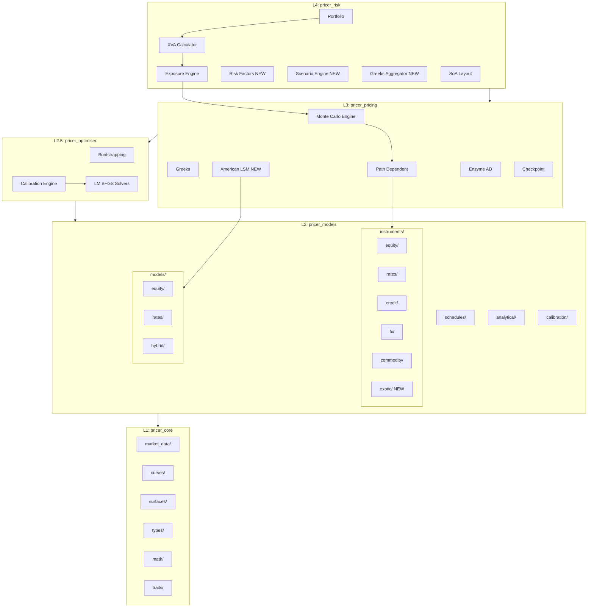
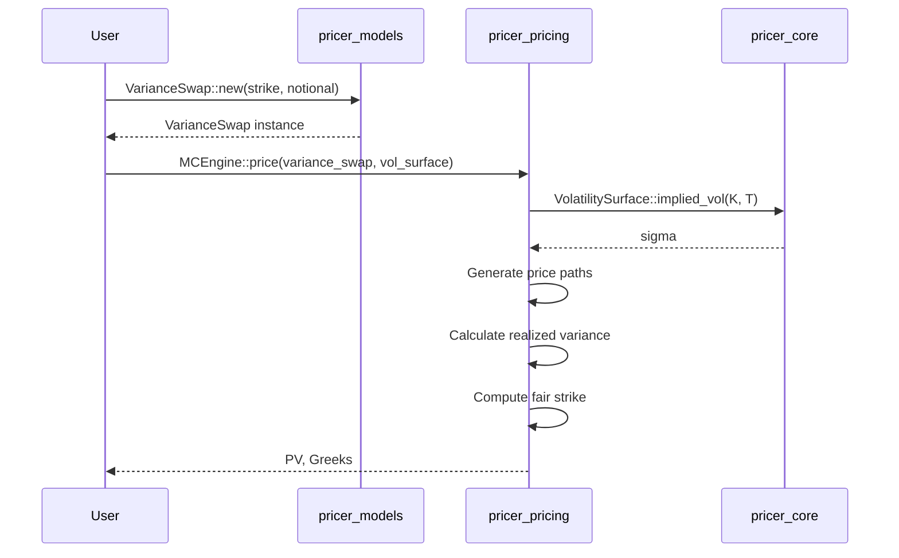
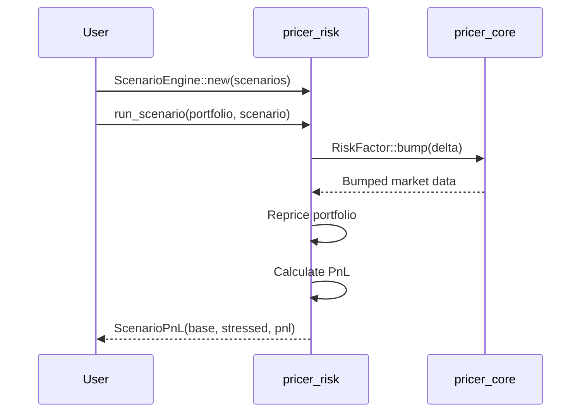
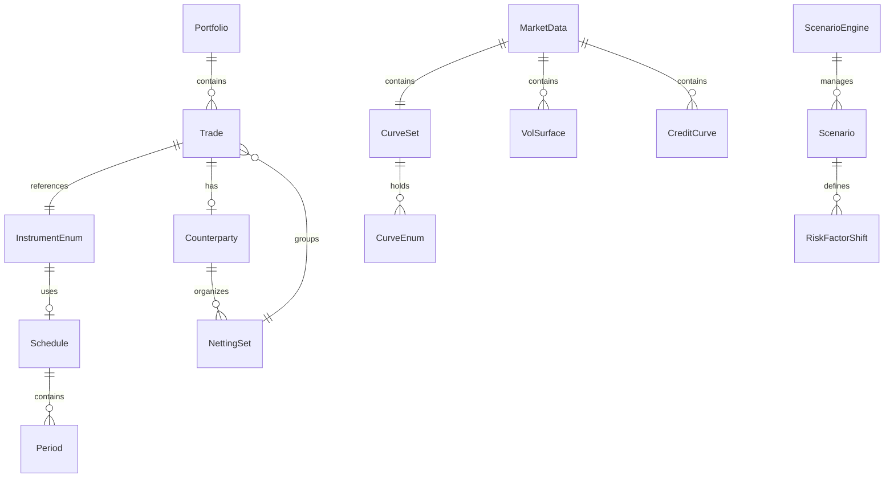

# Technical Design: crate-architecture-redesign

## Overview

**Purpose**: 本設計は、neutryx-rustライブラリのクレート構成を全デリバティブ評価に対応できるよう再設計する。現行の5層アーキテクチャを基盤としつつ、株式デリバティブに加えて金利・クレジット・為替・コモディティ・エキゾチックデリバティブをカバーする拡張性を確保する。

**Users**: クオンツ開発者、リスク管理者、金利トレーダー、クレジットアナリスト、ストラクチャラーが、統一されたAPIで多様なデリバティブ商品の評価とリスク計算を実行する。

**Impact**: 5層アーキテクチャ（L1→L2→L2.5→L3→L4）の確立、pricer_optimiser (L2.5)の役割明確化、残りのエキゾチック商品とリスクファクター管理の実装。

### Goals

- アセットクラス非依存の商品階層設計を完成させる
- pricer_optimiser (L2.5)をキャリブレーション・ブートストラップ・ソルバーの中央基盤として確立
- エキゾチックデリバティブ（VarianceSwap, Cliquet, Autocallable等）の実装
- リスクファクター管理とシナリオエンジンの整備
- Enum dispatchパターンによるEnzyme AD互換性の継続維持

### Non-Goals

- LIBOR Market Model (LMM)のフル実装（将来フェーズ）
- リアルタイムマーケットデータフィード統合
- GUI/Web UIの提供
- 規制計算（SA-CCR, FRTB, SIMM）の完全実装（将来拡張）

## Architecture

### Existing Architecture Analysis

現行アーキテクチャは5層構造を採用し、Enzyme AD (Nightly Rust)をL3に隔離している。

**現行の維持すべきパターン**:

- **Enum Dispatch**: `InstrumentEnum<T>`, `StochasticModelEnum` でtrait objectsを避け静的ディスパッチ
- **Generic Float**: 全型が `T: Float` でジェネリック（AD互換性）
- **依存方向**: L1→L2→L2.5→L3→L4の一方向のみ
- **SoA Layout**: L4でベクトル化最適化
- **Feature Flags**: アセットクラス別条件付きコンパイル

**実装済み項目**（✅）:

- 5層アーキテクチャ構造
- アセットクラス別フォルダ構成（equity, rates, credit, fx, commodity, exotic）
- マルチカーブ対応（CurveSet, CreditCurve）
- 確率モデル（GBM, Heston, SABR, Hull-White, CIR）
- 金利・クレジット・為替デリバティブ

**残り実装項目**（❌）:

- エキゾチックデリバティブの構造体実装（スケルトンのみ存在）
- リスクファクター管理（RiskFactor trait, ScenarioEngine）
- Wrong-Way Risk (WWR)対応
- GreeksAggregator

### Architecture Pattern & Boundary Map



**Architecture Integration**:

- **Selected pattern**: 5層アーキテクチャ（L1→L2→L2.5→L3→L4）
- **Domain boundaries**: 各アセットクラス（equity, rates, credit, fx, commodity, exotic）が独立モジュール
- **Existing patterns preserved**: Enum dispatch、Generic Float、Builder pattern、SoA layout
- **New components rationale**:
  - pricer_optimiser (L2.5): キャリブレーション・ブートストラップをモデル定義(L2)と評価(L3)の間に配置
  - RiskFactor trait: 複数リスクタイプの統一管理
  - ScenarioEngine: ストレステスト・感応度分析
  - GreeksAggregator: ポートフォリオレベルGreeks集約
- **Steering compliance**: A-I-P-S依存方向、Enzyme隔離継続、静的ディスパッチ優先

### Technology Stack

| Layer | Choice / Version | Role in Feature | Notes |
|-------|------------------|-----------------|-------|
| Language | Rust Edition 2021 | 全層 | nightly-2025-01-15 (L3のみ) |
| AD Backend | Enzyme LLVM 18 | L3 Greeks計算 | L3のみ、他は安定Rust |
| Numeric | num-traits 0.2 | Float trait bounds | 全層で使用 |
| Parallelism | rayon 1.10 | L4 Portfolio並列処理 | |
| Time | chrono 0.4 | Schedule生成、日付計算 | L1 types |
| RNG | rand 0.8 | Monte Carlo | L3 |
| Serialization | serde 1.0 | Currency、設定 | optional feature |
| Testing | criterion, proptest | ベンチマーク、property testing | |

## System Flows

### エキゾチック商品評価フロー（NEW）



### リスクファクターシナリオフロー（NEW）



## Requirements Traceability

| Requirement | Summary | Components | Interfaces | Flows |
|-------------|---------|------------|------------|-------|
| 1.1-1.5 | 5層レイヤー構成 | pricer_core, pricer_models, pricer_optimiser, pricer_pricing, pricer_risk | - | - |
| 2.1-2.5 | アセットクラス別商品階層 | InstrumentEnum, equity/, rates/, credit/, fx/, exotic/ | InstrumentTrait | - |
| 3.1-3.5 | マルチカーブ市場データ | CurveSet, CreditCurve, HazardRateCurve | YieldCurve, CreditCurve traits | - |
| 4.1-4.5 | 確率モデル拡張 | HullWhite, CIR, Heston, SABR, CorrelatedModels | StochasticModel trait | - |
| 5.1-5.6 | キャリブレーション基盤 | pricer_optimiser, Calibrator, LM, BFGS | Calibrator trait | - |
| 6.1-6.6 | 金利デリバティブ | InterestRateSwap, Swaption, CapFloor, Schedule | - | IRS評価フロー |
| 7.1-7.5 | クレジットデリバティブ | CDS, HazardRateCurve, WWR | CreditCurve trait | XVA計算フロー |
| 8.1-8.5 | 為替デリバティブ | FxOption, FxForward, CurrencyPair, GarmanKohlhagen | - | - |
| 9.1-9.8 | エキゾチックデリバティブ | VarianceSwap, Cliquet, Autocallable, Rainbow, LSM | - | エキゾチック評価フロー |
| 10.1-10.5 | リスクファクター管理 | RiskFactor, GreeksAggregator, ScenarioEngine | RiskFactor trait | シナリオフロー |
| 11.1-11.5 | パフォーマンス | SoA, Rayon, Workspace, Checkpoint | - | - |
| 12.1-12.4 | 規制計算 | SA-CCR, FRTB, SIMM（将来） | - | - |

## Components and Interfaces

### Component Summary

| Component | Domain/Layer | Intent | Req Coverage | Key Dependencies | Contracts |
|-----------|--------------|--------|--------------|------------------|-----------|
| InstrumentEnum | L2 Models | 全商品の静的ディスパッチ | 2.1-2.5 | pricer_core (P0) | Service |
| CurveSet | L1 Core | マルチカーブ管理 | 3.1-3.2 | YieldCurve (P0) | Service |
| CreditCurve | L1 Core | クレジットカーブ抽象化 | 3.3, 7.3 | - | Service |
| StochasticModelEnum | L2 Models | 確率モデルディスパッチ | 4.1-4.5 | pricer_core (P0) | Service |
| CalibrationEngine | L2.5 Optimiser | モデルキャリブレーション | 5.1-5.6 | Solvers (P0) | Service |
| Schedule | L2 Models | 支払日生成 | 6.5 | chrono (P0) | Service |
| ExoticInstrument | L2 Models | エキゾチック商品定義 | 9.1-9.8 | Schedule (P0) | State |
| RiskFactor | L1 Core | リスクファクター抽象化 | 10.1-10.2 | - | Service |
| GreeksAggregator | L4 Risk | ポートフォリオGreeks集約 | 10.3 | GreeksResult (P0) | Service |
| ScenarioEngine | L4 Risk | ストレステスト実行 | 10.4-10.5 | RiskFactor (P0) | Service |
| LSM | L3 Pricing | Longstaff-Schwartz法 | 9.7 | MC (P0) | Service |

### L2.5: pricer_optimiser（重点コンポーネント）

#### CalibrationEngine

| Field | Detail |
|-------|--------|
| Intent | モデルパラメータの市場データへのキャリブレーションを実行 |
| Requirements | 5.1, 5.2, 5.3, 5.4, 5.5 |

**Responsibilities & Constraints**

- イールドカーブのブートストラップ（OIS/Swap rates）
- 確率モデルのキャリブレーション（Hull-White α/σ等）
- 数値ソルバー（Levenberg-Marquardt, BFGS）の提供
- OptimiserErrorによる詳細なエラー報告

**Dependencies**

- Inbound: pricer_models instruments → キャリブレーション対象 (P0)
- Inbound: pricer_pricing (optional) → 勾配計算 (P1)
- Outbound: pricer_core/math/solvers → Newton, Brent (P0)
- Internal: bootstrapping/, calibration/, solvers/ modules

**Contracts**: Service [x]

##### Service Interface

```rust
pub struct CalibrationEngine<T: Float> {
    pub tolerance: T,
    pub max_iterations: usize,
    pub solver: SolverType,
}

pub enum SolverType {
    LevenbergMarquardt,
    Bfgs,
    GradientDescent,
}

impl<T: Float> CalibrationEngine<T> {
    pub fn calibrate_model<M: Calibratable<T>>(
        &self,
        model: &mut M,
        targets: &[CalibrationTarget<T>],
    ) -> Result<CalibrationResult<T>, OptimiserError>;

    pub fn bootstrap_curve(
        &self,
        instruments: &[SwapRate<T>],
    ) -> Result<InterpolatedCurve<T>, OptimiserError>;
}

pub struct CalibrationResult<T: Float> {
    pub converged: bool,
    pub iterations: usize,
    pub residual: T,
    pub final_params: Vec<T>,
}

#[derive(Debug, thiserror::Error)]
pub enum OptimiserError {
    #[error("Calibration did not converge after {iterations} iterations, residual: {residual}")]
    NotConverged { iterations: usize, residual: f64 },
    #[error("Numerical instability: {reason}")]
    NumericalInstability { reason: String },
    #[error("Insufficient data for calibration")]
    InsufficientData,
}
```

### L2: pricer_models - エキゾチック商品（NEW）

#### ExoticInstrument

| Field | Detail |
|-------|--------|
| Intent | エキゾチックデリバティブの構造体定義（VarianceSwap, Cliquet, Autocallable等） |
| Requirements | 9.1-9.8 |

**Responsibilities & Constraints**

- VarianceSwap: 実現バリアンス vs ストライクのペイオフ
- VolatilitySwap: 実現ボラティリティのペイオフ
- Cliquet: リセット日、ローカル/グローバルキャップ・フロア
- Autocallable: 早期償還バリア、クーポン条件、ノックインプット
- Rainbow: BestOf/WorstOf、相関パラメータ
- QuantoOption: quanto調整

**Contracts**: State [x]

##### State Management

```rust
#[cfg(feature = "exotic")]
pub enum ExoticInstrument<T: Float> {
    VarianceSwap(VarianceSwap<T>),
    VolatilitySwap(VolatilitySwap<T>),
    Cliquet(Cliquet<T>),
    Autocallable(Autocallable<T>),
    Rainbow(Rainbow<T>),
    Quanto(QuantoOption<T>),
}

pub struct VarianceSwap<T: Float> {
    pub strike: T,                    // Variance strike (K_var)
    pub notional: T,                  // Variance notional
    pub observation_dates: Vec<Date>,
    pub annualization_factor: T,      // Usually 252
    pub currency: Currency,
}

pub struct Cliquet<T: Float> {
    pub reset_dates: Vec<Date>,
    pub local_cap: Option<T>,
    pub local_floor: Option<T>,
    pub global_cap: Option<T>,
    pub global_floor: Option<T>,
    pub currency: Currency,
}

pub struct Autocallable<T: Float> {
    pub observation_dates: Vec<Date>,
    pub autocall_barrier: T,          // Early redemption barrier
    pub coupon_barrier: T,            // Coupon payment barrier
    pub coupon_rate: T,
    pub knockin_barrier: Option<T>,   // Put activation barrier
    pub put_strike: T,
    pub notional: T,
    pub currency: Currency,
}

pub struct Rainbow<T: Float> {
    pub underlyings: Vec<String>,     // Asset identifiers
    pub weights: Vec<T>,
    pub rainbow_type: RainbowType,
    pub strike: T,
    pub maturity: Date,
    pub currency: Currency,
}

pub enum RainbowType {
    BestOf,
    WorstOf,
    Spread,
    BasketCall,
    BasketPut,
}

pub struct QuantoOption<T: Float> {
    pub underlying_currency: Currency,
    pub settlement_currency: Currency,
    pub fx_rate_at_inception: T,
    pub underlying_option: Box<EquityInstrument<T>>,
}
```

### L4: pricer_risk - リスクファクター管理（NEW）

#### RiskFactor Trait

| Field | Detail |
|-------|--------|
| Intent | リスクファクターの統一インターフェース（金利、クレジット、FX等） |
| Requirements | 10.1, 10.2 |

**Contracts**: Service [x]

##### Service Interface

```rust
pub trait RiskFactor<T: Float>: Clone {
    fn factor_type(&self) -> RiskFactorType;
    fn bump(&self, delta: T) -> Self;
    fn apply_scenario(&self, scenario: &Scenario<T>) -> Self;
    fn name(&self) -> &str;
}

#[derive(Clone, Copy, Debug, PartialEq, Eq, Hash)]
pub enum RiskFactorType {
    InterestRate,
    Credit,
    Fx,
    Equity,
    Commodity,
    Volatility,
}

pub struct InterestRateRiskFactor<T: Float> {
    pub curve_name: CurveName,
    pub tenor: Option<T>,  // None for parallel shift
    pub value: T,
}

pub struct CreditRiskFactor<T: Float> {
    pub entity: String,
    pub hazard_rate: T,
}

pub struct FxRiskFactor<T: Float> {
    pub currency_pair: CurrencyPair,
    pub spot_rate: T,
}
```

#### GreeksAggregator

| Field | Detail |
|-------|--------|
| Intent | ポートフォリオレベルのDelta、Gamma、Vega集約 |
| Requirements | 10.3 |

**Contracts**: Service [x]

##### Service Interface

```rust
pub struct GreeksAggregator {
    pub aggregation_method: AggregationMethod,
}

pub enum AggregationMethod {
    Simple,              // Sum of individual Greeks
    NotionalWeighted,    // Weighted by notional
    CorrelationAdjusted, // Considers correlation
}

impl GreeksAggregator {
    pub fn aggregate<T: Float>(
        &self,
        portfolio: &Portfolio<T>,
        individual_greeks: &[GreeksResult<T>],
    ) -> PortfolioGreeks<T>;
}

pub struct PortfolioGreeks<T: Float> {
    pub delta: HashMap<RiskFactorType, T>,
    pub gamma: HashMap<RiskFactorType, T>,
    pub vega: HashMap<RiskFactorType, T>,
    pub theta: T,
    pub rho: HashMap<CurveName, T>,
    pub credit_delta: HashMap<String, T>,
}
```

#### ScenarioEngine

| Field | Detail |
|-------|--------|
| Intent | ストレステストシナリオの適用とPnL計算 |
| Requirements | 10.4, 10.5 |

**Contracts**: Service [x]

##### Service Interface

```rust
pub struct ScenarioEngine<T: Float> {
    pub scenarios: Vec<Scenario<T>>,
}

pub struct Scenario<T: Float> {
    pub name: String,
    pub shifts: Vec<RiskFactorShift<T>>,
}

pub struct RiskFactorShift<T: Float> {
    pub factor_type: RiskFactorType,
    pub factor_name: String,
    pub shift_type: ShiftType,
    pub value: T,
}

pub enum ShiftType {
    Absolute,   // +/- absolute value
    Relative,   // +/- percentage
    Parallel,   // Parallel curve shift
    Twist,      // Short/long differential
    Butterfly,  // Curvature
}

impl<T: Float> ScenarioEngine<T> {
    pub fn run_scenario(
        &self,
        portfolio: &Portfolio<T>,
        scenario: &Scenario<T>,
        base_pv: T,
    ) -> ScenarioPnL<T>;

    pub fn run_all_scenarios(
        &self,
        portfolio: &Portfolio<T>,
    ) -> Vec<ScenarioPnL<T>>;

    pub fn preset_scenarios() -> Vec<Scenario<T>> {
        // Parallel +100bp, Twist, Butterfly, Credit spread +50bp, FX +/-10%
    }
}

pub struct ScenarioPnL<T: Float> {
    pub scenario_name: String,
    pub base_pv: T,
    pub stressed_pv: T,
    pub pnl: T,
    pub breakdown: HashMap<TradeId, T>,
}
```

### L3: pricer_pricing - Longstaff-Schwartz（NEW）

#### LongstaffSchwartz

| Field | Detail |
|-------|--------|
| Intent | Bermudan/American optionの早期行使境界推定 |
| Requirements | 9.7 |

**Contracts**: Service [x]

##### Service Interface

```rust
pub struct LongstaffSchwartz<T: Float> {
    pub basis_functions: BasisFunctionType,
    pub num_basis: usize,
    pub use_two_pass: bool,  // Bias reduction
}

pub enum BasisFunctionType {
    Polynomial(usize),   // Degree
    Laguerre(usize),     // Number of functions
    Hermite(usize),
}

impl<T: Float> LongstaffSchwartz<T> {
    pub fn new(basis: BasisFunctionType, num_basis: usize) -> Self;

    pub fn compute_continuation_value(
        &self,
        paths: &[Vec<T>],
        payoffs: &[T],
        exercise_times: &[usize],
    ) -> Result<Vec<T>, LsmError>;

    pub fn find_exercise_boundary(
        &self,
        paths: &[Vec<T>],
        payoff_fn: impl Fn(&T, usize) -> T,
    ) -> Result<Vec<T>, LsmError>;

    pub fn price_bermudan<I: Instrument<T>>(
        &self,
        instrument: &I,
        mc_config: &MCConfig,
        model: &StochasticModelEnum<T>,
    ) -> Result<T, PricingError>;
}
```

## Data Models

### Domain Model



**Aggregates**:

- `Portfolio`: Trade集約のルートエンティティ
- `MarketData`: カーブ・サーフェス集約のルートエンティティ
- `InstrumentEnum`: 商品定義（Value Object）
- `ScenarioEngine`: シナリオ管理のルートエンティティ

**Invariants**:

- Portfolio内のTradeは一意のID
- CurveSetの全カーブは同一Float型T
- Scheduleの期間は重複せず連続

### Logical Data Model

**InstrumentEnum Structure** (Updated):

```text
InstrumentEnum<T>
├── Equity(EquityInstrument<T>)
│   ├── Vanilla(VanillaOption<T>)
│   ├── Barrier(BarrierOption<T>)
│   ├── Asian(AsianOption<T>)
│   └── Lookback(LookbackOption<T>)
├── Rates(RatesInstrument<T>)
│   ├── Swap(InterestRateSwap<T>)
│   ├── Swaption(Swaption<T>)
│   ├── Cap(Cap<T>)
│   ├── Floor(Floor<T>)
│   └── Fra(ForwardRateAgreement<T>)
├── Credit(CreditInstrument<T>)
│   └── Cds(CreditDefaultSwap<T>)
├── Fx(FxInstrument<T>)
│   ├── Option(FxOption<T>)
│   └── Forward(FxForward<T>)
├── Commodity(CommodityInstrument<T>)
│   ├── Forward(CommodityForward<T>)
│   └── Option(CommodityOption<T>)
└── Exotic(ExoticInstrument<T>)     [NEW]
    ├── VarianceSwap(VarianceSwap<T>)
    ├── VolatilitySwap(VolatilitySwap<T>)
    ├── Cliquet(Cliquet<T>)
    ├── Autocallable(Autocallable<T>)
    ├── Rainbow(Rainbow<T>)
    └── Quanto(QuantoOption<T>)
```

## Error Handling

### Error Strategy

各クレートで専用のエラー型を定義し、`thiserror`で構造化。上位層は下位層のエラーを包含。

### Error Categories and Responses

**User Errors (Validation)**:

- `InvalidMaturity`: 満期が過去または不正
- `InvalidNotional`: ノーショナルが負または0
- `MissingCurve`: 必要なカーブがCurveSetに存在しない
- `InvalidScenario`: シナリオ定義が不正

**System Errors (Runtime)**:

- `NumericalInstability`: 計算中のNaN/Inf発生
- `CalibrationNotConverged`: キャリブレーション収束失敗
- `InsufficientPaths`: MCパス数不足

**Business Logic Errors**:

- `InvalidSchedule`: スケジュール生成パラメータ不正
- `CurrencyMismatch`: 通貨不整合
- `ModelConstraintViolation`: モデルパラメータ制約違反

### Error Types per Crate

```rust
// pricer_optimiser (NEW)
#[derive(Debug, thiserror::Error)]
pub enum OptimiserError {
    #[error("Calibration did not converge after {iterations} iterations, residual: {residual}")]
    NotConverged { iterations: usize, residual: f64 },
    #[error("Numerical instability: {reason}")]
    NumericalInstability { reason: String },
    #[error("Insufficient data for calibration")]
    InsufficientData,
    #[error("Solver error: {0}")]
    Solver(String),
}

// pricer_risk (NEW)
#[derive(Debug, thiserror::Error)]
pub enum ScenarioError {
    #[error("Invalid scenario: {reason}")]
    InvalidScenario { reason: String },
    #[error("Risk factor not found: {name}")]
    RiskFactorNotFound { name: String },
    #[error("Pricing error during scenario: {0}")]
    PricingError(#[from] PricingError),
}
```

## Testing Strategy

### Unit Tests

- `ExoticInstrument`: 各variant（VarianceSwap, Cliquet等）の構築と基本プロパティ
- `RiskFactor`: bump(), apply_scenario()の正常系・異常系
- `GreeksAggregator`: Simple/NotionalWeighted集約の計算精度
- `ScenarioEngine`: Parallel/Twist/Butterflyシフトの適用
- `LongstaffSchwartz`: 単純なAmerican putでの収束確認

### Integration Tests

- エキゾチック評価: VarianceSwap → MC → 既知値との比較
- シナリオ分析: Portfolio → ScenarioEngine → PnL breakdown
- Bermudan Swaption: LSM → Hull-White → 収束確認

### Performance Tests

- `criterion`: エキゾチック商品評価ベンチマーク
- シナリオ100本の並列実行性能
- LSM 50,000パスでのBermudan評価

### Property-Based Tests (proptest)

- `Scenario`: 任意のシフト値で数値安定性
- `GreeksAggregator`: 集約前後で符号保存
- `ExoticInstrument`: serialize/deserializeの往復一致

## Optional Sections

### Migration Strategy

**Phase 1: エキゾチック商品実装**

1. `pricer_models/instruments/exotic/`に構造体追加
2. `ExoticInstrument` enumにvariant追加
3. InstrumentEnumへの統合

**Phase 2: リスクファクター管理**

1. `pricer_core/traits/risk_factor.rs`にRiskFactor trait定義
2. `pricer_risk/risk_factors/`モジュール作成
3. `pricer_risk/scenarios/`モジュール作成
4. GreeksAggregator実装

**Rollback Triggers**:

- CI/CDテスト失敗
- ベンチマーク10%以上の性能低下
- 既存APIの意図しない破壊

### Performance & Scalability

**Target Metrics**:

- エキゾチック単体MC評価: < 100ms (10,000パス)
- シナリオ100本並列実行: < 1s
- LSM Bermudan評価: < 2s (50,000パス)
- GreeksAggregator 10,000取引: < 10ms

**Scaling Approach**:

- Rayon並列化でCPUコア線形スケール（~4倍）
- SoA layoutでベクトル化最適化
- Workspace bufferで再利用、アロケーション最小化
