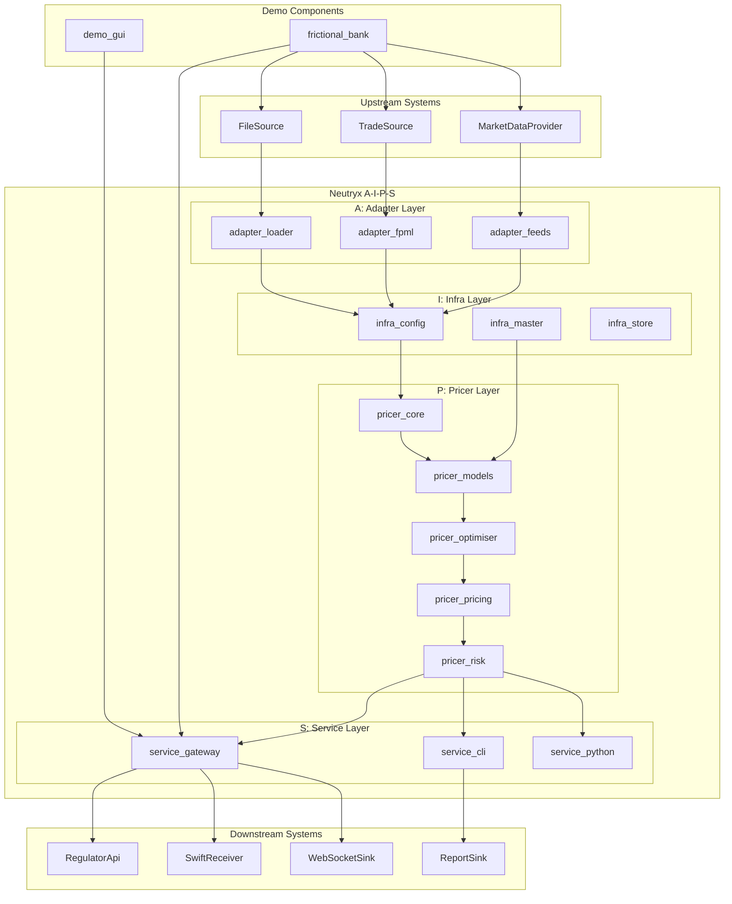
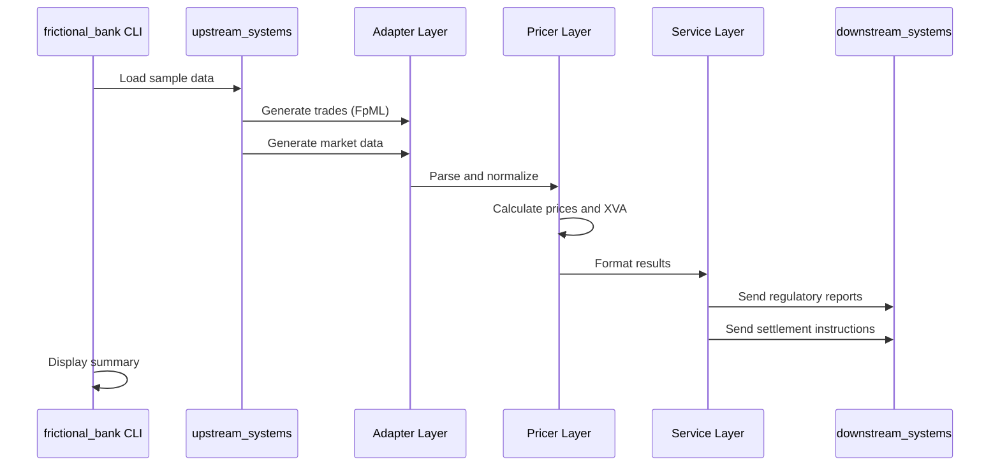
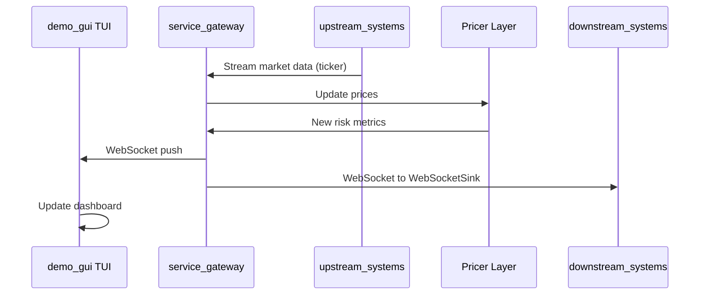
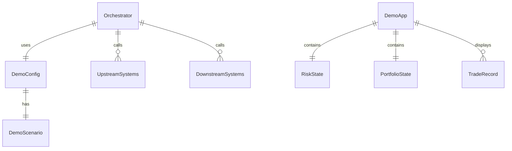

# Technical Design: frictional-bank-demo

## Overview

**Purpose**: FrictionalBank デモは、Neutryx ライブラリの全機能（A-I-P-S アーキテクチャ）を統合した仮想銀行システムのデモンストレーションを提供する。外部システム（upstream/downstream）との連携を含む End-to-End のデータフローを実演し、Tier-1 銀行向けデリバティブプライシングライブラリとしての実用性を示す。

**Users**: デモ運用者、クオンツアナリスト、システムアーキテクト、潜在顧客がこのデモを通じて Neutryx の機能を評価する。

**Impact**: 既存の Neutryx クレート群を統合し、新たに `frictional_bank` オーケストレーター、`demo_gui` TUI、サンプルデータ、Jupyter ノートブックを追加する。

### Goals

- Neutryx の A-I-P-S アーキテクチャを実証する統合デモを構築
- EOD バッチ、イントラデイ、ストレステストの 3 シナリオを CLI から実行可能に
- ratatui ベースの TUI ダッシュボードでリアルタイムリスク可視化
- service_python を通じた Jupyter ノートブックでのクオンツ分析デモ

### Non-Goals

- 本番環境向けの高可用性・スケーラビリティ（デモ目的）
- Web GUI の完全実装（TUI 優先、Web はオプション）
- 外部 DB 永続化（インメモリまたはファイルベース）
- pricer_pricing (Enzyme) の必須化（stable-only モードをデフォルト）

---

## Architecture

### Existing Architecture Analysis

Neutryx は A-I-P-S 一方向データフローアーキテクチャを採用済み：

- **A**dapter: adapter_feeds, adapter_fpml, adapter_loader（完全実装）
- **I**nfra: infra_config, infra_master, infra_store（完全実装）
- **P**ricer: pricer_core → pricer_models → pricer_optimiser → pricer_pricing → pricer_risk（完全実装）
- **S**ervice: service_cli, service_gateway, service_python（部分実装）

Demo クレートとして upstream_systems, downstream_systems が既に実装済み。

### Architecture Pattern & Boundary Map

**Selected Pattern**: Orchestrator パターン

frictional_bank クレートが全デモシナリオを制御し、upstream → Adapter → Infra → Pricer → Service → downstream のデータフローをオーケストレーションする。



**Architecture Integration**:

- **Selected pattern**: Orchestrator パターン — frictional_bank が全フローを制御
- **Domain boundaries**: Demo クレートは Service 層を経由してのみ Pricer にアクセス
- **Existing patterns preserved**: A-I-P-S 一方向データフロー、static dispatch
- **New components rationale**:
  - `frictional_bank`: シナリオ制御とワークフローオーケストレーション
  - `demo_gui`: 可視化専用、service_gateway API のみ使用
- **Steering compliance**: A-I-P-S 依存ルール遵守

### Technology Stack

| Layer | Choice / Version | Role in Feature | Notes |
|-------|------------------|-----------------|-------|
| Frontend / CLI | ratatui 0.30, clap 4.4 | TUI ダッシュボード、CLI コマンド | 既存 service_cli パターン踏襲 |
| Backend / Services | axum 0.7 (ws feature), tokio 1.42 | WebSocket リアルタイム配信 | service_gateway 拡張 |
| Data / Storage | serde_json, csv | サンプルデータ読み書き | 外部 DB 不使用 |
| Messaging / Events | async-channel, tokio broadcast | 非同期イベント配信 | upstream/downstream で既使用 |
| Infrastructure / Runtime | Rust stable / nightly optional | pricer_pricing optional | feature flag で制御 |

---

## System Flows

### EOD Batch Flow



**Key Decisions**:
- バッチ処理は同期実行、全フロー完了後にサマリー表示
- エラー発生時は処理継続し、最終サマリーでエラー件数報告

### Intraday Real-time Flow



**Key Decisions**:
- WebSocket で GUI とリスクダッシュボードに同時配信
- 100ms 間隔でマーケットデータ更新（configurable）

---

## Requirements Traceability

| Requirement | Summary | Components | Interfaces | Flows |
|-------------|---------|------------|------------|-------|
| 1.1-1.6 | Upstream Systems | upstream_systems (既存) | MarketDataProvider, TradeSource, FileSource | EOD, Intraday |
| 2.1-2.6 | Downstream Systems | downstream_systems (既存) | RegulatorApi, SwiftReceiver, WebSocketSink | EOD, Intraday |
| 3.1-3.6 | Orchestrator | frictional_bank | Orchestrator, DemoConfig | EOD, Intraday, Stress |
| 4.1-4.7 | GUI | demo_gui | DemoApp, PortfolioView, RiskView | Intraday |
| 5.1-5.5 | Sample Data | demo/data/ | File structure | EOD |
| 6.1-6.6 | Jupyter Notebooks | demo/notebooks/, service_python | PyO3 bindings | N/A |
| 7.1-7.6 | A-I-P-S Integration | All Neutryx crates | Existing interfaces | All |
| 8.1-8.5 | Workspace Integration | Cargo.toml | Workspace config | Build |
| 9.1-9.5 | Demo Execution | frictional_bank CLI | ScenarioRunner | All |

---

## Components and Interfaces

### Summary

| Component | Domain/Layer | Intent | Req Coverage | Key Dependencies | Contracts |
|-----------|--------------|--------|--------------|-----------------|-----------|
| frictional_bank | Demo/Orchestrator | デモシナリオ制御 | 3.1-3.6, 9.1-9.5 | upstream_systems (P0), service_gateway (P0) | Service |
| demo_gui | Demo/UI | TUI ダッシュボード | 4.1-4.7 | service_gateway (P0), ratatui (P0) | State |
| service_gateway (拡張) | Service | WebSocket 追加 | 2.4, 4.6 | axum (P0), tokio (P0) | API |
| demo/data/ | Demo/Data | サンプルデータ | 5.1-5.5 | None | File |
| demo/notebooks/ | Demo/Python | Jupyter デモ | 6.1-6.6 | service_python (P0) | N/A |

---

### Demo / Orchestrator Layer

#### frictional_bank

| Field | Detail |
|-------|--------|
| Intent | デモシナリオのオーケストレーションと CLI インターフェース |
| Requirements | 3.1, 3.2, 3.3, 3.4, 3.5, 3.6, 9.1, 9.2, 9.3, 9.4, 9.5 |

**Responsibilities & Constraints**

- EOD バッチ、イントラデイ、ストレステストの 3 シナリオを制御
- upstream_systems → Adapter → Infra → Pricer → Service → downstream_systems のデータフローを管理
- demo_config.toml から設定を読み込み
- A-I-P-S 依存ルールに違反しない（全 Neutryx クレートに依存可能）

**Dependencies**

- Inbound: None（エントリーポイント）
- Outbound: upstream_systems — データ生成 (P0)
- Outbound: service_gateway — API アクセス (P0)
- Outbound: downstream_systems — 結果配信 (P0)
- Outbound: 全 Neutryx adapter_*, infra_*, pricer_*, service_* — 統合 (P0)
- External: clap — CLI 引数解析 (P0)
- External: tokio — 非同期ランタイム (P0)

**Contracts**: Service [x] / API [ ] / Event [ ] / Batch [ ] / State [ ]

##### Service Interface

```rust
/// デモシナリオの種類
pub enum DemoScenario {
    /// EOD バッチ処理
    Eod,
    /// イントラデイリアルタイム
    Intraday,
    /// ストレステスト
    Stress,
}

/// デモ設定
pub struct DemoConfig {
    pub scenario: DemoScenario,
    pub data_dir: PathBuf,
    pub output_dir: PathBuf,
    pub market_update_interval_ms: u64,
    pub enable_gui: bool,
    pub enable_enzyme: bool,
}

/// オーケストレーター
pub struct Orchestrator {
    config: DemoConfig,
    upstream: UpstreamSystems,
    gateway_client: GatewayClient,
    downstream: DownstreamSystems,
}

impl Orchestrator {
    /// 新規オーケストレーター作成
    pub fn new(config: DemoConfig) -> Result<Self, DemoError>;

    /// EOD バッチシナリオ実行
    pub async fn run_eod(&self) -> Result<EodSummary, DemoError>;

    /// イントラデイシナリオ実行
    pub async fn run_intraday(&self) -> Result<(), DemoError>;

    /// ストレステストシナリオ実行
    pub async fn run_stress(&self) -> Result<StressSummary, DemoError>;
}
```

- Preconditions: config が有効、data_dir にサンプルデータ存在
- Postconditions: シナリオ完了後に結果サマリーを返却
- Invariants: A-I-P-S データフロー順序を維持

**Implementation Notes**

- Integration: clap サブコマンドで `eod`, `intraday`, `stress` を選択
- Validation: 起動時に config と data_dir を検証
- Risks: pricer_pricing 未ビルド時は Enzyme 機能無効化

---

### Demo / UI Layer

#### demo_gui

| Field | Detail |
|-------|--------|
| Intent | ratatui ベースの TUI ダッシュボードでリアルタイムリスク可視化 |
| Requirements | 4.1, 4.2, 4.3, 4.4, 4.5, 4.6 |

**Responsibilities & Constraints**

- PortfolioView: ポートフォリオ構成と評価額表示
- RiskView: XVA メトリクス（CVA, DVA, FVA）とエクスポージャー（EE, EPE, PFE）表示
- TradeBlotter: 取引一覧と状態表示
- Charts: 価格推移・リスク推移のチャート描画
- service_gateway の REST/WebSocket API のみ使用（直接 Pricer に依存しない）

**Dependencies**

- Inbound: frictional_bank — GUI 起動 (P1)
- Outbound: service_gateway — REST/WebSocket API (P0)
- External: ratatui — TUI フレームワーク (P0)
- External: crossterm — ターミナル制御 (P0)
- External: tokio — 非同期ランタイム (P0)

**Contracts**: Service [ ] / API [ ] / Event [ ] / Batch [ ] / State [x]

##### State Management

```rust
/// TUI アプリケーション状態
pub struct DemoApp {
    /// 現在のタブ
    pub current_tab: Tab,
    /// ポートフォリオデータ
    pub portfolio: PortfolioState,
    /// リスクメトリクス
    pub risk_metrics: RiskState,
    /// 取引一覧
    pub trades: Vec<TradeRecord>,
    /// チャートデータ
    pub chart_data: ChartState,
    /// WebSocket 接続状態
    pub ws_connected: bool,
}

pub enum Tab {
    Portfolio,
    Risk,
    Trades,
    Charts,
}

pub struct RiskState {
    pub cva: f64,
    pub dva: f64,
    pub fva: f64,
    pub ee: Vec<f64>,
    pub epe: f64,
    pub pfe_95: Vec<f64>,
    pub last_updated: DateTime<Utc>,
}
```

- State model: 単一 DemoApp 構造体でアプリケーション状態を集約
- Persistence: なし（セッション中のみ）
- Concurrency: tokio::sync::RwLock で WebSocket 更新とレンダリングを同期

**Implementation Notes**

- Integration: `ratatui::run()` でイベントループ開始
- Validation: WebSocket 切断時は再接続を試行、UI にステータス表示
- Risks: ターミナルサイズ小さい場合のレイアウト崩れ → 最小サイズチェック

---

### Service Layer (Extension)

#### service_gateway WebSocket Extension

| Field | Detail |
|-------|--------|
| Intent | リアルタイムリスクメトリクス配信用 WebSocket エンドポイント追加 |
| Requirements | 2.4, 4.6 |

**Responsibilities & Constraints**

- `/ws/risk` エンドポイントで WebSocket 接続を受け付け
- リスクメトリクス更新を接続クライアントに broadcast
- 既存 REST API に影響を与えない

**Dependencies**

- Inbound: demo_gui — WebSocket クライアント (P0)
- Inbound: downstream_systems — WebSocketSink 統合 (P1)
- Outbound: pricer_risk — リスクメトリクス取得 (P0)
- External: axum (ws feature) — WebSocket サポート (P0)

**Contracts**: Service [ ] / API [x] / Event [ ] / Batch [ ] / State [ ]

##### API Contract

| Method | Endpoint | Request | Response | Errors |
|--------|----------|---------|----------|--------|
| GET (Upgrade) | /ws/risk | WebSocket Upgrade | WebSocket Connection | 400, 500 |

##### WebSocket Message Protocol

```rust
/// WebSocket メッセージ（downstream_systems::WebSocketMessage と互換）
#[derive(Serialize, Deserialize)]
#[serde(tag = "type", content = "data")]
pub enum WsMessage {
    /// リスクメトリクス更新
    RiskUpdate(RiskMetrics),
    /// ハートビート
    Heartbeat { timestamp: i64 },
    /// エラー
    Error { message: String },
}

#[derive(Serialize, Deserialize)]
pub struct RiskMetrics {
    pub cva: f64,
    pub dva: f64,
    pub fva: f64,
    pub epe: f64,
    pub ene: f64,
    pub timestamp: i64,
}
```

**Implementation Notes**

- Integration: `Router::new().route("/ws/risk", any(ws_handler))` で追加
- Validation: 接続時に認証なし（デモ用）
- Risks: 多数接続時のブロードキャストパフォーマンス → tokio broadcast channel 使用

---

### Demo / Data Layer

#### demo/data/

| Field | Detail |
|-------|--------|
| Intent | デモ実行に必要なサンプルデータを提供 |
| Requirements | 5.1, 5.2, 5.3, 5.4, 5.5 |

**Directory Structure**

```text
demo/data/
├── input/
│   ├── trades/
│   │   ├── equity_trades.csv
│   │   ├── rates_trades.csv
│   │   ├── fx_trades.csv
│   │   └── cds_trades.xml
│   ├── market_data/
│   │   ├── yield_curves.csv
│   │   ├── vol_surfaces.csv
│   │   ├── credit_spreads.csv
│   │   └── fx_spots.csv
│   └── counterparties/
│       ├── counterparties.csv
│       ├── netting_sets.csv
│       └── csa_contracts.csv
├── config/
│   ├── demo_config.toml
│   ├── holidays.csv
│   └── currencies.csv
└── output/
    ├── reports/
    ├── settlement/
    └── regulatory/
```

**Implementation Notes**

- 静的ファイルとして作成、runtime 生成なし
- CSV は adapter_loader でロード可能な形式
- XML は FpML 形式で adapter_fpml でパース可能

---

## Data Models

### Domain Model



**Aggregates**:
- `Orchestrator`: デモ実行の集約ルート
- `DemoApp`: TUI 状態の集約ルート

**Domain Events**:
- `RiskMetricsUpdated`: リスクメトリクス更新時に WebSocket 配信
- `TradeBooked`: 取引ブッキング時にポートフォリオ更新

---

## Error Handling

### Error Strategy

Demo 用途のため、エラーは可能な限りユーザーフレンドリーに表示し、処理継続を優先する。

### Error Categories and Responses

**User Errors (4xx)**:
- 無効な設定ファイル → 設定例を表示して終了
- サンプルデータ不足 → 不足ファイルを一覧表示

**System Errors (5xx)**:
- WebSocket 切断 → 自動再接続（3 回まで）
- pricer_pricing 未ビルド → stable-only モードで継続

**Business Logic Errors (422)**:
- 価格計算失敗 → 該当取引をスキップ、サマリーで報告

### Monitoring

- tracing クレートでログ出力
- デモ終了時に実行サマリー（成功/失敗件数）表示

---

## Testing Strategy

### Unit Tests

- `Orchestrator::new()` の設定検証
- `DemoApp` 状態遷移のテスト
- WebSocket メッセージのシリアライゼーション

### Integration Tests

- EOD シナリオの End-to-End 実行
- WebSocket 接続と RiskMetrics 受信
- upstream_systems → downstream_systems データフロー

### E2E Tests

- `cargo run -p frictional_bank -- eod` の正常終了確認
- TUI 起動と基本操作（タブ切替）

---

## Optional Sections

### Performance & Scalability

**Target Metrics**:
- TUI レンダリング: 60 FPS 維持
- WebSocket 遅延: < 100ms
- EOD バッチ: 1000 取引を 10 秒以内

**Optimisation**:
- ratatui の差分レンダリング活用
- tokio broadcast channel で効率的な配信
