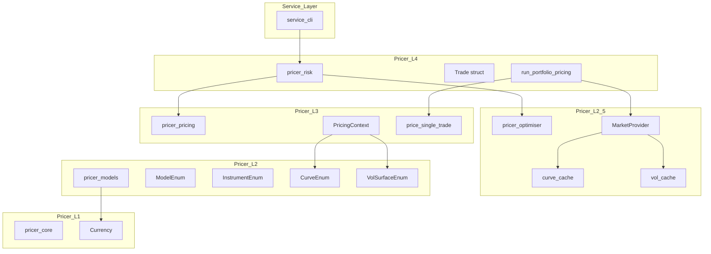
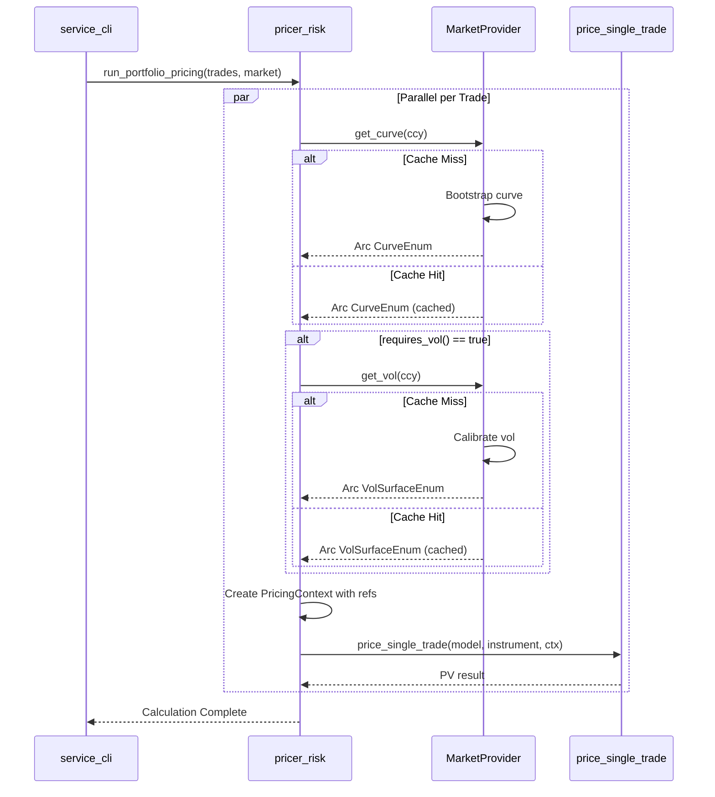
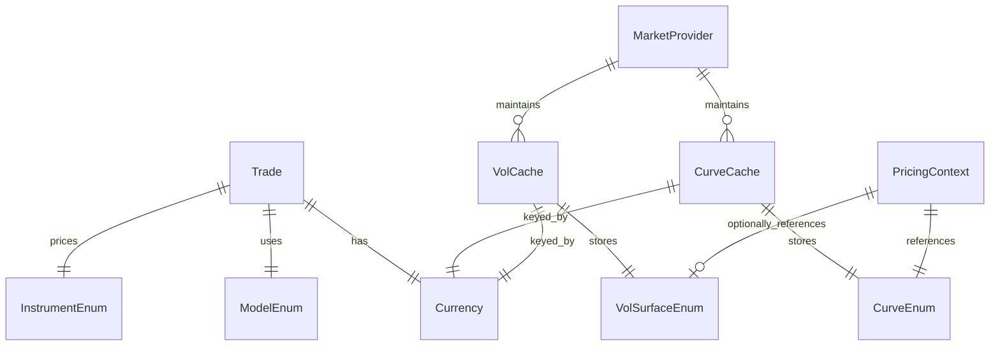

# Technical Design Document

## Overview

**Purpose**: 本機能は、A-I-P-S構造、3段ロケットパターン、遅延評価、およびArcキャッシュを統合した最小構成のポートフォリオプライシング実装を提供する。

**Users**: 開発者およびアーキテクトが、アーキテクチャパターンの効果をログ出力で検証可能とする。

**Impact**: 既存の pricer_models, pricer_optimiser, pricer_pricing, pricer_risk, service_cli に新規モジュールを追加。既存コードへの破壊的変更なし。

### Goals
- 3段ロケットパターン（定義 → リンク → 実行）の実証
- Pull-then-Push 実行パターンの実装
- Arc キャッシュによるオブジェクト共有の検証
- ログ出力による遅延評価の可視化

### Non-Goals
- 本番用の完全な金利モデル実装
- 既存 `CurveEnum<T: Float>` との統合（Phase 2）
- Enzyme AD 互換性（本デモは `f64` 固定）
- 永続化やシリアライズ

## Architecture

### Existing Architecture Analysis

本機能は既存 A-I-P-S アーキテクチャに準拠する:

- **pricer_core (L1)**: `Currency` enum を再利用
- **pricer_models (L2)**: 簡易版 Model/Instrument/Curve/Vol enum を追加
- **pricer_optimiser (L2.5)**: `MarketProvider` を新規追加
- **pricer_pricing (L3)**: `PricingContext` と `price_single_trade` を新規追加
- **pricer_risk (L4)**: `Trade` と `run_portfolio_pricing` を新規追加

### Architecture Pattern & Boundary Map



**Architecture Integration**:
- **Selected pattern**: Pull-then-Push（準備フェーズで遅延取得、実行フェーズでカーネル呼び出し）
- **Domain boundaries**: L2（型定義） / L2.5（キャッシュ） / L3（計算） / L4（オーケストレーション）
- **Existing patterns preserved**: 静的ディスパッチ enum、A-I-P-S 依存性規則
- **New components rationale**: 最小構成でアーキテクチャパターンを検証
- **Steering compliance**: 一方向データフロー、British English 命名規則

### Technology Stack

| Layer | Choice / Version | Role in Feature | Notes |
|-------|------------------|-----------------|-------|
| Backend / Services | Rust Edition 2021 | 全コンポーネント | Stable toolchain で動作 |
| Parallelisation | rayon 1.x | ポートフォリオ並列処理 | workspace 依存として既存 |
| Concurrency | std::sync (RwLock, Arc) | スレッドセーフキャッシュ | 標準ライブラリのみ |

## System Flows

### Portfolio Pricing Flow



**Key Decisions**:
- 各トレードは独立して並列処理可能
- `PricingContext` は Arc から借用した参照を保持
- Vol は `requires_vol()` が true の場合のみ取得

## Requirements Traceability

| Requirement | Summary | Components | Interfaces | Flows |
|-------------|---------|------------|------------|-------|
| 1.1 | ModelEnum 提供 | pricer_models | ModelEnum | - |
| 1.2 | InstrumentEnum 提供 | pricer_models | InstrumentEnum | - |
| 1.3-1.4 | requires_vol() メソッド | pricer_models | InstrumentEnum::requires_vol() | - |
| 1.5-1.6 | CurveEnum, VolSurfaceEnum 提供 | pricer_models | CurveEnum, VolSurfaceEnum | - |
| 1.7 | Currency enum | pricer_core (既存) | Currency | - |
| 2.1-2.2 | キャッシュ構造 | pricer_optimiser | MarketProvider | - |
| 2.3-2.6 | 遅延評価 get_curve/get_vol | pricer_optimiser | MarketProvider | Portfolio Pricing |
| 2.7 | Double-check locking | pricer_optimiser | MarketProvider | - |
| 3.1-3.2 | PricingContext 参照 | pricer_pricing | PricingContext | - |
| 3.3-3.6 | price_single_trade | pricer_pricing | price_single_trade() | Portfolio Pricing |
| 4.1-4.7 | Trade, オーケストレーション | pricer_risk | Trade, run_portfolio_pricing() | Portfolio Pricing |
| 5.1-5.5 | ログ出力 | pricer_optimiser | - | Portfolio Pricing |
| 6.1-6.5 | 依存性規則 | 全コンポーネント | Cargo.toml | - |

## Components and Interfaces

| Component | Domain/Layer | Intent | Req Coverage | Key Dependencies | Contracts |
|-----------|--------------|--------|--------------|------------------|-----------|
| demo module (pricer_models) | L2 | デモ用 enum 定義 | 1.1-1.6 | pricer_core (P0) | Service |
| MarketProvider | L2.5 | 遅延評価キャッシュ | 2.1-2.7, 5.1-5.2 | pricer_models (P0) | Service, State |
| PricingContext | L3 | 軽量コンテキスト | 3.1-3.2 | pricer_models (P0) | Service |
| price_single_trade | L3 | プライシングカーネル | 3.3-3.6 | pricer_models (P0) | Service |
| Trade | L4 | トレード定義 | 4.1 | pricer_models (P0) | - |
| run_portfolio_pricing | L4 | オーケストレーション | 4.2-4.7, 5.3-5.5 | pricer_optimiser (P0), pricer_pricing (P0), rayon (P1) | Service |

### Pricer Layer L2 (pricer_models)

#### demo module

| Field | Detail |
|-------|--------|
| Intent | 最小構成デモ用の enum 定義（本番では既存型を使用） |
| Requirements | 1.1, 1.2, 1.3, 1.4, 1.5, 1.6 |

**Responsibilities & Constraints**
- 3段ロケット第1段：純粋なデータ構造定義
- 静的ディスパッチによる型分岐
- `f64` 固定（AD 非互換だがデモ目的には十分）

**Dependencies**
- Inbound: None
- Outbound: pricer_core::types::Currency (P0)
- External: None

**Contracts**: Service [x]

##### Service Interface

```rust
// --- Models (State Evolution) ---
pub struct BlackScholes { pub vol: f64 }
pub struct HullWhite { pub mean_rev: f64, pub vol: f64 }

pub enum ModelEnum {
    BlackScholes(BlackScholes),
    HullWhite(HullWhite),
}

impl ModelEnum {
    /// 状態遷移を適用（簡略化）
    pub fn evolve(&self, state: &mut f64);
}

// --- Instruments (Payoffs) ---
pub struct VanillaSwap { pub fixed_rate: f64 }
pub struct CmsSwap { pub fixed_rate: f64 }

pub enum InstrumentEnum {
    VanillaSwap(VanillaSwap),
    CmsSwap(CmsSwap),
}

impl InstrumentEnum {
    /// Volatility 依存性を判定
    /// - Preconditions: None
    /// - Postconditions: VanillaSwap -> false, CmsSwap -> true
    pub fn requires_vol(&self) -> bool;
}

// --- Market Objects ---
pub struct FlatCurve { pub rate: f64 }
pub struct SabrVolSurface { pub alpha: f64 }

pub enum CurveEnum { Flat(FlatCurve) }
pub enum VolSurfaceEnum { Sabr(SabrVolSurface) }

impl CurveEnum {
    /// Discount factor を計算
    /// - Preconditions: t >= 0
    /// - Postconditions: 0 < result <= 1
    pub fn get_df(&self, t: f64) -> f64;
}
```

### Pricer Layer L2.5 (pricer_optimiser)

#### MarketProvider

| Field | Detail |
|-------|--------|
| Intent | スレッドセーフな遅延評価キャッシュ機構 |
| Requirements | 2.1, 2.2, 2.3, 2.4, 2.5, 2.6, 2.7, 5.1, 5.2 |

**Responsibilities & Constraints**
- Pull メカニズムの実装
- Arc によるゼロコピー共有
- Double-check locking で重複構築を防止
- 構築時にログ出力（可観測性）

**Dependencies**
- Inbound: pricer_risk (P0)
- Outbound: pricer_models::demo (P0)
- External: std::sync::{Arc, RwLock} (P0)

**Contracts**: Service [x] / State [x]

##### Service Interface

```rust
use std::collections::HashMap;
use std::sync::{Arc, RwLock};
use pricer_core::types::Currency;
use crate::demo::{CurveEnum, VolSurfaceEnum};

pub struct MarketProvider {
    curve_cache: RwLock<HashMap<Currency, Arc<CurveEnum>>>,
    vol_cache: RwLock<HashMap<Currency, Arc<VolSurfaceEnum>>>,
}

impl MarketProvider {
    /// 新規 MarketProvider を作成
    pub fn new() -> Self;

    /// Yield Curve を取得（遅延構築）
    /// - Preconditions: None
    /// - Postconditions:
    ///   - Cache hit: 即座に Arc を返却、ログなし
    ///   - Cache miss: Bootstrap 実行、ログ出力、キャッシュ格納
    /// - Invariants: 同一 Currency に対する構築は1回のみ
    pub fn get_curve(&self, ccy: Currency) -> Arc<CurveEnum>;

    /// Volatility Surface を取得（遅延構築）
    /// - Preconditions: None
    /// - Postconditions:
    ///   - Cache hit: 即座に Arc を返却、ログなし
    ///   - Cache miss: Calibration 実行、ログ出力、キャッシュ格納
    /// - Invariants: 同一 Currency に対する構築は1回のみ
    pub fn get_vol(&self, ccy: Currency) -> Arc<VolSurfaceEnum>;
}
```

##### State Management

- **State model**: `HashMap<Currency, Arc<T>>` per cache type
- **Persistence & consistency**: In-memory only, process lifetime
- **Concurrency strategy**: RwLock with double-check locking pattern

**Implementation Notes**
- Integration: 既存 `pricer_optimiser/src/` に `provider.rs` を追加
- Validation: Cache miss 時のログ出力で構築を検証
- Risks: 並列アクセス時のデッドロック回避（取得順序統一）

### Pricer Layer L3 (pricer_pricing)

#### PricingContext

| Field | Detail |
|-------|--------|
| Intent | 軽量参照コンテキスト（HashMap 検索なし） |
| Requirements | 3.1, 3.2 |

**Responsibilities & Constraints**
- 3段ロケット第2段：Arc から借用した参照を保持
- ゼロコスト抽象化（参照のみ）
- ライフタイム `'a` で借用関係を明示

**Dependencies**
- Inbound: pricer_risk (P0)
- Outbound: pricer_models::demo (P0)
- External: None

**Contracts**: Service [x]

##### Service Interface

```rust
use crate::demo::{CurveEnum, VolSurfaceEnum};

pub struct PricingContext<'a> {
    pub discount_curve: &'a CurveEnum,
    pub adjustment_vol: Option<&'a VolSurfaceEnum>,
}
```

#### price_single_trade

| Field | Detail |
|-------|--------|
| Intent | プライシングカーネル（ホットループ） |
| Requirements | 3.3, 3.4, 3.5, 3.6 |

**Responsibilities & Constraints**
- 3段ロケット第3段：純粋な計算ロジック
- HashMap 検索や動的アロケーションを禁止
- 静的ディスパッチのみ

**Dependencies**
- Inbound: pricer_risk (P0)
- Outbound: pricer_models::demo (P0)
- External: None

**Contracts**: Service [x]

##### Service Interface

```rust
use crate::demo::{ModelEnum, InstrumentEnum, CurveEnum, VolSurfaceEnum};

/// 単一トレードの PV を計算
/// - Preconditions: ctx.adjustment_vol is Some when instrument.requires_vol()
/// - Postconditions: Returns discounted payoff value
/// - Invariants: No HashMap lookups, no dynamic allocation
pub fn price_single_trade(
    model: &ModelEnum,
    instrument: &InstrumentEnum,
    ctx: &PricingContext,
) -> f64;
```

### Pricer Layer L4 (pricer_risk)

#### Trade

| Field | Detail |
|-------|--------|
| Intent | トレード定義構造体 |
| Requirements | 4.1 |

**Responsibilities & Constraints**
- トレード識別子、通貨、モデル、商品を保持

**Contracts**: (Data struct only)

##### Service Interface

```rust
use pricer_core::types::Currency;
use pricer_models::demo::{ModelEnum, InstrumentEnum};

pub struct Trade {
    pub id: String,
    pub ccy: Currency,
    pub model: ModelEnum,
    pub instrument: InstrumentEnum,
}
```

#### run_portfolio_pricing

| Field | Detail |
|-------|--------|
| Intent | Pull-then-Push オーケストレーション |
| Requirements | 4.2, 4.3, 4.4, 4.5, 4.6, 4.7, 5.3, 5.4, 5.5 |

**Responsibilities & Constraints**
- Phase 1 (Pull): MarketProvider から依存データを遅延取得
- Phase 2 (Push): PricingContext を構築しカーネルに渡す
- Rayon による並列実行

**Dependencies**
- Inbound: service_cli (P0)
- Outbound: pricer_optimiser::MarketProvider (P0), pricer_pricing (P0)
- External: rayon (P1)

**Contracts**: Service [x]

##### Service Interface

```rust
use pricer_optimiser::MarketProvider;

/// ポートフォリオの並列プライシングを実行
/// - Preconditions: trades is not empty
/// - Postconditions: All trades processed, logs emitted for cache misses
pub fn run_portfolio_pricing(trades: &[Trade], market: &MarketProvider);
```

## Data Models

### Domain Model



**Aggregates and Boundaries**:
- `Trade`: 独立したエンティティ、他トレードと共有状態なし
- `MarketProvider`: キャッシュの集約ルート
- `PricingContext`: 一時的な値オブジェクト（トレードごとに生成・破棄）

**Business Rules**:
- `CmsSwap` は必ず `VolSurfaceEnum` を要求
- 同一 Currency のカーブ/Vol は共有される

## Error Handling

### Error Strategy

本デモでは簡略化のため `unwrap()` を使用。本番統合時は `Result<T, E>` パターンを適用。

### Error Categories

- **Concurrency Errors**: RwLock poisoning → panic（デモでは許容）
- **Business Logic Errors**: requires_vol() mismatch → Option::None フォールバック

## Testing Strategy

### Unit Tests
- `ModelEnum::evolve` の状態遷移
- `InstrumentEnum::requires_vol()` の戻り値
- `CurveEnum::get_df()` の計算精度
- `MarketProvider::get_curve/get_vol` のキャッシュ動作

### Integration Tests
- `run_portfolio_pricing` のログ出力パターン検証
- 並列実行時のキャッシュ整合性
- Arc 参照カウントの検証

### Performance Tests
- 1000トレード並列処理のスループット
- キャッシュヒット率の測定

## Optional Sections

### Performance & Scalability

- **Target**: 1000トレード/秒（単一ノード）
- **Scaling**: Rayon による CPU コア並列化
- **Caching**: 通貨ごとに Arc キャッシュで O(1) 参照取得
