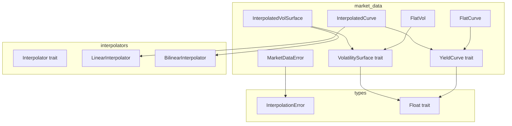

# Design Document: Market Data Structures

## Overview

**Purpose**: 本機能は、定量金融プライシングのためのイールドカーブとボラティリティサーフェス抽象化を提供する。

**Users**: クオンツ開発者がオプション・金利デリバティブのプライシングモデルで使用する。

**Impact**: `pricer_core` crate に新規 `market_data` モジュールを追加し、既存の interpolators インフラストラクチャと統合する。

### Goals
- YieldCurve trait と FlatCurve / InterpolatedCurve 実装の提供
- VolatilitySurface trait と FlatVol / InterpolatedVolSurface 実装の提供
- `T: Float` ジェネリクスによる Enzyme AD 互換性の確保
- 既存 `pricer_core::math::interpolators` との統合

### Non-Goals
- Term structure bootstrapping（将来フェーズ）
- SABR / SVI 等のパラメトリック Vol モデル
- Real-time market data feed 連携

## Architecture

### Existing Architecture Analysis

既存アーキテクチャ:
- `pricer_core::math::interpolators`: `Interpolator<T>` trait、`LinearInterpolator`、`BilinearInterpolator`
- `pricer_core::types::error`: `InterpolationError`、`PricingError`
- `pricer_core::traits`: `Float` trait (num_traits からの re-export)

統合ポイント:
- `InterpolatedCurve` は内部で `LinearInterpolator` を利用
- `InterpolatedVolSurface` は内部で `BilinearInterpolator` を利用
- `MarketDataError` は `InterpolationError` からの変換を提供

### Architecture Pattern & Boundary Map



**Architecture Integration**:
- Selected pattern: Trait-based polymorphism with concrete implementations (Box<dyn> 禁止、Enzyme 互換)
- Domain boundaries: `market_data` モジュールが curves/surfaces を所有、interpolators は再利用
- Existing patterns preserved: `T: Float` ジェネリクス、Result-based エラーハンドリング
- New components rationale: 市場データ抽象化はプライシングロジックから分離すべき
- Steering compliance: 静的 dispatch、AD 互換性維持

### Technology Stack

| Layer | Choice / Version | Role in Feature | Notes |
|-------|------------------|-----------------|-------|
| Core | Rust stable | 実装言語 | pricer_core は stable Rust のみ |
| Numerics | num-traits 0.2 | Float trait 提供 | 既存依存 |
| Error | thiserror 1.x | エラー derive macro | 既存パターン踏襲 |

## Requirements Traceability

| Requirement | Summary | Components | Interfaces | Flows |
|-------------|---------|------------|------------|-------|
| 1.1-1.5 | YieldCurve trait 定義 | YieldCurve | discount_factor, zero_rate, forward_rate | - |
| 2.1-2.5 | FlatCurve 実装 | FlatCurve | YieldCurve trait | - |
| 3.1-3.6 | InterpolatedCurve 実装 | InterpolatedCurve | YieldCurve trait | Pillar interpolation |
| 4.1-4.5 | VolatilitySurface trait 定義 | VolatilitySurface | volatility, domain | - |
| 5.1-5.4 | FlatVol 実装 | FlatVol | VolatilitySurface trait | - |
| 6.1-6.6 | InterpolatedVolSurface 実装 | InterpolatedVolSurface | VolatilitySurface trait | 2D interpolation |
| 7.1-7.5 | MarketDataError 定義 | MarketDataError | From<InterpolationError> | - |
| 8.1-8.5 | Generic 互換性 | All | T: Float | AD propagation |

## Components and Interfaces

| Component | Domain/Layer | Intent | Req Coverage | Key Dependencies | Contracts |
|-----------|--------------|--------|--------------|------------------|-----------|
| YieldCurve | market_data/trait | 割引因子・レート計算インターフェース | 1.1-1.5 | Float (P0) | Service |
| FlatCurve | market_data/impl | 定数レートカーブ | 2.1-2.5 | YieldCurve (P0) | Service |
| InterpolatedCurve | market_data/impl | 補間ベースカーブ | 3.1-3.6 | YieldCurve (P0), LinearInterpolator (P0) | Service |
| VolatilitySurface | market_data/trait | Vol 検索インターフェース | 4.1-4.5 | Float (P0) | Service |
| FlatVol | market_data/impl | 定数 Vol サーフェス | 5.1-5.4 | VolatilitySurface (P0) | Service |
| InterpolatedVolSurface | market_data/impl | 補間ベース Vol サーフェス | 6.1-6.6 | VolatilitySurface (P0), BilinearInterpolator (P0) | Service |
| MarketDataError | market_data/error | 市場データエラー型 | 7.1-7.5 | InterpolationError (P1) | - |

### market_data/trait

#### YieldCurve

| Field | Detail |
|-------|--------|
| Intent | 割引因子、ゼロレート、フォワードレート計算の統一インターフェース |
| Requirements | 1.1, 1.2, 1.3, 1.4, 1.5 |

**Responsibilities & Constraints**
- 時間 t に対する割引因子 D(t) の計算
- ゼロレート r(t) の導出: r(t) = -ln(D(t))/t
- フォワードレート f(t1, t2) の導出
- 負の満期に対するエラーハンドリング

**Dependencies**
- Inbound: None
- Outbound: None
- External: num_traits::Float — ジェネリック数値演算 (P0)

**Contracts**: Service [x]

##### Service Interface
```rust
/// Generic yield curve trait for discount factor and rate calculations.
///
/// All implementations must be generic over `T: Float` for AD compatibility.
pub trait YieldCurve<T: Float> {
    /// Return the discount factor for maturity `t`.
    ///
    /// # Arguments
    /// * `t` - Time to maturity in years (must be >= 0)
    ///
    /// # Returns
    /// * `Ok(D(t))` - Discount factor at time t
    /// * `Err(MarketDataError::InvalidMaturity)` - If t < 0
    fn discount_factor(&self, t: T) -> Result<T, MarketDataError>;

    /// Return the continuously compounded zero rate for maturity `t`.
    ///
    /// Default implementation: r(t) = -ln(D(t)) / t
    fn zero_rate(&self, t: T) -> Result<T, MarketDataError> {
        let df = self.discount_factor(t)?;
        if t <= T::zero() {
            return Err(MarketDataError::InvalidMaturity { t: t.to_f64().unwrap_or(0.0) });
        }
        Ok(-df.ln() / t)
    }

    /// Return the forward rate between t1 and t2.
    ///
    /// Default implementation: f(t1,t2) = -ln(D(t2)/D(t1)) / (t2 - t1)
    fn forward_rate(&self, t1: T, t2: T) -> Result<T, MarketDataError> {
        let df1 = self.discount_factor(t1)?;
        let df2 = self.discount_factor(t2)?;
        let dt = t2 - t1;
        if dt <= T::zero() {
            return Err(MarketDataError::InvalidMaturity { t: dt.to_f64().unwrap_or(0.0) });
        }
        Ok(-(df2 / df1).ln() / dt)
    }
}
```

- Preconditions: t >= 0 for discount_factor; t > 0 for zero_rate; t2 > t1 for forward_rate
- Postconditions: D(0) = 1; D(t) > 0 for all t >= 0
- Invariants: D(t1) >= D(t2) for t1 <= t2 (no arbitrage)

#### VolatilitySurface

| Field | Detail |
|-------|--------|
| Intent | ストライク/満期によるインプライドボラティリティ検索 |
| Requirements | 4.1, 4.2, 4.3, 4.4, 4.5 |

**Responsibilities & Constraints**
- (strike, expiry) に対するボラティリティ σ(K, T) の取得
- 有効ドメインの提供
- 境界外クエリに対するエラーハンドリング

**Dependencies**
- Inbound: None
- Outbound: None
- External: num_traits::Float — ジェネリック数値演算 (P0)

**Contracts**: Service [x]

##### Service Interface
```rust
/// Generic volatility surface trait for implied volatility lookup.
///
/// All implementations must be generic over `T: Float` for AD compatibility.
pub trait VolatilitySurface<T: Float> {
    /// Return the implied volatility for given strike and expiry.
    ///
    /// # Arguments
    /// * `strike` - Strike price (must be > 0)
    /// * `expiry` - Time to expiry in years (must be > 0)
    ///
    /// # Returns
    /// * `Ok(sigma)` - Implied volatility
    /// * `Err(MarketDataError::InvalidStrike)` - If strike <= 0
    /// * `Err(MarketDataError::OutOfBounds)` - If outside valid domain
    fn volatility(&self, strike: T, expiry: T) -> Result<T, MarketDataError>;

    /// Return the valid strike domain.
    fn strike_domain(&self) -> (T, T);

    /// Return the valid expiry domain.
    fn expiry_domain(&self) -> (T, T);
}
```

- Preconditions: strike > 0, expiry > 0
- Postconditions: sigma > 0
- Invariants: 連続性（補間実装において）

### market_data/impl

#### FlatCurve

| Field | Detail |
|-------|--------|
| Intent | 定数金利による単純イールドカーブ |
| Requirements | 2.1, 2.2, 2.3, 2.4, 2.5 |

**Responsibilities & Constraints**
- 単一の金利パラメータ r を保持
- D(t) = exp(-r * t) を計算
- 全満期に対して同一のゼロレート/フォワードレートを返す

**Dependencies**
- Inbound: Pricing models — YieldCurve として使用 (P0)
- Outbound: None
- External: None

**Contracts**: Service [x]

##### Service Interface
```rust
/// Flat yield curve with constant interest rate.
#[derive(Debug, Clone, Copy)]
pub struct FlatCurve<T: Float> {
    rate: T,
}

impl<T: Float> FlatCurve<T> {
    /// Construct a flat curve with the given constant rate.
    pub fn new(rate: T) -> Self {
        Self { rate }
    }

    /// Return the constant rate.
    pub fn rate(&self) -> T {
        self.rate
    }
}

impl<T: Float> YieldCurve<T> for FlatCurve<T> {
    fn discount_factor(&self, t: T) -> Result<T, MarketDataError> {
        if t < T::zero() {
            return Err(MarketDataError::InvalidMaturity { t: t.to_f64().unwrap_or(0.0) });
        }
        Ok((-self.rate * t).exp())
    }

    // zero_rate and forward_rate use default implementations
    // but can be overridden for efficiency
    fn zero_rate(&self, t: T) -> Result<T, MarketDataError> {
        if t <= T::zero() {
            return Err(MarketDataError::InvalidMaturity { t: t.to_f64().unwrap_or(0.0) });
        }
        Ok(self.rate)
    }

    fn forward_rate(&self, t1: T, t2: T) -> Result<T, MarketDataError> {
        if t2 <= t1 {
            return Err(MarketDataError::InvalidMaturity { t: (t2 - t1).to_f64().unwrap_or(0.0) });
        }
        Ok(self.rate)
    }
}
```

**Implementation Notes**
- Integration: 直接利用可能、依存なし
- Validation: t >= 0 チェック
- Risks: なし（シンプルな実装）

#### InterpolatedCurve

| Field | Detail |
|-------|--------|
| Intent | ピラーポイントによる補間イールドカーブ |
| Requirements | 3.1, 3.2, 3.3, 3.4, 3.5, 3.6 |

**Responsibilities & Constraints**
- テナーとレートのピラーポイントを保持
- 指定された補間方式でゼロレートを補間
- Log-linear 補間オプション（割引因子に対して）

**Dependencies**
- Inbound: Pricing models — YieldCurve として使用 (P0)
- Outbound: LinearInterpolator — レート補間 (P0)
- External: None

**Contracts**: Service [x]

##### Service Interface
```rust
/// Interpolation method for yield curves.
#[derive(Debug, Clone, Copy, PartialEq, Eq)]
pub enum CurveInterpolation {
    /// Linear interpolation on zero rates
    Linear,
    /// Log-linear interpolation on discount factors
    LogLinear,
}

/// Interpolated yield curve using pillar points.
#[derive(Debug, Clone)]
pub struct InterpolatedCurve<T: Float> {
    tenors: Vec<T>,
    rates: Vec<T>,
    method: CurveInterpolation,
    allow_extrapolation: bool,
}

impl<T: Float> InterpolatedCurve<T> {
    /// Construct an interpolated curve from pillar points.
    ///
    /// # Arguments
    /// * `tenors` - Sorted tenor points (years)
    /// * `rates` - Corresponding zero rates
    /// * `method` - Interpolation method
    /// * `allow_extrapolation` - Whether to allow flat extrapolation
    pub fn new(
        tenors: &[T],
        rates: &[T],
        method: CurveInterpolation,
        allow_extrapolation: bool,
    ) -> Result<Self, MarketDataError>;

    /// Return the tenor domain.
    pub fn domain(&self) -> (T, T);
}

impl<T: Float> YieldCurve<T> for InterpolatedCurve<T> {
    fn discount_factor(&self, t: T) -> Result<T, MarketDataError>;
    // Uses interpolated zero_rate then computes exp(-r*t)
}
```

**Implementation Notes**
- Integration: `LinearInterpolator` を内部で使用してレート補間
- Validation: テナーのソート確認、最小2点必要
- Risks: Log-linear で小さな DF に対する数値安定性 — ln() オーバーフローチェック

#### FlatVol

| Field | Detail |
|-------|--------|
| Intent | 定数ボラティリティサーフェス |
| Requirements | 5.1, 5.2, 5.3, 5.4 |

**Responsibilities & Constraints**
- 単一のボラティリティパラメータ σ を保持
- 全 (strike, expiry) に対して同一のボラティリティを返す
- 正の strike/expiry に対して常に有効

**Dependencies**
- Inbound: Option pricing models — VolatilitySurface として使用 (P0)
- Outbound: None
- External: None

**Contracts**: Service [x]

##### Service Interface
```rust
/// Flat volatility surface with constant implied volatility.
#[derive(Debug, Clone, Copy)]
pub struct FlatVol<T: Float> {
    sigma: T,
}

impl<T: Float> FlatVol<T> {
    /// Construct a flat volatility surface.
    pub fn new(sigma: T) -> Self {
        Self { sigma }
    }

    /// Return the constant volatility.
    pub fn sigma(&self) -> T {
        self.sigma
    }
}

impl<T: Float> VolatilitySurface<T> for FlatVol<T> {
    fn volatility(&self, strike: T, expiry: T) -> Result<T, MarketDataError> {
        if strike <= T::zero() {
            return Err(MarketDataError::InvalidStrike {
                strike: strike.to_f64().unwrap_or(0.0)
            });
        }
        if expiry <= T::zero() {
            return Err(MarketDataError::InvalidExpiry {
                expiry: expiry.to_f64().unwrap_or(0.0)
            });
        }
        Ok(self.sigma)
    }

    fn strike_domain(&self) -> (T, T) {
        (T::zero(), T::infinity())
    }

    fn expiry_domain(&self) -> (T, T) {
        (T::zero(), T::infinity())
    }
}
```

**Implementation Notes**
- Integration: 直接利用可能、依存なし
- Validation: strike > 0, expiry > 0 チェック
- Risks: なし（シンプルな実装）

#### InterpolatedVolSurface

| Field | Detail |
|-------|--------|
| Intent | グリッドデータによる補間ボラティリティサーフェス |
| Requirements | 6.1, 6.2, 6.3, 6.4, 6.5, 6.6 |

**Responsibilities & Constraints**
- (strike, expiry, vol) グリッドを満期スライスで整理
- 2D 補間（bilinear）でストライク/満期検索
- Flat extrapolation をデフォルトでサポート

**Dependencies**
- Inbound: Option pricing models — VolatilitySurface として使用 (P0)
- Outbound: BilinearInterpolator — 2D 補間 (P0)
- External: None

**Contracts**: Service [x]

##### Service Interface
```rust
/// Interpolated volatility surface using grid data.
#[derive(Debug, Clone)]
pub struct InterpolatedVolSurface<T: Float> {
    strikes: Vec<T>,
    expiries: Vec<T>,
    vols: Vec<Vec<T>>,  // vols[expiry_idx][strike_idx]
    allow_extrapolation: bool,
}

impl<T: Float> InterpolatedVolSurface<T> {
    /// Construct an interpolated volatility surface from grid data.
    ///
    /// # Arguments
    /// * `strikes` - Sorted strike prices
    /// * `expiries` - Sorted expiry times
    /// * `vols` - Volatility grid: vols[expiry_idx][strike_idx]
    /// * `allow_extrapolation` - Whether to allow flat extrapolation
    pub fn new(
        strikes: &[T],
        expiries: &[T],
        vols: &[&[T]],
        allow_extrapolation: bool,
    ) -> Result<Self, MarketDataError>;
}

impl<T: Float> VolatilitySurface<T> for InterpolatedVolSurface<T> {
    fn volatility(&self, strike: T, expiry: T) -> Result<T, MarketDataError>;
    // Uses BilinearInterpolator internally

    fn strike_domain(&self) -> (T, T);
    fn expiry_domain(&self) -> (T, T);
}
```

**Implementation Notes**
- Integration: `BilinearInterpolator` をラップして使用
- Validation: グリッド次元一致、ソート確認
- Risks: 境界での extrapolation 動作 — flat extrapolation をデフォルト

### market_data/error

#### MarketDataError

| Field | Detail |
|-------|--------|
| Intent | 市場データ操作のエラーハンドリング |
| Requirements | 7.1, 7.2, 7.3, 7.4, 7.5 |

**Responsibilities & Constraints**
- InvalidMaturity, InvalidStrike, InvalidExpiry, OutOfBounds バリアントを提供
- InterpolationError からの変換をサポート
- PricingError との統合

**Dependencies**
- Inbound: All market data components
- Outbound: None
- External: thiserror — Error derive (P1)

**Contracts**: None (data type)

##### Data Model
```rust
use thiserror::Error;

/// Market data operation errors.
#[derive(Error, Debug, Clone, PartialEq)]
pub enum MarketDataError {
    /// Invalid maturity (negative time).
    #[error("Invalid maturity: t = {t}")]
    InvalidMaturity { t: f64 },

    /// Invalid strike price (non-positive).
    #[error("Invalid strike: K = {strike}")]
    InvalidStrike { strike: f64 },

    /// Invalid expiry (non-positive).
    #[error("Invalid expiry: T = {expiry}")]
    InvalidExpiry { expiry: f64 },

    /// Query point outside valid domain.
    #[error("Out of bounds: {x} not in [{min}, {max}]")]
    OutOfBounds { x: f64, min: f64, max: f64 },

    /// Interpolation error.
    #[error("Interpolation error: {0}")]
    Interpolation(#[from] InterpolationError),

    /// Insufficient data for construction.
    #[error("Insufficient data: got {got}, need {need}")]
    InsufficientData { got: usize, need: usize },
}

impl From<MarketDataError> for PricingError {
    fn from(err: MarketDataError) -> Self {
        PricingError::InvalidInput(err.to_string())
    }
}
```

## Data Models

### Domain Model

**Aggregates**:
- YieldCurve: 時間軸上の金利構造を表現
- VolatilitySurface: ストライク×満期の2次元ボラティリティ構造を表現

**Value Objects**:
- `CurveInterpolation`: 補間方式 enum
- Pillar points (tenor, rate) pairs
- Vol grid (strike, expiry, vol) tuples

**Invariants**:
- Discount factors must be positive: D(t) > 0
- No-arbitrage: D(t1) >= D(t2) for t1 <= t2
- Volatilities must be positive: σ > 0

## Error Handling

### Error Strategy
Result-based エラーハンドリング、early return パターン

### Error Categories and Responses
- **User Errors**: InvalidMaturity, InvalidStrike, InvalidExpiry — 入力検証で即座に拒否
- **System Errors**: OutOfBounds — ドメイン外クエリ、extrapolation 許可時は回復可能
- **Business Logic Errors**: InsufficientData — 構築時の検証

### Monitoring
- Debug trait 実装で構造体状態をログ可能
- thiserror による Display 実装でエラーメッセージ標準化

## Testing Strategy

### Unit Tests
1. FlatCurve: discount_factor, zero_rate, forward_rate の数学的正確性
2. InterpolatedCurve: 補間精度、境界動作、extrapolation
3. FlatVol: 定数返却、入力検証
4. InterpolatedVolSurface: 2D 補間精度、グリッド境界
5. MarketDataError: From trait 変換、Display 出力

### Integration Tests
1. YieldCurve + プライシングモデル統合
2. VolatilitySurface + オプションプライシング統合
3. Dual64 による AD 微分検証

### AD Compatibility Tests
1. FlatCurve with Dual64: 金利感応度 (delta) 伝播
2. InterpolatedCurve with Dual64: 補間を通じた微分連続性
3. VolatilitySurface with Dual64: vega 計算の正確性
