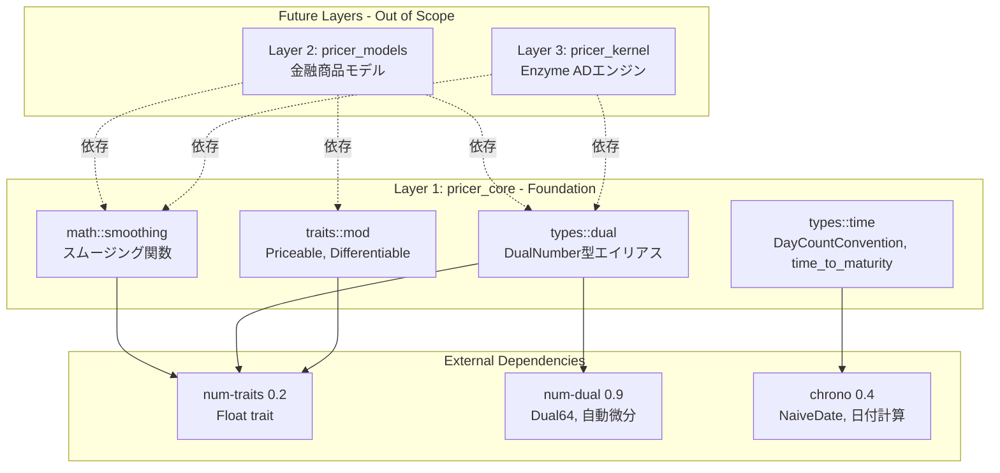

# Technical Design Document

## Overview

Phase 1では、XVA価格計算ライブラリの数学的基盤としてLayer 1 (pricer_core)を実装します。このフェーズは、自動微分対応のスムージング関数、Dual数型統合、基本的な価格計算trait、金融計算用の時間型を提供し、Layer 2以降での微分可能な価格計算の基礎を確立します。

**Purpose**: Enzymeとnum-dualの双方で動作する検証可能な数学的基盤を提供し、Layer 3のADエンジンとLayer 2の金融商品モデルに対して型安全なインターフェースを確立します。

**Users**: 量子金融開発者とリスク分析エンジニアが、微分可能な価格計算ロジックを実装する際にpricer_coreの関数とtraitを利用します。

**Impact**: 新規実装により、4層アーキテクチャの最下層 (Foundation) を構築し、他のpricer_*クレートへの依存をゼロに保ちながら、安定版Rustのみで動作する再利用可能な数学ライブラリを提供します。

### Goals

- 微分可能なスムージング関数群 (smooth_max, smooth_min, smooth_indicator, smooth_abs) をジェネリック型で実装
- num-dualクレート統合によるDual数型のサポートと勾配計算の検証機能を提供
- 価格計算と微分可能性の基本traitを定義し、Layer 2での型安全な実装を可能にする
- 金融計算に必要な時間型とDay Count Convention (Act/365, Act/360, 30/360) を実装
- 全ての関数がEnzyme ADとnum-dualの両方で動作することをテストで検証
- 安定版Rustツールチェインのみでビルド可能な依存関係ゼロのFoundation層を確立

### Non-Goals

- Layer 3のEnzyme統合やADエンジンの実装 (Phase 3で対応)
- Layer 2の金融商品モデルや価格計算ロジック (Phase 2で対応)
- 高次微分 (2次以上) のサポート (Phase 1では1次微分のみ、将来拡張可能)
- Act/Act ISDAなど高度なDay Count Convention (将来のフェーズで追加)
- パフォーマンスベンチマークの実装 (criterionの追加のみ、実際のベンチマークはPhase 6)
- プロダクション環境での実行 (Phase 1は基盤構築、Phase 6で本番対応)

## Architecture

### Architecture Pattern & Boundary Map

**選択されたパターン**: Pure Library Pattern (依存関係ゼロのFoundation層)

**Domain/Feature Boundaries**:
- **数学関数境界**: スムージング関数 (`math/smoothing`) は純粋関数として実装され、副作用なし
- **型システム境界**: Dual数型 (`types/dual`) とトレイト (`traits`) は独立したモジュールとして分離
- **時間計算境界**: Day Count Convention (`types/time`) は金融ドメインの知識をカプセル化

**Architecture Integration**:
- **Layer 1の責任範囲**: 数学的基盤のみを提供し、ビジネスロジックやADエンジンへの依存を持たない
- **Bottom-Up Dependencies**: L1 ← L2 ← L3 → L4 の依存フローを厳守し、L1は他のpricer_*クレートに依存しない
- **静的ディスパッチ**: 全てのトレイトは静的ディスパッチ (enum) を前提とし、`Box<dyn Trait>`を使用しない
- **Steering Compliance**: ステアリング文書の4層アーキテクチャ原則、型安全性要件、微分可能性設計に完全準拠



### Technology Stack & Alignment

| Layer | Choice / Version | Role in Feature | Notes |
|-------|------------------|-----------------|-------|
| Language | Rust Edition 2021 | 全てのコードを安定版Rustで実装 | ナイトリーツールチェインは不要 (Layer 1の原則) |
| Numeric Traits | num-traits 0.2 | ジェネリック数値計算のトレイト提供 | 514.9M総ダウンロード、業界標準 |
| Dual Numbers | num-dual 0.9 | 自動微分とDual数型のバックエンド | 要件文書で指定、将来0.13へのアップグレードパス確保 |
| Date/Time | chrono 0.4 | 日付計算とDay Count Convention | NaiveDateを使用、タイムゾーン不要 |
| Testing | proptest 1.0, approx 0.5 | プロパティテストと浮動小数点近似比較 | 数学的正しさの検証に必須 |
| Benchmarking | criterion (dev-dependency) | 将来のパフォーマンステスト準備 | Phase 6で実際のベンチマーク実装 |

**Alignment with Steering Principles**:
- **4層分離**: Layer 1は安定版Rustのみを使用し、Layer 3のEnzyme依存から完全に分離
- **静的ディスパッチ**: num-traitsのFloat traitはdyn非互換であり、設計全体が静的ディスパッチを前提
- **依存関係最小化**: 外部依存を num-traits, num-dual, chrono, テストクレートのみに制限

詳細な技術選定の根拠と代替案の評価は`research.md`の「Architecture Pattern Evaluation」および「Design Decisions」セクションを参照してください。

## Requirements Traceability

| Requirement | Summary | Components | Interfaces | Flows |
|-------------|---------|------------|------------|-------|
| 1 | スムージング関数の実装 | math::smoothing モジュール | smooth_max, smooth_min, smooth_indicator, smooth_abs | N/A (純粋関数) |
| 2 | Dual数型とnum-dual統合 | types::dual モジュール | DualNumber型エイリアス | N/A (型定義) |
| 3 | 基本的なトレイト定義 | traits::mod モジュール | Priceable, Differentiable | N/A (トレイト定義) |
| 4 | 時間型と日付計算 | types::time モジュール | DayCountConvention, time_to_maturity | N/A (計算関数) |
| 5 | モジュール構造とエクスポート | lib.rs, mod.rs | pub mod math, pub mod traits, pub mod types | N/A (モジュール構造) |
| 6 | テスト戦略とプロパティテスト | 各モジュールの#[cfg(test)] | ユニットテスト、プロパティテスト | N/A (テストコード) |
| 7 | ドキュメントとコードスタイル | 全てのpublic項目 | Rustdocコメント、モジュールドキュメント | N/A (ドキュメント) |
| 8 | ビルドとCI統合 | Cargo.toml, .github/workflows/ci.yml | Edition 2021, stable toolchain | N/A (ビルド設定) |
| 9 | 依存関係の最小化 | Cargo.toml | num-traits, num-dual, chrono のみ | N/A (依存関係管理) |
| 10 | パフォーマンスとメモリ効率 | 全てのスムージング関数 | #[inline]属性、スタック演算のみ | N/A (最適化) |

## Components and Interfaces

### Component Summary

| Component | Domain/Layer | Intent | Req Coverage | Key Dependencies (P0/P1) | Contracts |
|-----------|--------------|--------|--------------|--------------------------|-----------|
| math::smoothing | 数学関数 / L1 | 微分可能なスムージング関数群を提供 | 1, 6, 7, 10 | num-traits (P0) | Service |
| types::dual | 数値型 / L1 | Dual数型統合とnum-dual互換性 | 2, 6, 7, 9 | num-dual (P0), num-traits (P0) | Service |
| types::time | 金融計算 / L1 | 時間型とDay Count Convention | 4, 7, 9 | chrono (P0) | Service |
| traits::mod | 抽象化 / L1 | 価格計算と微分可能性のトレイト | 3, 7, 9 | num-traits (P0) | Service |
| lib.rs | モジュール構造 / L1 | publicモジュールのエクスポート | 5, 7, 8 | なし | N/A |

### Layer 1: Foundation (pricer_core)

#### math::smoothing

| Field | Detail |
|-------|--------|
| Intent | LogSumExp/Boltzmann演算子による微分可能なスムージング関数を提供 |
| Requirements | 1, 6, 7, 10 |

**Responsibilities & Constraints**
- 不連続な関数 (max, min, abs, indicator) の滑らかな近似を計算
- epsilon (ε) パラメータによる近似精度の制御 (ε → 0で真の関数に収束)
- ジェネリック型 `T: num_traits::Float` でf32/f64の両方をサポート
- 副作用なし、純粋関数として実装 (テスト容易性、並列実行安全性)

**Dependencies**
- External: num-traits 0.2 — Floatトレイトの提供 (P0)

**Contracts**: Service [x]

##### Service Interface

```rust
/// LogSumExpによる微分可能な最大値関数
///
/// # Mathematical Definition
/// smooth_max(a, b, ε) = ε * log(exp(a/ε) + exp(b/ε))
///
/// # Convergence
/// lim(ε→0) smooth_max(a, b, ε) = max(a, b)
///
/// # Arguments
/// * `a` - 第1引数
/// * `b` - 第2引数
/// * `epsilon` - スムージングパラメータ (推奨範囲: 1e-8 ~ 1e-3)
///
/// # Returns
/// max(a, b)の微分可能な近似値
///
/// # Panics
/// epsilon <= 0の場合にパニック
#[inline]
pub fn smooth_max<T: Float>(a: T, b: T, epsilon: T) -> T;

/// smooth_maxの双対として実装される微分可能な最小値関数
///
/// # Mathematical Definition
/// smooth_min(a, b, ε) = -smooth_max(-a, -b, ε)
#[inline]
pub fn smooth_min<T: Float>(a: T, b: T, epsilon: T) -> T;

/// Sigmoid関数によるHeaviside関数の微分可能な近似
///
/// # Mathematical Definition
/// smooth_indicator(x, ε) = 1 / (1 + exp(-x/ε))
///
/// # Convergence
/// lim(ε→0) smooth_indicator(x, ε) = { 0 if x < 0, 0.5 if x = 0, 1 if x > 0 }
#[inline]
pub fn smooth_indicator<T: Float>(x: T, epsilon: T) -> T;

/// Softplusベースの微分可能な絶対値関数
///
/// # Mathematical Definition
/// smooth_abs(x, ε) = ε * log(exp(x/ε) + exp(-x/ε))
///
/// # Convergence
/// lim(ε→0) smooth_abs(x, ε) = |x|
#[inline]
pub fn smooth_abs<T: Float>(x: T, epsilon: T) -> T;
```

**Preconditions**:
- epsilon > 0 (ゼロまたは負の値は数学的に無効)

**Postconditions**:
- 戻り値は有限の浮動小数点数 (NaN/Infinityを返さない、数値安定性の保証)
- smooth_max(a, b, ε) >= max(a, b) - tolerance (tolerance = O(ε))
- smooth_min(a, b, ε) <= min(a, b) + tolerance

**Invariants**:
- smooth_max(a, b, ε) == smooth_max(b, a, ε) (交換法則)
- smooth_min(a, b, ε) == smooth_min(b, a, ε) (交換法則)
- smooth_abs(-x, ε) == smooth_abs(x, ε) (偶関数)
- smooth_indicator(-x, ε) == 1 - smooth_indicator(x, ε) (対称性)

**Implementation Notes**
- **Integration**: Layer 2のpayoff関数で使用 (例: バリアオプションのインジケータ、デジタルオプションのステップ関数)
- **Validation**: プロパティテストで収束性と不変条件を検証、approxクレートで数値精度を確認
- **Risks**: 指数関数のオーバーフロー/アンダーフロー → 数値安定版実装 (log-sum-exp trick) を`research.md`で文書化

#### types::dual

| Field | Detail |
|-------|--------|
| Intent | num-dualクレート統合によるDual数型サポートと自動微分の検証機能を提供 |
| Requirements | 2, 6, 7, 9 |

**Responsibilities & Constraints**
- `num_dual::Dual64`をpricer_coreの`DualNumber`型エイリアスとして公開
- スムージング関数とDual数型の互換性を保証
- Enzymeとnum-dualの双方で勾配計算が一致することを検証

**Dependencies**
- External: num-dual 0.9 — Dual数型と自動微分バックエンド (P0)
- External: num-traits 0.2 — Floatトレイトとの統合 (P0)

**Contracts**: Service [x]

##### Service Interface

```rust
/// num-dual::Dual64型のエイリアス
///
/// # Usage
/// Dual数を使用して自動微分を計算する場合:
/// ```rust
/// use pricer_core::types::dual::DualNumber;
/// use pricer_core::math::smoothing::smooth_max;
///
/// let a = DualNumber::from(3.0).derivative();
/// let b = DualNumber::from(5.0);
/// let result = smooth_max(a, b, 1e-6);
/// let gradient = result.eps; // ∂smooth_max/∂a
/// ```
pub type DualNumber = num_dual::Dual64;
```

**Preconditions**:
- num-dualクレートが依存関係として利用可能

**Postconditions**:
- DualNumber型はnum_traits::Floatトレイトを実装
- スムージング関数はDualNumber型で動作し、勾配情報を正しく伝播

**Invariants**:
- Dual数の基本演算 (加算、減算、乗算、除算、指数関数、対数関数) がnum_traitsトレイトを通じて動作

**Implementation Notes**
- **Integration**: Layer 3のEnzymeとの比較検証に使用、テストでは解析的微分との一致を確認
- **Validation**: approxクレートで数値的微分とDual数の勾配を比較
- **Risks**: num-dual 0.9と0.13の互換性 → `research.md`でアップグレードパスを文書化

#### types::time

| Field | Detail |
|-------|--------|
| Intent | 金融計算に必要な時間型とDay Count Convention (年率換算規約) を提供 |
| Requirements | 4, 7, 9 |

**Responsibilities & Constraints**
- Day Count Convention (Act/365, Act/360, 30/360) を列挙型で定義
- 開始日と終了日から年単位の時間差を計算 (time_to_maturity関数)
- デフォルト規約はAct/365 (デリバティブと英国債の標準)

**Dependencies**
- External: chrono 0.4 — NaiveDateによる日付計算 (P0)

**Contracts**: Service [x]

##### Service Interface

```rust
/// Day Count Convention (年率換算規約)
///
/// # Variants
/// - `ActualActual365`: 実際の日数 / 365 (デリバティブ、英国債で標準)
/// - `ActualActual360`: 実際の日数 / 360 (マネーマーケット商品で一般的)
/// - `Thirty360`: 各月を30日、1年を360日として計算 (米国社債で一般的)
#[non_exhaustive]
#[derive(Debug, Clone, Copy, PartialEq, Eq)]
pub enum DayCountConvention {
    ActualActual365,
    ActualActual360,
    Thirty360,
}

impl DayCountConvention {
    /// 開始日と終了日から年単位の時間差を計算
    ///
    /// # Arguments
    /// * `start` - 開始日
    /// * `end` - 終了日
    ///
    /// # Returns
    /// 年単位の時間差 (例: 0.5は6ヶ月、1.0は1年)
    pub fn year_fraction(&self, start: NaiveDate, end: NaiveDate) -> f64;
}

/// デフォルト規約 (Act/365) による年単位の時間差を計算
///
/// # Arguments
/// * `start` - 開始日
/// * `end` - 終了日
///
/// # Returns
/// 年単位の時間差 (Act/365規約)
pub fn time_to_maturity(start: NaiveDate, end: NaiveDate) -> f64;
```

**Preconditions**:
- start <= end (逆順の日付は未定義動作、パニックまたはエラーを返す)

**Postconditions**:
- 戻り値は非負の浮動小数点数
- Act/365: year_fraction = (end - start).num_days() / 365.0
- Act/360: year_fraction = (end - start).num_days() / 360.0
- 30/360: 各月を30日として計算 (Bond Basis規約)

**Invariants**:
- time_to_maturity(start, end) == DayCountConvention::ActualActual365.year_fraction(start, end)

**Implementation Notes**
- **Integration**: Layer 2の価格計算で満期までの時間を計算 (例: Black-Scholesモデルのtime-to-maturity)
- **Validation**: 既知の日付ペアで手計算結果と比較、各規約の境界条件をテスト
- **Risks**: 30/360規約の複数のバリエーション (US, European, Italian) → Phase 1では米国規約のみ実装

#### traits::mod

| Field | Detail |
|-------|--------|
| Intent | Layer 2以降で使用する価格計算と微分可能性の基本traitを定義 |
| Requirements | 3, 7, 9 |

**Responsibilities & Constraints**
- `Priceable`トレイト: 金融商品の価格計算インターフェース
- `Differentiable`トレイト: 勾配計算インターフェース
- ジェネリック型 `T: num_traits::Float` でf32/f64の両方をサポート
- 静的ディスパッチ (enum) を前提とし、`Box<dyn Trait>`を禁止

**Dependencies**
- External: num-traits 0.2 — Floatトレイトの制約 (P0)

**Contracts**: Service [x]

##### Service Interface

```rust
/// 価格計算可能なエンティティを表すトレイト
///
/// # Type Parameters
/// * `T` - 浮動小数点型 (f32またはf64)
///
/// # Usage
/// Layer 2の金融商品モデルでこのトレイトを実装します:
/// ```rust
/// enum Instrument<T: Float> {
///     VanillaOption { strike: T, maturity: T },
///     BarrierOption { strike: T, barrier: T, maturity: T },
/// }
///
/// impl<T: Float> Priceable<T> for Instrument<T> {
///     fn price(&self) -> T {
///         match self {
///             Instrument::VanillaOption { .. } => { /* 価格計算 */ }
///             Instrument::BarrierOption { .. } => { /* 価格計算 */ }
///         }
///     }
/// }
/// ```
///
/// # Important
/// このトレイトは静的ディスパッチ (enum) でのみ使用してください。
/// `Box<dyn Priceable>`は使用しないでください (Enzymeと非互換)。
pub trait Priceable<T: Float> {
    /// 金融商品の価格を計算
    ///
    /// # Returns
    /// 計算された価格 (現在価値)
    fn price(&self) -> T;
}

/// 微分可能なエンティティを表すトレイト
///
/// # Type Parameters
/// * `T` - 浮動小数点型 (f32またはf64)
///
/// # Usage
/// Layer 3のADエンジンで勾配計算に使用します。
/// EnzymeまたはDual数型で実装されます。
pub trait Differentiable<T: Float> {
    /// 勾配 (1次微分) を計算
    ///
    /// # Returns
    /// 計算された勾配ベクトル (Greeks)
    fn gradient(&self) -> T;
}
```

**Preconditions**:
- 実装型は有効な状態を保持 (例: 満期が正、ストライク価格が正)

**Postconditions**:
- price()の戻り値は非負 (価格は負にならない、アービトラージ回避)
- gradient()の戻り値は有限の浮動小数点数

**Invariants**:
- トレイトメソッドは副作用を持たない (純粋関数、並列実行安全)

**Implementation Notes**
- **Integration**: Layer 2で`enum Instrument`が`Priceable`を実装、Layer 3で`Differentiable`をEnzyme/Dual数で実装
- **Validation**: ドキュメントコメントに静的ディスパッチの要件と例を明記
- **Risks**: dyn互換性の誤用 → ドキュメントで明示的に禁止、コンパイルエラーで検出可能

#### lib.rs (モジュール構造)

| Field | Detail |
|-------|--------|
| Intent | publicモジュールのエクスポートとクレートレベルのドキュメントを提供 |
| Requirements | 5, 7, 8 |

**Responsibilities & Constraints**
- `pub mod math`, `pub mod traits`, `pub mod types`を公開
- クレートレベルのドキュメントでLayer 1の役割と依存関係ゼロの原則を説明
- 各モジュールのmod.rsで再エクスポート構造を定義

**Dependencies**
- なし (内部モジュールのみ)

**Contracts**: N/A

##### Service Interface

```rust
//! # pricer_core: XVA価格計算ライブラリの数学的基盤
//!
//! ## Layer 1 (Foundation)の役割
//!
//! pricer_coreは4層アーキテクチャの最下層として、以下の機能を提供します:
//! - 微分可能なスムージング関数 (`math::smoothing`)
//! - Dual数型統合 (`types::dual`)
//! - 価格計算と微分可能性のトレイト (`traits`)
//! - 時間型とDay Count Convention (`types::time`)
//!
//! ## 依存関係ゼロの原則
//!
//! Layer 1は他のpricer_*クレートに依存せず、外部依存を最小限に制限します:
//! - num-traits: ジェネリック数値計算のトレイト
//! - num-dual: Dual数型と自動微分
//! - chrono: 日付計算
//!
//! ## 安定版Rustツールチェイン
//!
//! Layer 1は安定版Rustのみでビルド可能です (ナイトリー不要)。
//! Enzyme ADエンジンはLayer 3で分離されています。
//!
//! ## 使用例
//!
//! ```rust
//! use pricer_core::math::smoothing::smooth_max;
//! use pricer_core::types::dual::DualNumber;
//!
//! // f64での計算
//! let result = smooth_max(3.0, 5.0, 1e-6);
//!
//! // Dual数での自動微分
//! let a = DualNumber::from(3.0).derivative();
//! let b = DualNumber::from(5.0);
//! let result = smooth_max(a, b, 1e-6);
//! let gradient = result.eps; // ∂smooth_max/∂a
//! ```

pub mod math;
pub mod traits;
pub mod types;
```

**Implementation Notes**
- **Integration**: 他のクレートは`use pricer_core::math::smoothing::smooth_max`のように絶対パスでインポート
- **Validation**: cargo docでドキュメントを生成し、リンク切れや欠落を確認
- **Risks**: モジュール構造の変更 → `#[non_exhaustive]`やpub(crate)で将来の拡張性を確保

## Error Handling

### Error Strategy

Phase 1の数学関数は純粋関数として実装され、エラー処理は以下の戦略に従います:

**1. パニック (Panic) によるプリコンディション違反の検出**
- epsilon <= 0の場合: `assert!(epsilon > 0, "epsilon must be positive")`でパニック
- 数値オーバーフロー/アンダーフロー: デバッグビルドでパニック、リリースビルドでInfinityを返す

**2. 数値安定性の保証**
- LogSumExpのlog-sum-exp trickによるオーバーフロー回避
- 浮動小数点演算の結果がNaN/Infinityにならないことをテストで検証

**3. 型システムによるコンパイル時エラー検出**
- `T: num_traits::Float`制約により、非数値型での誤用をコンパイル時に防止
- 静的ディスパッチ要件により、`Box<dyn Trait>`の誤用をコンパイル時に検出

### Error Categories and Responses

**User Errors** (パラメータ誤用):
- epsilon <= 0 → パニック (プリコンディション違反、開発時に即座に検出)
- start > end (time_to_maturity) → パニックまたは負の値を返す (ドキュメントで明記)

**System Errors** (数値計算エラー):
- 浮動小数点オーバーフロー → log-sum-exp trickで回避、テストで検証
- NaN/Infinity → 発生しないことをプロパティテストで保証

**Business Logic Errors** (N/A):
- Phase 1は純粋な数学関数のみ、ビジネスロジックエラーは存在しない

### Monitoring

**開発時のエラー追跡**:
- パニックメッセージにパラメータ値と期待値を含める
- テスト失敗時にproptestが失敗ケースの入力値を報告

**将来の監視 (Phase 6)**:
- criterionベンチマークでパフォーマンス回帰を検出
- CI/CDパイプラインでテストカバレッジとlintエラーを監視

## Testing Strategy

### Unit Tests

**対象**: 各スムージング関数、Dual数型、Day Count Convention、トレイト

**主要なテストケース**:
1. **smooth_max収束性**: epsilon = [1e-2, 1e-4, 1e-6]で真のmax関数との誤差を検証
2. **smooth_min双対性**: smooth_min(a, b, ε) == -smooth_max(-a, -b, ε)を検証
3. **smooth_indicator境界値**: x = 0でsmooth_indicator(0, ε) ≈ 0.5を検証
4. **smooth_abs偶関数性**: smooth_abs(-x, ε) == smooth_abs(x, ε)を検証
5. **DualNumber勾配伝播**: Dual数でsmooth_maxを計算し、解析的微分と一致を検証 (approx使用)
6. **DayCountConvention既知値**: 2024-01-01から2024-07-01で各規約の結果を検証

### Integration Tests

**対象**: モジュール間の相互作用、pub APIの動作確認

**主要なテストケース**:
1. **スムージング関数とDual数**: 全てのスムージング関数がDualNumber型で動作することを検証
2. **トレイトとジェネリック型**: Priceableトレイトをf32/f64/DualNumberで実装し、動作を検証
3. **モジュールエクスポート**: lib.rsからの絶対パスインポートが動作することを検証
4. **chronoとの統合**: NaiveDateからtime_to_maturityが正しく計算されることを検証

### Property-Based Tests (proptest)

**対象**: 数学的不変条件の検証

**主要なプロパティ**:
1. **smooth_max不等式**: `smooth_max(a, b, ε) >= max(a, b) - tolerance`をランダムな(a, b, ε)で検証
2. **smooth_min不等式**: `smooth_min(a, b, ε) <= min(a, b) + tolerance`をランダムな(a, b, ε)で検証
3. **smooth_max交換法則**: `smooth_max(a, b, ε) == smooth_max(b, a, ε)`を検証
4. **smooth_indicator単調性**: x1 < x2 → smooth_indicator(x1, ε) <= smooth_indicator(x2, ε)を検証
5. **DayCountConvention非負性**: `year_fraction(start, end) >= 0`をランダムな日付ペアで検証

**設定**:
- proptest::prelude::* を使用
- cases = 1000 (十分な試行回数、偽陰性を回避)
- epsilonの範囲: 1e-8 ~ 1e-3 (実用的な範囲)

### Code Quality Tests

**対象**: フォーマット、lint、ドキュメント

**主要なチェック**:
1. **cargo fmt --all -- --check**: 全てのコードがフォーマット済み
2. **cargo clippy --all-targets -- -D warnings**: 全てのlint警告を解消
3. **cargo doc --no-deps**: ドキュメント生成が成功し、リンク切れがない
4. **cargo test --doc**: ドキュメント内のコード例が動作することを検証

## Optional Sections

### Performance & Scalability

**Target Metrics** (Phase 6で測定、Phase 1では準備のみ):
- smooth_max/smooth_min: < 10ns per call (リリースビルド、LLVM最適化後)
- Dual数の勾配計算: < 50ns per call (num-dualのオーバーヘッド含む)
- time_to_maturity: < 100ns per call (chronoの日付差分計算)

**Optimization Techniques** (Phase 1で適用):
- `#[inline]`属性: 全てのスムージング関数にインライン展開を指示
- スタック演算のみ: 動的メモリ割り当て (Box, Vec) をホットパスで使用しない
- LTO有効化: ワークスペースレベルのリリースプロファイルでcodegen-units=1を設定

**Scalability** (将来のフェーズ):
- Layer 2のポートフォリオ計算でrayonによる並列化 (Phase 5)
- スムージング関数は副作用なし、並列実行安全 (データ競合なし)

## Supporting References

### 数学的定式化の詳細

**LogSumExp (LSE) 公式**:
```
LSE_α(x₁,…,xₙ) = (1/α) log Σᵢ₌₁ⁿ exp(αxᵢ)
```

**2引数版smooth_max**:
```
smooth_max(a, b, ε) = ε * log(exp(a/ε) + exp(b/ε))
```

**数値安定版 (log-sum-exp trick)**:
```
m = max(a, b)
smooth_max(a, b, ε) = m + ε * log(exp((a-m)/ε) + exp((b-m)/ε))
```

この実装により、a, bが大きい場合のオーバーフローを回避します。

**Sigmoid関数 (smooth_indicator)**:
```
σ(x/ε) = 1 / (1 + exp(-x/ε))
```

**Softplus (smooth_abs)**:
```
smooth_abs(x, ε) = ε * log(exp(x/ε) + exp(-x/ε))
             = ε * log(2 * cosh(x/ε))
```

### Day Count Convention実装詳細

**Act/365 Fixed**:
```rust
year_fraction = (end - start).num_days() as f64 / 365.0
```

**Act/360**:
```rust
year_fraction = (end - start).num_days() as f64 / 360.0
```

**30/360 (US Bond Basis)**:
```rust
let d1 = min(start.day(), 30);
let d2 = if d1 == 30 { min(end.day(), 30) } else { end.day() };
let days = 360 * (end.year() - start.year())
         + 30 * (end.month() - start.month())
         + (d2 - d1);
year_fraction = days as f64 / 360.0
```

### 外部クレートのバージョン管理

**Cargo.toml dependencies**:
```toml
[dependencies]
num-traits = "0.2"
num-dual = "0.9"
chrono = "0.4"

[dev-dependencies]
proptest = "1.0"
approx = "0.5"
criterion = "0.5"
```

**MSRV (Minimum Supported Rust Version)**:
- rustc 1.70以上 (num-traitsとchronoの要件)
- 安定版ツールチェインのみ (ナイトリー不要)

詳細な調査結果、設計判断の根拠、代替案の評価は`research.md`を参照してください。
