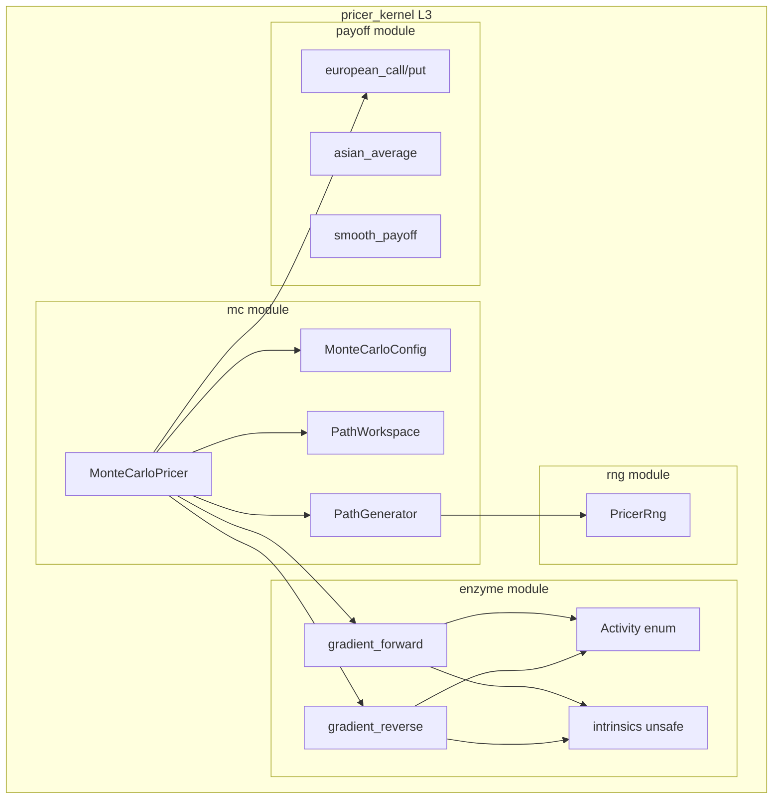
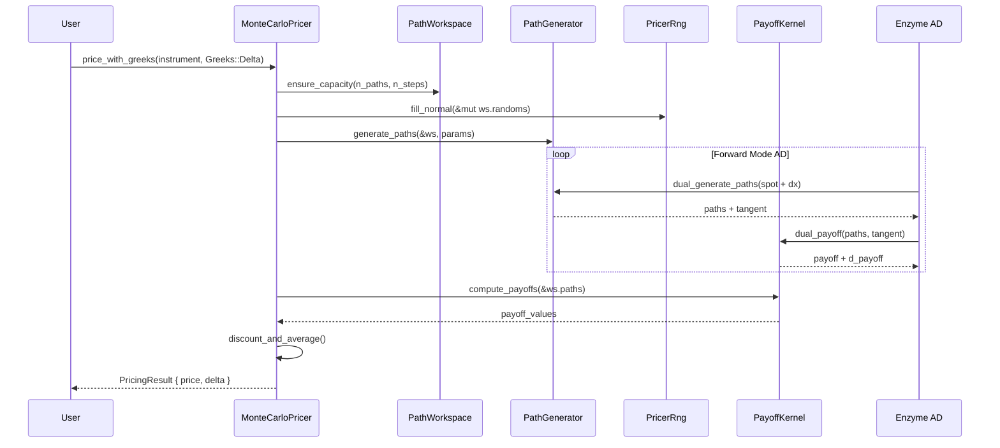
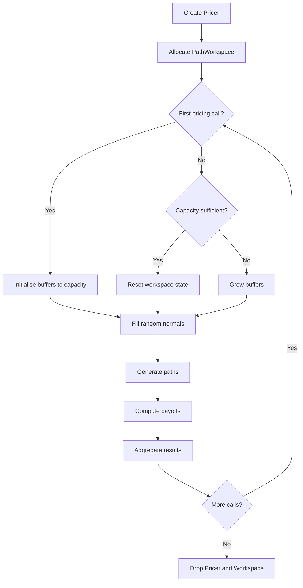

# Design Document: Monte Carlo Kernel - Enzyme Integration

## Overview

**Purpose**: This design establishes the Monte Carlo pricing kernel within `pricer_kernel` (Layer 3), providing path generation, payoff evaluation, and Enzyme-based automatic differentiation for high-performance Greeks computation.

**Users**: Quantitative developers requiring Monte Carlo pricing with AD-computed sensitivities will use this kernel through safe Rust APIs.

**Impact**: Enables production-grade Monte Carlo pricing with Enzyme LLVM-level gradients, achieving C++-competitive performance whilst maintaining memory safety.

### Goals

- Implement GBM path generation with Enzyme-compatible operations
- Provide workspace buffer management for allocation-free inner loops
- Integrate Enzyme autodiff with explicit activity annotations
- Support forward-mode Delta and reverse-mode Vega computation

### Non-Goals

- Full stochastic volatility models (Heston) - Phase 4
- Path-dependent checkpointing - Phase 4
- Integration with pricer_core/pricer_models types - Phase 4
- GPU acceleration - future phase

## Architecture

### Existing Architecture Analysis

The 4-layer architecture isolates Enzyme (nightly Rust) to Layer 3:

```
L1 (pricer_core)    -> Foundation (Stable Rust)
L2 (pricer_models)  -> Business Logic (Stable Rust)
L3 (pricer_kernel)  -> AD Engine (Nightly Rust + Enzyme) <- THIS FEATURE
L4 (pricer_xva)     -> Application (Stable Rust)
```

**Current State**: Phase 3.0 established the enzyme module with placeholder finite difference. Phase 3.1a delivered RNG infrastructure. This design builds the Monte Carlo kernel.

### Architecture Pattern and Boundary Map



**Architecture Integration**:

- **Selected pattern**: Workspace-based simulation with pre-allocated buffers
- **Domain boundaries**: MC kernel isolated within L3; no L1/L2 dependencies in Phase 3.2
- **Existing patterns preserved**: Activity annotations from Phase 3.0; RNG from Phase 3.1a
- **New components rationale**: PathWorkspace enables Enzyme optimisation; PayoffModule provides smooth differentiable payoffs
- **Steering compliance**: Follows tech.md static dispatch, structure.md L3 isolation

### Technology Stack

| Layer | Choice / Version | Role in Feature | Notes |
|-------|------------------|-----------------|-------|
| Language | Rust Edition 2021 | Core implementation | Workspace-inherited |
| Toolchain | nightly-2025-01-15 | Enzyme feature support | L3 only |
| AD Backend | Enzyme LLVM plugin | Gradient computation | Via enzyme module |
| RNG | rand + rand_distr | Normal distribution | Phase 3.1a infrastructure |
| Testing | approx 0.5 | Floating-point comparison | Workspace dependency |

## System Flows

### Monte Carlo Pricing with AD Flow



### Workspace Buffer Lifecycle



## Requirements Traceability

| Requirement | Summary | Components | Interfaces | Flows |
|-------------|---------|------------|------------|-------|
| FR-1.1 | GBM Path Simulator | PathGenerator | generate_paths | Pricing flow |
| FR-1.2 | Workspace Buffer Management | PathWorkspace | ensure_capacity, reset | Workspace lifecycle |
| FR-1.3 | Seeded Reproducibility | MonteCarloPricer | with_seed | Pricing flow |
| FR-2.1 | European Option Payoff | PayoffKernel | european_call | Pricing flow |
| FR-2.2 | Path-Dependent Payoff | PayoffKernel | path_dependent | Pricing flow |
| FR-3.1 | Activity Annotations | Activity enum | Activity::* | AD flow |
| FR-3.2 | Safe Autodiff Wrappers | enzyme module | gradient_forward/reverse | AD flow |
| FR-3.3 | MC Gradient Computation | MonteCarloPricer | mc_delta, mc_vega | AD flow |
| FR-4.1 | Pricer Configuration | MonteCarloConfig | builder pattern | Config |
| FR-4.2 | Pricing with Greeks | MonteCarloPricer | price_with_greeks | Pricing flow |
| FR-4.3 | Convergence Monitoring | MonteCarloStats | std_error | Pricing flow |

## Components and Interfaces

| Component | Domain/Layer | Intent | Req Coverage | Key Dependencies | Contracts |
|-----------|--------------|--------|--------------|------------------|-----------|
| MonteCarloConfig | L3/MC | Simulation configuration | FR-4.1 | None | State |
| PathWorkspace | L3/MC | Pre-allocated buffers | FR-1.2, NFR-2.1, NFR-2.2 | None | State |
| PathGenerator | L3/MC | GBM path generation | FR-1.1, FR-1.3 | RNG (P0) | Service |
| PayoffKernel | L3/MC | Smooth payoff evaluation | FR-2.1, FR-2.2 | None | Service |
| MonteCarloPricer | L3/MC | Orchestration | FR-4.2, FR-4.3 | All above (P0) | Service |
| gradient_forward | L3/Enzyme | Forward mode AD | FR-3.2, FR-3.3 | Enzyme (P1) | Service |
| gradient_reverse | L3/Enzyme | Reverse mode AD | FR-3.2, FR-3.3 | Enzyme (P1) | Service |

### L3 / Monte Carlo Module

#### MonteCarloConfig

| Field | Detail |
|-------|--------|
| Intent | Configuration for Monte Carlo simulation parameters |
| Requirements | FR-4.1 |

**Responsibilities and Constraints**

- Store simulation parameters (n_paths, n_steps, seed)
- Validate configuration at construction
- Immutable after construction

**Contracts**: State [x]

##### Configuration State Contract

```rust
/// Monte Carlo simulation configuration.
///
/// # Example
/// ```rust
/// use pricer_kernel::mc::MonteCarloConfig;
///
/// let config = MonteCarloConfig::builder()
///     .n_paths(10_000)
///     .n_steps(252)
///     .seed(42)
///     .build()
///     .expect("valid config");
/// ```
#[derive(Clone, Debug)]
pub struct MonteCarloConfig {
    /// Number of simulation paths (1..=10_000_000).
    pub n_paths: usize,
    /// Number of time steps per path (1..=10_000).
    pub n_steps: usize,
    /// AD mode for gradient computation.
    pub ad_mode: AdMode,
    /// Optional seed for reproducibility.
    pub seed: Option<u64>,
}

/// Automatic differentiation mode.
#[derive(Clone, Copy, Debug, Default, PartialEq, Eq)]
pub enum AdMode {
    /// No automatic differentiation.
    #[default]
    NoAd,
    /// Forward mode (tangent propagation).
    Forward,
    /// Reverse mode (adjoint accumulation).
    Reverse,
}

impl MonteCarloConfig {
    /// Create a configuration builder.
    pub fn builder() -> MonteCarloConfigBuilder;

    /// Validate configuration constraints.
    ///
    /// # Errors
    /// Returns `ConfigError` if:
    /// - n_paths == 0 or > 10_000_000
    /// - n_steps == 0 or > 10_000
    pub fn validate(&self) -> Result<(), ConfigError>;
}
```

---

#### PathWorkspace

| Field | Detail |
|-------|--------|
| Intent | Pre-allocated buffers for allocation-free simulation |
| Requirements | FR-1.2, NFR-2.1, NFR-2.2 |

**Responsibilities and Constraints**

- Hold pre-allocated buffers for random numbers, paths, payoffs
- Grow capacity on demand (amortised)
- Reset state without deallocation
- Memory layout: contiguous f64 arrays for SIMD

**Contracts**: State [x]

##### Workspace State Contract

```rust
/// Pre-allocated workspace for Monte Carlo simulation.
///
/// # Memory Layout
/// - `randoms`: n_paths × n_steps contiguous f64 (row-major)
/// - `paths`: n_paths × (n_steps + 1) contiguous f64 (row-major)
/// - `payoffs`: n_paths contiguous f64
///
/// # Buffer Hoisting
/// All allocations occur in `ensure_capacity`. The simulation loop
/// operates on slices without any heap allocation.
pub struct PathWorkspace {
    /// Random normal samples (n_paths × n_steps).
    randoms: Vec<f64>,
    /// Price paths (n_paths × (n_steps + 1)).
    paths: Vec<f64>,
    /// Payoff values per path (n_paths).
    payoffs: Vec<f64>,
    /// Current capacity (n_paths).
    capacity_paths: usize,
    /// Current capacity (n_steps).
    capacity_steps: usize,
}

impl PathWorkspace {
    /// Create workspace with initial capacity.
    pub fn new(n_paths: usize, n_steps: usize) -> Self;

    /// Ensure capacity for given simulation size.
    ///
    /// Grows buffers if necessary. Never shrinks.
    pub fn ensure_capacity(&mut self, n_paths: usize, n_steps: usize);

    /// Reset workspace state without deallocation.
    ///
    /// Clears logical size but retains capacity.
    pub fn reset(&mut self);

    /// Get mutable slice of random buffer.
    ///
    /// # Safety
    /// Caller must ensure buffer was initialised via `ensure_capacity`.
    #[inline]
    pub fn randoms_mut(&mut self) -> &mut [f64];

    /// Get slice of generated paths.
    #[inline]
    pub fn paths(&self) -> &[f64];

    /// Get mutable slice of payoff buffer.
    #[inline]
    pub fn payoffs_mut(&mut self) -> &mut [f64];
}
```

**Implementation Notes**

- Memory growth strategy: double capacity when exceeded
- Zero-initialise buffers to avoid UB from uninitialised reads
- `#[repr(C)]` not required; Rust guarantees contiguous Vec

---

#### PathGenerator

| Field | Detail |
|-------|--------|
| Intent | Generate GBM paths using Euler-Maruyama discretisation |
| Requirements | FR-1.1, FR-1.3 |

**Responsibilities and Constraints**

- Implement GBM path generation: `S(t+dt) = S(t) * exp((r - 0.5*sigma^2)*dt + sigma*sqrt(dt)*Z)`
- Use log-space formulation for numerical stability
- All operations AD-compatible (Enzyme-friendly)
- No allocations within generation loop

**Dependencies**

- Inbound: MonteCarloPricer - orchestrates path generation (P0)
- Internal: PathWorkspace - provides buffers (P0)
- Internal: PricerRng - provides random samples (P0)

**Contracts**: Service [x]

##### Path Generation Service Interface

```rust
/// Parameters for GBM path generation.
#[derive(Clone, Copy, Debug)]
pub struct GbmParams {
    /// Initial spot price.
    pub spot: f64,
    /// Risk-free rate (drift).
    pub rate: f64,
    /// Volatility (annualised).
    pub volatility: f64,
    /// Time to maturity (years).
    pub maturity: f64,
}

/// Generate GBM paths using Euler-Maruyama discretisation.
///
/// # Arguments
/// * `workspace` - Pre-allocated workspace with random samples filled
/// * `params` - GBM parameters
/// * `n_paths` - Number of paths to generate
/// * `n_steps` - Number of time steps
///
/// # Algorithm
/// ```text
/// S(t+dt) = S(t) * exp((r - 0.5*sigma^2)*dt + sigma*sqrt(dt)*Z)
/// ```
///
/// # Activity Analysis (Enzyme)
/// - `spot`: Dual (forward mode input)
/// - `rate`: Const (typically not differentiated)
/// - `volatility`: Dual (for Vega)
/// - Random samples: Const (frozen during AD)
///
/// # Panics
/// Panics if workspace capacity insufficient.
#[inline]
pub fn generate_gbm_paths(
    workspace: &mut PathWorkspace,
    params: GbmParams,
    n_paths: usize,
    n_steps: usize,
);

/// Generate GBM paths with forward-mode AD.
///
/// Returns both primal paths and tangent (derivative w.r.t. spot).
///
/// # Arguments
/// * `workspace` - Workspace for primal computation
/// * `tangent_workspace` - Workspace for tangent computation
/// * `params` - GBM parameters
/// * `d_spot` - Tangent seed for spot (typically 1.0)
#[inline]
pub fn generate_gbm_paths_dual(
    workspace: &mut PathWorkspace,
    tangent_workspace: &mut PathWorkspace,
    params: GbmParams,
    d_spot: f64,
    n_paths: usize,
    n_steps: usize,
);
```

**Implementation Notes**

- Log-space: avoids overflow for high volatility
- Precompute `drift_dt = (r - 0.5*sigma^2)*dt` and `vol_sqrt_dt = sigma*sqrt(dt)` outside loop
- Loop structure: outer over paths, inner over steps (cache-friendly)

---

#### PayoffKernel

| Field | Detail |
|-------|--------|
| Intent | Compute smooth, differentiable payoffs |
| Requirements | FR-2.1, FR-2.2 |

**Responsibilities and Constraints**

- Provide smooth payoff functions (no max/min discontinuities)
- Support European and path-dependent payoffs
- All operations AD-compatible

**Contracts**: Service [x]

##### Payoff Service Interface

```rust
/// Payoff type for option pricing.
#[derive(Clone, Copy, Debug)]
pub enum PayoffType {
    /// Call option: max(S - K, 0)
    Call,
    /// Put option: max(K - S, 0)
    Put,
}

/// Parameters for payoff computation.
#[derive(Clone, Copy, Debug)]
pub struct PayoffParams {
    /// Strike price.
    pub strike: f64,
    /// Payoff type (Call/Put).
    pub payoff_type: PayoffType,
    /// Smoothing epsilon for soft approximation.
    pub smoothing_epsilon: f64,
}

impl Default for PayoffParams {
    fn default() -> Self {
        Self {
            strike: 100.0,
            payoff_type: PayoffType::Call,
            smoothing_epsilon: 1e-4,
        }
    }
}

/// Compute smooth European call payoff.
///
/// Uses soft-plus approximation: `log(1 + exp(x/epsilon)) * epsilon`
/// which approximates `max(x, 0)` as epsilon -> 0.
///
/// # Arguments
/// * `terminal_price` - Price at expiry
/// * `strike` - Strike price
/// * `epsilon` - Smoothing parameter
///
/// # Returns
/// Smooth payoff value (always >= 0)
#[inline]
pub fn european_call_smooth(terminal_price: f64, strike: f64, epsilon: f64) -> f64;

/// Compute smooth European put payoff.
#[inline]
pub fn european_put_smooth(terminal_price: f64, strike: f64, epsilon: f64) -> f64;

/// Compute payoffs for all paths in workspace.
///
/// # Arguments
/// * `workspace` - Workspace with generated paths
/// * `params` - Payoff parameters
/// * `n_paths` - Number of paths
/// * `n_steps` - Number of steps (to locate terminal prices)
///
/// # Side Effects
/// Writes payoff values to `workspace.payoffs_mut()`.
pub fn compute_payoffs(
    workspace: &mut PathWorkspace,
    params: PayoffParams,
    n_paths: usize,
    n_steps: usize,
);

/// Compute Asian average payoff (arithmetic mean).
///
/// # Arguments
/// * `path` - Slice of price path
/// * `strike` - Strike price
/// * `epsilon` - Smoothing parameter
#[inline]
pub fn asian_arithmetic_call_smooth(path: &[f64], strike: f64, epsilon: f64) -> f64;
```

**Implementation Notes**

- Soft-plus: `softplus(x, eps) = eps * ln(1 + exp(x/eps))`
- Numerically stable: use `log1p_exp` for large x
- Asian: running sum computed in single pass

---

#### MonteCarloPricer

| Field | Detail |
|-------|--------|
| Intent | Orchestrate Monte Carlo pricing with optional AD |
| Requirements | FR-4.2, FR-4.3 |

**Responsibilities and Constraints**

- Create and manage workspace
- Orchestrate path generation, payoff, discounting
- Compute Greeks via Enzyme AD
- Track convergence statistics

**Dependencies**

- Internal: MonteCarloConfig (P0)
- Internal: PathWorkspace (P0)
- Internal: PathGenerator (P0)
- Internal: PayoffKernel (P0)
- Internal: PricerRng (P0)
- Internal: Enzyme AD functions (P1)

**Contracts**: Service [x]

##### Pricer Service Interface

```rust
/// Monte Carlo pricing engine.
pub struct MonteCarloPricer {
    config: MonteCarloConfig,
    workspace: PathWorkspace,
    rng: PricerRng,
}

/// Pricing result with optional Greeks.
#[derive(Clone, Debug, Default)]
pub struct PricingResult {
    /// Present value of the instrument.
    pub price: f64,
    /// Standard error of the price estimate.
    pub std_error: f64,
    /// Delta (dPrice/dSpot).
    pub delta: Option<f64>,
    /// Gamma (d2Price/dSpot2).
    pub gamma: Option<f64>,
    /// Vega (dPrice/dVol).
    pub vega: Option<f64>,
    /// Theta (dPrice/dTime).
    pub theta: Option<f64>,
    /// Rho (dPrice/dRate).
    pub rho: Option<f64>,
}

/// Greek type for selection.
#[derive(Clone, Copy, Debug, PartialEq, Eq, Hash)]
pub enum Greek {
    Delta,
    Gamma,
    Vega,
    Theta,
    Rho,
}

impl MonteCarloPricer {
    /// Create pricer with configuration.
    pub fn new(config: MonteCarloConfig) -> Result<Self, ConfigError>;

    /// Create pricer with specific seed.
    pub fn with_seed(config: MonteCarloConfig, seed: u64) -> Result<Self, ConfigError>;

    /// Price a European option.
    ///
    /// # Arguments
    /// * `params` - GBM and payoff parameters
    /// * `discount_factor` - Present value discount factor
    ///
    /// # Returns
    /// Price and standard error.
    pub fn price_european(
        &mut self,
        gbm: GbmParams,
        payoff: PayoffParams,
        discount_factor: f64,
    ) -> PricingResult;

    /// Price with selected Greeks.
    ///
    /// # Arguments
    /// * `gbm` - GBM parameters
    /// * `payoff` - Payoff parameters
    /// * `discount_factor` - Discount factor
    /// * `greeks` - Which Greeks to compute
    ///
    /// # Returns
    /// Price and requested Greeks.
    pub fn price_with_greeks(
        &mut self,
        gbm: GbmParams,
        payoff: PayoffParams,
        discount_factor: f64,
        greeks: &[Greek],
    ) -> PricingResult;

    /// Reset pricer state for new simulation.
    pub fn reset(&mut self);
}
```

**Implementation Notes**

- Greeks via bump-and-revalue: `delta = (price(S+dS) - price(S-dS)) / (2*dS)`
- When Enzyme is enabled, use AD instead of bump-and-revalue
- Standard error: `std_dev(payoffs) / sqrt(n_paths)`

---

### L3 / Enzyme Module Extensions

#### gradient_forward Extension

| Field | Detail |
|-------|--------|
| Intent | Forward-mode AD wrapper for MC kernels |
| Requirements | FR-3.2 |

**Contracts**: Service [x]

##### Forward Mode Interface

```rust
/// Forward-mode gradient for multi-argument functions.
///
/// Computes f(x) and df/dx simultaneously.
///
/// # Activity Analysis
/// - Input `x`: Dual (tangent propagated)
/// - Input `y`: Const (not differentiated)
/// - Output: returns (f(x), df/dx)
///
/// # Phase 3.2 Implementation
/// Uses finite difference as placeholder until Enzyme integration.
/// Phase 4 will use `#[autodiff_forward]`.
///
/// # Safety
/// Safe wrapper around unsafe Enzyme intrinsics.
#[inline]
pub fn gradient_forward_2<F>(f: F, x: f64, y: f64, dx: f64) -> (f64, f64)
where
    F: Fn(f64, f64) -> f64;

/// Forward-mode gradient for array inputs.
///
/// # Activity Analysis
/// - Input slice: Duplicated (parallel tangent array)
/// - Scalar params: Const
#[inline]
pub fn gradient_forward_slice<F>(
    f: F,
    x: &[f64],
    dx: &[f64],
    params: f64,
) -> (f64, f64)
where
    F: Fn(&[f64], f64) -> f64;
```

---

## Data Models

### Domain Model

No persistent data models. The domain consists of:

- **Value objects**: f64 prices, rates, volatilities
- **Invariants**: `n_paths > 0`, `n_steps > 0`, `volatility > 0`

### Memory Layout

```
PathWorkspace Memory Layout:
+------------------+
| randoms          |  [f64; n_paths * n_steps]
+------------------+
| paths            |  [f64; n_paths * (n_steps + 1)]
+------------------+
| payoffs          |  [f64; n_paths]
+------------------+

Indexing:
- randoms[path * n_steps + step]
- paths[path * (n_steps + 1) + step]
- payoffs[path]
```

## Error Handling

### Error Strategy

Configuration validation at construction; runtime operations are infallible for valid inputs.

### Error Categories and Responses

**Configuration Errors** (construction-time):

- Invalid n_paths (0 or > 10M) -> `ConfigError::InvalidPathCount`
- Invalid n_steps (0 or > 10K) -> `ConfigError::InvalidStepCount`
- Invalid parameters (negative vol) -> `ConfigError::InvalidParameter`

**Runtime Errors** (none expected):

- NaN/Inf in paths -> Debug assertion, logged warning
- Workspace capacity panic -> Programming error (should never occur)

### Error Types

```rust
/// Configuration error for Monte Carlo pricer.
#[derive(Clone, Debug, PartialEq, Eq)]
pub enum ConfigError {
    /// Path count outside valid range [1, 10_000_000].
    InvalidPathCount(usize),
    /// Step count outside valid range [1, 10_000].
    InvalidStepCount(usize),
    /// Invalid parameter value.
    InvalidParameter { name: &'static str, value: String },
}

impl std::error::Error for ConfigError {}
impl std::fmt::Display for ConfigError { /* ... */ }
```

## Testing Strategy

### Unit Tests

1. `test_gbm_path_generation` - Verify GBM paths have correct statistical properties
2. `test_workspace_capacity_growth` - Verify buffer growth without data loss
3. `test_european_call_payoff` - Verify smooth payoff matches analytical
4. `test_european_put_parity` - Verify put-call parity holds
5. `test_pricer_reproducibility` - Verify seeded pricer produces identical results
6. `test_delta_finite_difference` - Verify Delta computation accuracy
7. `test_pricing_result_std_error` - Verify standard error calculation

### Integration Tests

1. `test_mc_vs_analytical_bs` - Compare MC price to Black-Scholes (large n_paths)
2. `test_mc_delta_vs_bs_delta` - Compare MC Delta to analytical Delta
3. `test_workspace_reuse` - Verify multiple pricing calls reuse buffers
4. `test_ad_mode_consistency` - Verify Forward/Reverse give same gradient

### Performance Tests

1. `bench_path_generation` - Benchmark 10K paths × 252 steps
2. `bench_pricing_with_delta` - Benchmark pricing + Delta
3. `bench_workspace_overhead` - Benchmark workspace allocation vs reuse

## Optional Sections

### Security Considerations

Not applicable for numerical computation module. No user input, network calls, or sensitive data.

### Performance and Scalability

- **Target throughput**: >1M path-steps/second/core
- **Memory**: O(n_paths × n_steps) working set
- **AD overhead**: <3× primal for reverse mode
- **Parallelisation**: Path-independent, suitable for Rayon (Phase 4)

## Supporting References

### GBM Discretisation

```
Exact simulation (log-space):
S(t+dt) = S(t) * exp((r - 0.5*sigma^2)*dt + sigma*sqrt(dt)*Z)

where Z ~ N(0,1)
```

### Soft-Plus Function

```
softplus(x, eps) = eps * ln(1 + exp(x/eps))

Properties:
- softplus(x, eps) -> max(x, 0) as eps -> 0
- Everywhere differentiable
- softplus'(x, eps) = sigmoid(x/eps)
```

### Activity Annotation Reference

```rust
// Forward mode: spot is Dual, others Const
#[autodiff_forward(df_spot, Dual, Const, Const)]
fn price(spot: f64, rate: f64, vol: f64) -> f64;

// Reverse mode: output Active, arrays Duplicated
#[autodiff_reverse(df, Duplicated, Active)]
fn price_paths(paths: &[f64]) -> f64;
```
