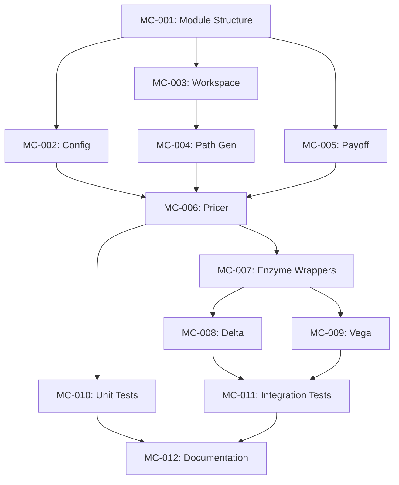

# Implementation Tasks: Monte Carlo Kernel - Enzyme Integration

## Task Overview

| Task ID | Title | Status | Priority | Estimated Complexity |
|---------|-------|--------|----------|---------------------|
| MC-001 | Create mc module structure | pending | P0 | Low |
| MC-002 | Implement MonteCarloConfig and builder | pending | P0 | Low |
| MC-003 | Implement PathWorkspace with buffer management | pending | P0 | Medium |
| MC-004 | Implement GBM path generation | pending | P0 | Medium |
| MC-005 | Implement PayoffKernel with smooth payoffs | pending | P0 | Medium |
| MC-006 | Implement MonteCarloPricer orchestration | pending | P0 | Medium |
| MC-007 | Extend enzyme module with forward gradient wrappers | pending | P1 | Medium |
| MC-008 | Implement Delta computation via AD | pending | P1 | Medium |
| MC-009 | Implement Vega computation via AD | pending | P1 | Medium |
| MC-010 | Add comprehensive unit tests | pending | P0 | Medium |
| MC-011 | Add integration tests (MC vs analytical) | pending | P1 | High |
| MC-012 | Update module exports and documentation | pending | P2 | Low |

---

## Task Details

### MC-001: Create mc module structure

**Status**: pending
**Priority**: P0
**Requirements**: FR-4.1, FR-4.2

#### Description
Create the `mc` module directory structure and update `lib.rs` exports.

#### Acceptance Criteria
- [ ] Create `src/mc/mod.rs` with module documentation
- [ ] Create `src/mc/config.rs` for configuration types
- [ ] Create `src/mc/workspace.rs` for buffer management
- [ ] Create `src/mc/paths.rs` for path generation
- [ ] Create `src/mc/payoff.rs` for payoff kernels
- [ ] Create `src/mc/pricer.rs` for pricer orchestration
- [ ] Create `src/mc/error.rs` for error types
- [ ] Update `src/lib.rs` to export mc module

#### Implementation Notes
- Follow existing module structure patterns from enzyme and rng modules
- Use British English in all documentation
- Module-level docs should reference Phase 3.2

---

### MC-002: Implement MonteCarloConfig and builder

**Status**: pending
**Priority**: P0
**Requirements**: FR-4.1

#### Description
Implement the configuration structure with validation and builder pattern.

#### Acceptance Criteria
- [ ] Implement `MonteCarloConfig` struct with fields: n_paths, n_steps, ad_mode, seed
- [ ] Implement `AdMode` enum: NoAd, Forward, Reverse
- [ ] Implement `MonteCarloConfigBuilder` with fluent API
- [ ] Implement validation: n_paths in [1, 10_000_000], n_steps in [1, 10_000]
- [ ] Implement `ConfigError` enum with Display trait
- [ ] Add unit tests for valid and invalid configurations

#### Test Cases
```rust
#[test]
fn test_config_builder_valid() {
    let config = MonteCarloConfig::builder()
        .n_paths(10_000)
        .n_steps(252)
        .build()
        .unwrap();
    assert_eq!(config.n_paths, 10_000);
}

#[test]
fn test_config_invalid_paths() {
    let result = MonteCarloConfig::builder()
        .n_paths(0)
        .build();
    assert!(matches!(result, Err(ConfigError::InvalidPathCount(0))));
}
```

---

### MC-003: Implement PathWorkspace with buffer management

**Status**: pending
**Priority**: P0
**Requirements**: FR-1.2, NFR-2.1, NFR-2.2

#### Description
Implement pre-allocated workspace buffers for allocation-free simulation.

#### Acceptance Criteria
- [ ] Implement `PathWorkspace` struct with randoms, paths, payoffs vectors
- [ ] Implement `new(n_paths, n_steps)` constructor
- [ ] Implement `ensure_capacity(n_paths, n_steps)` with growth strategy
- [ ] Implement `reset()` to clear state without deallocation
- [ ] Implement accessor methods: `randoms_mut()`, `paths()`, `paths_mut()`, `payoffs_mut()`
- [ ] Verify no allocations occur in accessor methods
- [ ] Add unit tests for capacity growth and reset

#### Implementation Notes
- Memory layout: row-major for cache efficiency
- Growth strategy: double capacity when exceeded
- Zero-initialise buffers to avoid UB

#### Test Cases
```rust
#[test]
fn test_workspace_capacity_growth() {
    let mut ws = PathWorkspace::new(100, 10);
    ws.ensure_capacity(200, 20);
    assert!(ws.randoms_mut().len() >= 200 * 20);
}

#[test]
fn test_workspace_reset_preserves_capacity() {
    let mut ws = PathWorkspace::new(100, 10);
    let cap_before = ws.capacity();
    ws.reset();
    assert_eq!(ws.capacity(), cap_before);
}
```

---

### MC-004: Implement GBM path generation

**Status**: pending
**Priority**: P0
**Requirements**: FR-1.1, FR-1.3

#### Description
Implement Geometric Brownian Motion path generation using Euler-Maruyama.

#### Acceptance Criteria
- [ ] Implement `GbmParams` struct: spot, rate, volatility, maturity
- [ ] Implement `generate_gbm_paths(workspace, params, n_paths, n_steps)`
- [ ] Use log-space formulation: `S(t+dt) = S(t) * exp(...)`
- [ ] Precompute drift_dt and vol_sqrt_dt outside loop
- [ ] No allocations within generation loop
- [ ] Add statistical validation tests (mean, variance)

#### Implementation Notes
- Activity Analysis:
  - `spot`: Dual (differentiable input)
  - `rate`, `volatility`: Dual (for Rho, Vega)
  - `randoms`: Const (frozen during AD)

#### Test Cases
```rust
#[test]
fn test_gbm_paths_statistical_properties() {
    // Large sample test: E[S(T)] ≈ S(0) * exp(r*T)
    let mut ws = PathWorkspace::new(100_000, 1);
    let params = GbmParams { spot: 100.0, rate: 0.05, volatility: 0.2, maturity: 1.0 };
    fill_randoms(&mut ws, seed);
    generate_gbm_paths(&mut ws, params, 100_000, 1);

    let mean = ws.paths().iter().skip(1).step_by(2).sum::<f64>() / 100_000.0;
    let expected = 100.0 * (0.05_f64).exp();
    assert_relative_eq!(mean, expected, epsilon = 0.5);
}
```

---

### MC-005: Implement PayoffKernel with smooth payoffs

**Status**: pending
**Priority**: P0
**Requirements**: FR-2.1, FR-2.2

#### Description
Implement smooth, differentiable payoff functions.

#### Acceptance Criteria
- [ ] Implement `PayoffType` enum: Call, Put
- [ ] Implement `PayoffParams` struct: strike, payoff_type, smoothing_epsilon
- [ ] Implement `soft_plus(x, epsilon)` with numerical stability
- [ ] Implement `european_call_smooth(terminal, strike, epsilon)`
- [ ] Implement `european_put_smooth(terminal, strike, epsilon)`
- [ ] Implement `compute_payoffs(workspace, params, n_paths, n_steps)`
- [ ] Implement `asian_arithmetic_call_smooth(path, strike, epsilon)`
- [ ] Verify put-call parity for smooth payoffs

#### Implementation Notes
- Soft-plus: `eps * ln(1 + exp(x/eps))`
- Use `log1p(exp(x))` for numerical stability when `x > 20`
- Smooth payoff gradient: sigmoid function

#### Test Cases
```rust
#[test]
fn test_european_call_smooth_itm() {
    let payoff = european_call_smooth(110.0, 100.0, 1e-4);
    assert_relative_eq!(payoff, 10.0, epsilon = 1e-3);
}

#[test]
fn test_put_call_parity_smooth() {
    let call = european_call_smooth(100.0, 100.0, 1e-4);
    let put = european_put_smooth(100.0, 100.0, 1e-4);
    assert_relative_eq!(call - put, 0.0, epsilon = 1e-3);
}
```

---

### MC-006: Implement MonteCarloPricer orchestration

**Status**: pending
**Priority**: P0
**Requirements**: FR-4.2, FR-4.3

#### Description
Implement the pricer that orchestrates path generation, payoff, and discounting.

#### Acceptance Criteria
- [ ] Implement `MonteCarloPricer` struct with config, workspace, rng
- [ ] Implement `new(config)` constructor
- [ ] Implement `with_seed(config, seed)` constructor
- [ ] Implement `price_european(gbm, payoff, discount_factor)` -> PricingResult
- [ ] Implement `price_with_greeks(gbm, payoff, df, greeks)` -> PricingResult
- [ ] Implement `reset()` for workspace reuse
- [ ] Implement `PricingResult` struct with price, std_error, optional Greeks
- [ ] Implement `Greek` enum: Delta, Gamma, Vega, Theta, Rho
- [ ] Calculate standard error: std_dev / sqrt(n_paths)

#### Test Cases
```rust
#[test]
fn test_pricer_reproducibility() {
    let config = MonteCarloConfig::builder().n_paths(1000).n_steps(10).build().unwrap();
    let gbm = GbmParams { spot: 100.0, rate: 0.05, volatility: 0.2, maturity: 1.0 };
    let payoff = PayoffParams::default();

    let mut pricer1 = MonteCarloPricer::with_seed(config.clone(), 42).unwrap();
    let mut pricer2 = MonteCarloPricer::with_seed(config, 42).unwrap();

    let result1 = pricer1.price_european(gbm, payoff, 0.95);
    let result2 = pricer2.price_european(gbm, payoff, 0.95);

    assert_eq!(result1.price, result2.price);
}
```

---

### MC-007: Extend enzyme module with forward gradient wrappers

**Status**: pending
**Priority**: P1
**Requirements**: FR-3.2

#### Description
Add safe wrappers for multi-argument gradient computation.

#### Acceptance Criteria
- [ ] Implement `gradient_forward_2<F>(f, x, y, dx)` for two-argument functions
- [ ] Implement `gradient_forward_slice<F>(f, x, dx, params)` for slice inputs
- [ ] Document activity annotations in doc comments
- [ ] Add unit tests for gradient computation

#### Implementation Notes
- Phase 3.2: Use finite difference as placeholder
- Activity documented for future Enzyme integration:
  - x: Dual (tangent propagated)
  - y/params: Const (not differentiated)

---

### MC-008: Implement Delta computation via AD

**Status**: pending
**Priority**: P1
**Requirements**: FR-3.3

#### Description
Implement Delta (dPrice/dSpot) using automatic differentiation.

#### Acceptance Criteria
- [ ] Implement `compute_delta(pricer, gbm, payoff, df)` function
- [ ] Use forward mode AD (or bump-and-revalue as placeholder)
- [ ] Bump size: `epsilon = max(0.01, 0.001 * spot)`
- [ ] Add comparison tests against analytical Black-Scholes Delta

#### Test Cases
```rust
#[test]
fn test_mc_delta_vs_bs_delta() {
    // Compare MC Delta to Black-Scholes Delta for European call
    let mc_delta = compute_delta(&mut pricer, gbm, payoff, df);
    let bs_delta = black_scholes_delta(spot, strike, rate, vol, maturity);
    assert_relative_eq!(mc_delta, bs_delta, epsilon = 0.02);
}
```

---

### MC-009: Implement Vega computation via AD

**Status**: pending
**Priority**: P1
**Requirements**: FR-3.3

#### Description
Implement Vega (dPrice/dVol) using automatic differentiation.

#### Acceptance Criteria
- [ ] Implement `compute_vega(pricer, gbm, payoff, df)` function
- [ ] Use reverse mode AD (or bump-and-revalue as placeholder)
- [ ] Bump size: 0.01 (1% volatility bump)
- [ ] Add comparison tests against analytical Black-Scholes Vega

---

### MC-010: Add comprehensive unit tests

**Status**: pending
**Priority**: P0
**Requirements**: NFR-3.1, NFR-3.2

#### Description
Add unit tests for all components.

#### Acceptance Criteria
- [ ] Config validation tests (valid and invalid inputs)
- [ ] Workspace allocation and reset tests
- [ ] Path generation statistical tests
- [ ] Payoff correctness tests
- [ ] Pricer end-to-end tests
- [ ] Reproducibility tests with seeds
- [ ] Edge case tests (zero vol, at-the-money)

#### Test Structure
```
src/mc/
├── config.rs     # inline tests
├── workspace.rs  # inline tests
├── paths.rs      # inline tests
├── payoff.rs     # inline tests
├── pricer.rs     # inline tests
└── tests.rs      # integration tests
```

---

### MC-011: Add integration tests (MC vs analytical)

**Status**: pending
**Priority**: P1
**Requirements**: NFR-3.2

#### Description
Add tests comparing Monte Carlo prices to analytical Black-Scholes.

#### Acceptance Criteria
- [ ] Create `tests/mc_integration.rs` file
- [ ] Test MC call price vs BS call price (100K paths, < 1% error)
- [ ] Test MC put price vs BS put price
- [ ] Test MC Delta vs BS Delta (< 2% relative error)
- [ ] Test MC Vega vs BS Vega
- [ ] Test convergence: error decreases with sqrt(n_paths)

#### Implementation Notes
- Black-Scholes formula implemented inline for testing
- Use high path count (100K+) for accurate comparison
- Document expected error bounds

---

### MC-012: Update module exports and documentation

**Status**: pending
**Priority**: P2
**Requirements**: Documentation

#### Acceptance Criteria
- [ ] Update `src/lib.rs` to export mc module publicly
- [ ] Add module-level documentation with usage examples
- [ ] Add crate-level documentation updates
- [ ] Ensure all public items have doc comments
- [ ] Run `cargo doc` and verify no warnings

---

## Dependency Graph



## Execution Order

1. **Foundation** (P0): MC-001 → MC-002 → MC-003 → MC-004 → MC-005 → MC-006
2. **AD Integration** (P1): MC-007 → MC-008 → MC-009
3. **Validation** (P0-P1): MC-010 → MC-011
4. **Finalisation** (P2): MC-012
