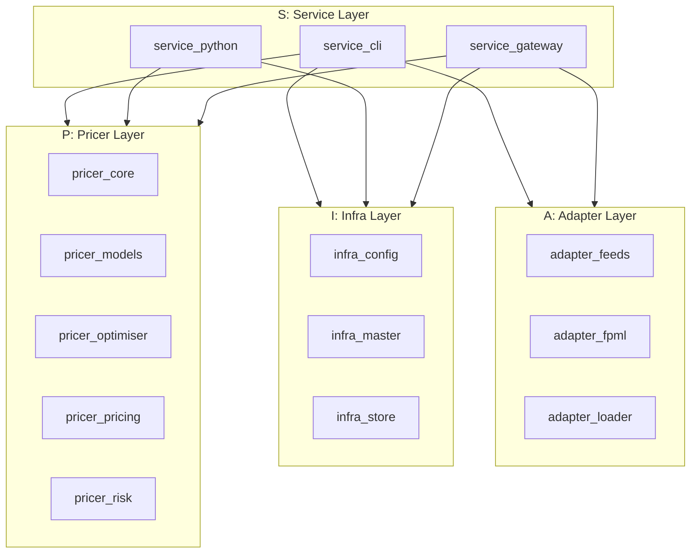
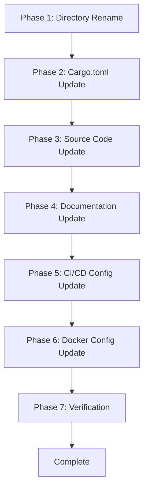

# Design Document: Service Layer Rename

## Overview

**Purpose**: Neutryx XVAプライシングライブラリのアーキテクチャ命名規則を改善し、マイクロサービス文脈により適した「Service」層への移行を実現する。

**Users**: 開発者、CI/CDシステム、ドキュメント利用者が新しいA-I-P-S構造を利用する。

**Impact**: 現行のA-I-P-R（Adapter-Infra-Pricer-Runtime）構造をA-I-P-S（Adapter-Infra-Pricer-Service）に変更。クレートディレクトリ、Cargo設定、ドキュメント、CI/CD設定の一括更新を行う。

### Goals

- Runtime層の3クレートをService層プレフィックスにリネーム
- `runtime_server`を`service_gateway`に変更しマイクロサービスゲートウェイとしての役割を明確化
- 全ドキュメントでA-I-P-S構造を反映
- バイナリ名・APIエンドポイントの後方互換性を維持

### Non-Goals

- バイナリ名（`neutryx`, `neutryx-server`）の変更
- Pythonモジュール名（`neutryx`）の変更
- 過去の仕様ドキュメント（`.kiro/specs/`内）の更新
- APIエンドポイントURLの変更

## Architecture

### Existing Architecture Analysis

現行のRuntime層（R）は以下の3クレートで構成されている：

| クレート | 役割 | バイナリ/ライブラリ名 |
|----------|------|----------------------|
| `runtime_cli` | CLIツール | `neutryx` |
| `runtime_python` | PyO3バインディング | `neutryx` (cdylib) |
| `runtime_server` | gRPC/REST API | `neutryx-server` |

依存関係ルール：R層はP/I/A全層に依存可能。

### Architecture Pattern & Boundary Map



**Architecture Integration**:
- Selected pattern: 命名規則変更（レイヤーリネーム）
- Domain/feature boundaries: A-I-P-S単方向依存フローを維持
- Existing patterns preserved: 依存関係ルール、バイナリ名、APIエンドポイント
- New components rationale: 既存コンポーネントのリネームのみ、新規追加なし
- Steering compliance: A-I-P-S依存関係ルールを継続遵守

### Technology Stack

| Layer | Choice / Version | Role in Feature | Notes |
|-------|------------------|-----------------|-------|
| Build System | Cargo Workspace | クレート名・パス変更 | `members`配列の更新 |
| VCS | Git | ディレクトリリネーム | `git mv`で履歴維持 |
| CI/CD | GitHub Actions | ワークフロー更新 | `runtime_*` → `service_*` |
| Documentation | Markdown | 全文置換 | A-I-P-R → A-I-P-S |

## Requirements Traceability

| Requirement | Summary | Components | Interfaces | Flows |
|-------------|---------|------------|------------|-------|
| 1.1-1.4 | クレートディレクトリのリネーム | DirectoryRename | Cargo Workspace | Rename Flow |
| 2.1-2.4 | Cargo.toml更新 | CargoConfig | Cargo CLI | Build Flow |
| 3.1-3.5 | ソースコードインポート更新 | SourceCode | Rust Compiler | Compile Flow |
| 4.1-4.8 | ドキュメント更新 | Documentation | N/A | N/A |
| 5.1-5.3 | CI/CD設定更新 | CIConfig | GitHub Actions | CI Flow |
| 6.1-6.4 | Docker設定更新 | DockerConfig | Docker CLI | Build Flow |
| 7.1-7.5 | 依存関係ルール維持 | Architecture | Cargo | Build Flow |
| 8.1-8.4 | 後方互換性 | Compatibility | CLI/API | User Flow |

## Components and Interfaces

| Component | Domain/Layer | Intent | Req Coverage | Key Dependencies | Contracts |
|-----------|--------------|--------|--------------|------------------|-----------|
| DirectoryRename | Build | クレートディレクトリのリネーム | 1.1-1.4 | Git (P0) | N/A |
| CargoConfig | Build | Cargo.toml設定更新 | 2.1-2.4 | Cargo (P0) | N/A |
| SourceCode | Code | インポート文更新 | 3.1-3.5 | rustc (P0) | N/A |
| Documentation | Docs | ドキュメント更新 | 4.1-4.8 | N/A | N/A |
| CIConfig | CI/CD | ワークフロー更新 | 5.1-5.3 | GitHub Actions (P0) | N/A |
| DockerConfig | Infra | Dockerfile更新 | 6.1-6.4 | Docker (P1) | N/A |

### Build Domain

#### DirectoryRename

| Field | Detail |
|-------|--------|
| Intent | `git mv`を使用してRuntime層クレートディレクトリをService層にリネーム |
| Requirements | 1.1, 1.2, 1.3, 1.4 |

**Responsibilities & Constraints**
- 3つのディレクトリを順次リネーム
- Git履歴を維持（`git mv`使用）
- アルファベット順序を維持

**Dependencies**
- External: Git — ディレクトリ移動 (P0)

**Implementation Notes**
- Integration: `git mv crates/runtime_cli crates/service_cli`
- Validation: `ls crates/service_*`で確認
- Risks: なし（ローカル操作）

#### CargoConfig

| Field | Detail |
|-------|--------|
| Intent | ワークスペースおよび各クレートのCargo.tomlを更新 |
| Requirements | 2.1, 2.2, 2.3, 2.4 |

**Responsibilities & Constraints**
- ワークスペースmembers配列の更新
- 各クレートの`[package].name`更新
- 内部依存パスは相対パスのため変更不要

**Dependencies**
- Inbound: DirectoryRename — ディレクトリ存在確認 (P0)
- External: Cargo — ビルド検証 (P0)

**Implementation Notes**
- Integration: `cargo build --workspace`で検証
- Validation: 全クレートがビルド成功すること
- Risks: パス解決エラー時は`cargo clean`後に再試行

### Code Domain

#### SourceCode

| Field | Detail |
|-------|--------|
| Intent | ソースコード内のインポート文を新クレート名に更新 |
| Requirements | 3.1, 3.2, 3.3, 3.4, 3.5 |

**Responsibilities & Constraints**
- `use runtime_*::`を`use service_*::`に置換
- 現時点でServiceクレートは他クレートから参照されていないため影響は限定的

**Dependencies**
- Inbound: CargoConfig — パッケージ名変更完了 (P0)
- External: rustc — コンパイル検証 (P0)

**Implementation Notes**
- Integration: `cargo test --workspace`で検証
- Validation: 全テストがパスすること
- Risks: 参照漏れ時はコンパイルエラーで検出可能

### Documentation Domain

#### Documentation

| Field | Detail |
|-------|--------|
| Intent | 全ドキュメントでA-I-P-S構造を反映 |
| Requirements | 4.1, 4.2, 4.3, 4.4, 4.5, 4.6, 4.7, 4.8 |

**Responsibilities & Constraints**
- Steering files: `product.md`, `structure.md`, `tech.md`
- Root docs: `README.md`, `CLAUDE.md`, `CONTRIBUTING.md`
- GitHub: `PULL_REQUEST_TEMPLATE.md`
- 履歴文書は更新対象外

**Dependencies**
- Inbound: SourceCode — 最終クレート名確定後 (P1)

**Implementation Notes**
- Integration: 手動レビューまたはgrep検証
- Validation: `grep -r "A-I-P-R"`, `grep -r "runtime_"`で残存確認
- Risks: 見落とし時は後続コミットで修正

## Data Models

本機能はデータモデル変更を伴わない。

## Error Handling

### Error Strategy

リネーム操作は原子的ではないため、途中失敗時は手動復旧が必要。

### Error Categories and Responses

**User Errors**: 該当なし（自動処理）

**System Errors**:
- ディスク容量不足 → 不要ファイル削除後に再試行
- Git操作失敗 → `git status`で状態確認、`git reset`で復旧

**Business Logic Errors**: 該当なし

### Monitoring

- CI/CDパイプラインでビルド成功を確認
- `cargo build --workspace`の終了コードを監視

## Testing Strategy

### Unit Tests

- 既存の全ユニットテストがパスすること（クレート名変更の影響なし）

### Integration Tests

- `cargo build --workspace`: 全クレートのビルド成功
- `cargo test --workspace`: 全テストパス
- `cargo clippy --workspace`: 警告なし

### E2E Tests

- `neutryx --help`: CLIが正常動作
- `neutryx-server`: サーバー起動確認

## Migration Strategy



### Phase Details

| Phase | 操作 | 検証方法 | ロールバック |
|-------|------|----------|-------------|
| 1 | `git mv`でディレクトリリネーム | `ls crates/service_*` | `git reset --hard HEAD` |
| 2 | Cargo.toml更新 | `cargo check --workspace` | ファイル復元 |
| 3 | ソースコード更新 | `cargo build --workspace` | ファイル復元 |
| 4 | ドキュメント更新 | `grep -r "runtime_"` | ファイル復元 |
| 5 | CI/CD設定更新 | GitHub Actions実行 | ファイル復元 |
| 6 | Docker設定更新 | `docker build` | ファイル復元 |
| 7 | 最終検証 | 全テスト実行 | N/A |

## Supporting References

### Rename Mapping Table

| 現行パス | 新パス | パッケージ名 |
|----------|--------|-------------|
| `crates/runtime_cli/` | `crates/service_cli/` | `service_cli` |
| `crates/runtime_python/` | `crates/service_python/` | `service_python` |
| `crates/runtime_server/` | `crates/service_gateway/` | `service_gateway` |

### Binary/Library Name Preservation

| クレート | バイナリ/ライブラリ名 | 変更 |
|----------|----------------------|------|
| `service_cli` | `neutryx` | 維持 |
| `service_python` | `neutryx` (cdylib) | 維持 |
| `service_gateway` | `neutryx-server` | 維持 |

### Dependency Rule Update

```text
変更前: A-I-P-R
A: Adapter   → adapter_feeds, adapter_fpml, adapter_loader
I: Infra     → infra_config, infra_master, infra_store
P: Pricer    → pricer_core, pricer_models, pricer_optimiser, pricer_pricing, pricer_risk
R: Runtime   → runtime_cli, runtime_python, runtime_server

変更後: A-I-P-S
A: Adapter   → adapter_feeds, adapter_fpml, adapter_loader
I: Infra     → infra_config, infra_master, infra_store
P: Pricer    → pricer_core, pricer_models, pricer_optimiser, pricer_pricing, pricer_risk
S: Service   → service_cli, service_gateway, service_python
```
