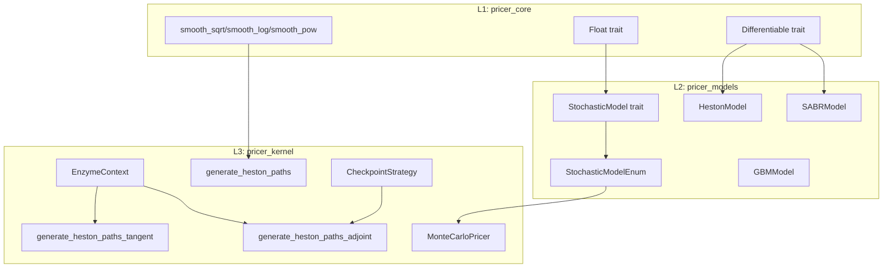
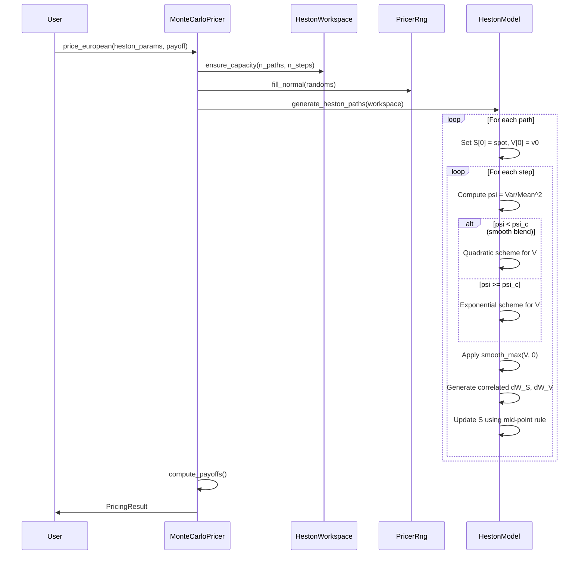
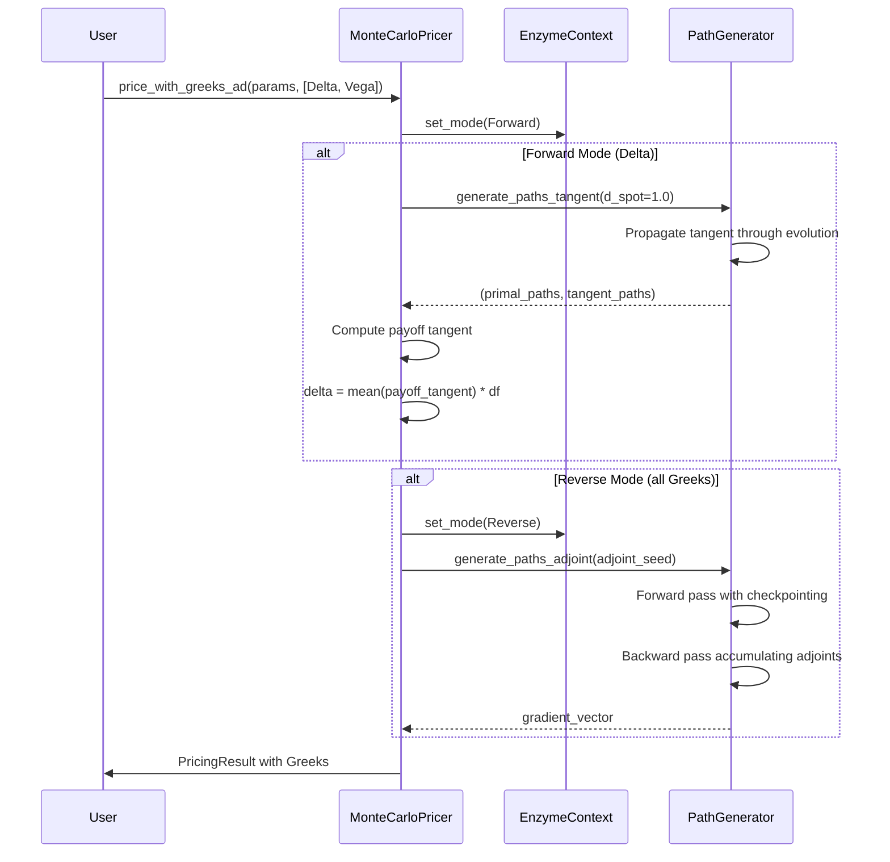
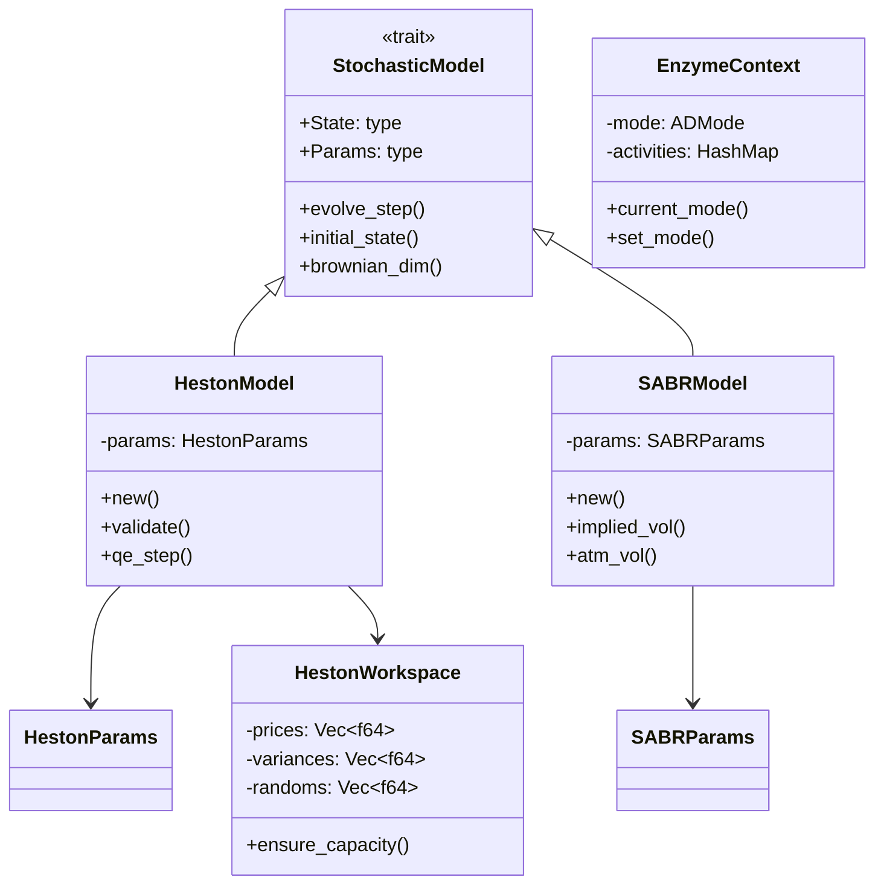

# 設計ドキュメント: 確率的ボラティリティモデル & Enzyme AD統合

## Overview

本機能は、Neutryx XVA価格計算ライブラリに確率的ボラティリティモデル（Heston、SABR）とEnzyme自動微分（AD）統合を実装する。

**Purpose**: クオンツ開発者とライブラリユーザーに対し、確率的ボラティリティを考慮したエキゾチックオプション価格計算とADベースのGreeks計算機能を提供する。

**Users**: クオンツ開発者はHeston/SABRモデルによるパス生成とインプライドボラティリティ計算を利用し、ライブラリユーザーはMonteCarloPricerを通じて統一APIでモデルを切り替える。

**Impact**: 既存のGBMパス生成（pricer_kernel/mc/paths.rs）を拡張し、新規StochasticModelトレイトを追加。Enzyme placeholderを完全なADコンテキスト管理に置き換える。

### Goals

- StochasticModelトレイトによる確率過程モデルの統一抽象化
- QE離散化スキームによるHestonモデルの高精度シミュレーション
- Hagan公式によるSABRインプライドボラティリティ計算
- EnzymeContextによるForward/Reverse ADモード管理
- Tangent/Adjointパス生成によるGreeks計算の効率化
- MonteCarloPricerへの新モデル統合

### Non-Goals

- 完全なEnzyme LLVM統合（Phase 4で実施）
- Local Volatilityモデルの実装
- GPU並列化（Phase 5以降）
- SABRモデルのモンテカルロシミュレーション（インプライドボラティリティ計算のみ）

## Architecture

### Existing Architecture Analysis

現行アーキテクチャは4層構造を採用:

- **L1 (pricer_core)**: Float trait、smooth approximations、Differentiableマーカートレイト
- **L2 (pricer_models)**: Instrument enum、models/mod.rs（placeholder）
- **L3 (pricer_kernel)**: GBMパス生成、Enzyme placeholder、MonteCarloPricer
- **L4 (pricer_xva)**: Portfolio analytics（本機能の範囲外）

**現行制約**:
- 静的ディスパッチ（enum-based）必須
- ジェネリックFloat型（num-dual互換性）
- Smooth approximations使用（Enzyme LLVM互換性）

### Architecture Pattern & Boundary Map



**Architecture Integration**:
- Selected pattern: Enum-based Static Dispatch with Generic Traits
- Domain boundaries: L2 defines models; L3 handles path generation and AD
- Existing patterns preserved: PathWorkspace, PricerRng, smooth_* functions
- New components rationale: StochasticModel unifies model interface; EnzymeContext centralizes AD state
- Steering compliance: Static dispatch, smooth approximations, 4-layer isolation maintained

### Technology Stack

| Layer | Choice / Version | Role in Feature | Notes |
|-------|------------------|-----------------|-------|
| L1 Foundation | num-traits 0.2 | Float trait for generic numerics | Existing dependency |
| L1 Foundation | num-dual (optional) | Dual numbers for verification | Existing dependency |
| L2 Business | pricer_models | StochasticModel trait, Heston/SABR | New trait and models |
| L3 AD Engine | Enzyme LLVM 18 | Forward/Reverse mode AD | Phase 4 full integration |
| L3 AD Engine | Rust nightly-2025-01-15 | #[autodiff_*] macros | Required for Enzyme |
| L3 Runtime | thread_local! | EnzymeContext storage | Standard library |

## System Flows

### Heston Path Generation Flow



**Key Decisions**:
- Smooth blend between quadratic/exponential using smooth_indicator
- Mid-point rule for asset price discretization
- Correlated Brownian motion via Cholesky decomposition

### AD Greeks Computation Flow



## Requirements Traceability

| Requirement | Summary | Components | Interfaces | Flows |
|-------------|---------|------------|------------|-------|
| 1.1-1.6 | StochasticModel trait abstraction | StochasticModel, StochasticModelEnum | evolve_step(), initial_state() | Path Generation |
| 2.1-2.7 | Heston QE discretization | HestonModel, HestonParams | new(), validate() | Heston Path Flow |
| 3.1-3.7 | SABR Hagan formula | SABRModel, SABRParams | implied_vol() | IV Calculation |
| 4.1-4.7 | EnzymeContext AD management | EnzymeContext, ADMode, Activity | set_mode(), current_mode() | AD Greeks Flow |
| 5.1-5.6 | Tangent path generation | generate_heston_paths_tangent | tangent seeds | Forward AD Flow |
| 6.1-6.6 | Adjoint path generation | generate_heston_paths_adjoint, CheckpointStrategy | adjoint seed | Reverse AD Flow |
| 7.1-7.6 | MonteCarloPricer integration | MonteCarloPricer | price_with_greeks_ad() | Pricing Flow |
| 8.1-8.6 | Smooth approximation extension | smooth_sqrt, smooth_log, smooth_pow | - | Used by models |
| 9.1-9.6 | Dual mode verification | verify module | verify_gradient() | Testing |
| 10.1-10.6 | Error handling | HestonError, SABRError | validate(), Result types | All flows |

## Components and Interfaces

### Summary Table

| Component | Domain/Layer | Intent | Req Coverage | Key Dependencies | Contracts |
|-----------|--------------|--------|--------------|------------------|-----------|
| StochasticModel | L2/pricer_models | 確率過程モデルの統一インターフェース | 1.1-1.6 | Float (P0) | Service |
| HestonModel | L2/pricer_models | QE離散化によるHestonシミュレーション | 2.1-2.7 | StochasticModel (P0), smooth_max (P0) | Service |
| SABRModel | L2/pricer_models | Haganインプライドボラティリティ計算 | 3.1-3.7 | smooth_log (P0), smooth_pow (P0) | Service |
| EnzymeContext | L3/pricer_kernel | ADモード管理 | 4.1-4.7 | thread_local (P0) | State |
| TangentPathGenerator | L3/pricer_kernel | Forward mode AD | 5.1-5.6 | EnzymeContext (P0), HestonModel (P0) | Service |
| AdjointPathGenerator | L3/pricer_kernel | Reverse mode AD | 6.1-6.6 | EnzymeContext (P0), CheckpointStrategy (P1) | Service |
| MonteCarloPricer (extension) | L3/pricer_kernel | モデル統合とGreeks計算 | 7.1-7.6 | StochasticModelEnum (P0) | Service |
| smooth_sqrt/log/pow | L1/pricer_core | 追加smooth関数 | 8.1-8.6 | Float (P0) | Service |

### L2: pricer_models

#### StochasticModel Trait

| Field | Detail |
|-------|--------|
| Intent | 確率過程モデルの統一インターフェース定義 |
| Requirements | 1.1, 1.2, 1.3, 1.4, 1.5, 1.6 |

**Responsibilities & Constraints**
- 1タイムステップの状態遷移（evolve_step）を定義
- 初期状態生成（initial_state）を定義
- ジェネリックFloat型による型安全性保証
- 静的ディスパッチのみ（Box<dyn>禁止）

**Dependencies**
- Inbound: HestonModel, SABRModel, GBMModel - trait implementation (P0)
- Outbound: Float trait - numeric operations (P0)
- External: num-traits - Float bound (P0)

**Contracts**: Service [x]

##### Service Interface

```rust
/// 確率過程モデルの統一インターフェース
///
/// # Type Safety
/// - T: Float bound ensures numeric operations available
/// - State type is model-specific (e.g., f64 for GBM, (f64, f64) for Heston)
pub trait StochasticModel<T: Float>: Differentiable {
    /// モデル固有の状態型（GBM: T, Heston: (T, T)）
    type State: Clone + Copy;

    /// モデルパラメータ型
    type Params: Clone;

    /// 1タイムステップの状態遷移
    ///
    /// # Arguments
    /// * `state` - 現在の状態
    /// * `dt` - タイムステップ
    /// * `dw` - ブラウン運動増分（モデルにより1次元または2次元）
    /// * `params` - モデルパラメータ
    ///
    /// # Returns
    /// 次の時点の状態
    fn evolve_step(
        state: Self::State,
        dt: T,
        dw: &[T],
        params: &Self::Params,
    ) -> Self::State;

    /// 初期状態を返す
    fn initial_state(params: &Self::Params) -> Self::State;

    /// 必要なブラウン運動の次元数
    fn brownian_dim() -> usize;
}
```

- Preconditions: dt > 0, dw.len() == brownian_dim()
- Postconditions: State is finite (no NaN/Inf)
- Invariants: State type is consistent across calls

#### StochasticModelEnum

| Field | Detail |
|-------|--------|
| Intent | 静的ディスパッチによるモデル切り替え |
| Requirements | 1.6, 7.1, 7.2 |

**Responsibilities & Constraints**
- 全モデルをenumバリアントとしてラップ
- match式によるゼロコスト抽象化
- 新モデル追加時はバリアント追加が必要

**Contracts**: Service [x]

##### Service Interface

```rust
/// 確率過程モデルの静的ディスパッチ用enum
#[derive(Clone, Debug)]
pub enum StochasticModelEnum<T: Float> {
    /// Geometric Brownian Motion
    GBM(GBMModel<T>),
    /// Heston stochastic volatility model
    Heston(HestonModel<T>),
    /// SABR volatility model (IV calculation only)
    SABR(SABRModel<T>),
}

impl<T: Float> StochasticModelEnum<T> {
    /// モデル名を返す
    fn model_name(&self) -> &'static str;

    /// ブラウン運動の次元数を返す
    fn brownian_dim(&self) -> usize;

    /// 2次元状態を持つモデルか判定
    fn is_two_factor(&self) -> bool;
}
```

#### HestonModel

| Field | Detail |
|-------|--------|
| Intent | QE離散化スキームによるHestonモデル実装 |
| Requirements | 2.1, 2.2, 2.3, 2.4, 2.5, 2.6, 2.7 |

**Responsibilities & Constraints**
- QE (Quadratic Exponential) 離散化スキーム実装
- 分散の非負性をsmooth_maxで保証
- 相関ブラウン運動生成
- Feller条件チェックと警告

**Dependencies**
- Inbound: MonteCarloPricer - path generation (P0)
- Outbound: smooth_max, smooth_indicator - variance positivity (P0)
- Outbound: StochasticModel trait - interface implementation (P0)

**Contracts**: Service [x]

##### Service Interface

```rust
/// Hestonモデルパラメータ
#[derive(Clone, Copy, Debug, PartialEq)]
pub struct HestonParams<T: Float> {
    /// スポット価格 (S0)
    pub spot: T,
    /// 初期分散 (v0)
    pub v0: T,
    /// 長期分散 (theta)
    pub theta: T,
    /// 平均回帰速度 (kappa)
    pub kappa: T,
    /// ボラティリティのボラティリティ (xi/sigma)
    pub xi: T,
    /// 相関係数 (rho)
    pub rho: T,
    /// リスクフリーレート
    pub rate: T,
    /// 満期までの時間
    pub maturity: T,
    /// QE切り替え閾値 (psi_c, default: 1.5)
    pub psi_c: T,
    /// smooth approximation epsilon
    pub smoothing_epsilon: T,
}

/// Hestonモデル
#[derive(Clone, Debug)]
pub struct HestonModel<T: Float> {
    params: HestonParams<T>,
}

impl<T: Float> HestonModel<T> {
    /// 新しいHestonモデルを作成
    pub fn new(params: HestonParams<T>) -> Result<Self, HestonError>;

    /// パラメータを検証
    pub fn validate(&self) -> Result<(), HestonError>;

    /// Feller条件をチェック (2*kappa*theta > xi^2)
    pub fn check_feller_condition(&self) -> bool;

    /// QE離散化による1ステップ遷移
    fn qe_step(
        state: (T, T),  // (S, V)
        dt: T,
        dw: &[T; 2],    // (dW_S, dW_V) correlated
    ) -> (T, T);
}

impl<T: Float> Differentiable for HestonModel<T> {}

impl<T: Float> StochasticModel<T> for HestonModel<T> {
    type State = (T, T);  // (price, variance)
    type Params = HestonParams<T>;

    fn evolve_step(state: Self::State, dt: T, dw: &[T], params: &Self::Params) -> Self::State;
    fn initial_state(params: &Self::Params) -> Self::State;
    fn brownian_dim() -> usize { 2 }
}
```

- Preconditions: params.validate() is Ok, v0 > 0, spot > 0
- Postconditions: variance >= 0 (via smooth_max), price > 0
- Invariants: |rho| <= 1, kappa > 0, theta > 0, xi > 0

**Implementation Notes**
- Integration: Cholesky decomposition for correlated Brownian: dW_S = dZ1, dW_V = rho * dZ1 + sqrt(1-rho^2) * dZ2
- Validation: Log warning if Feller condition violated; apply variance floor
- Risks: Numerical instability when xi is large relative to kappa*theta

#### SABRModel

| Field | Detail |
|-------|--------|
| Intent | Haganインプライドボラティリティ公式実装 |
| Requirements | 3.1, 3.2, 3.3, 3.4, 3.5, 3.6, 3.7 |

**Responsibilities & Constraints**
- Hagan近似公式によるIV計算
- ATM近傍での展開公式使用
- beta=0 (Normal), beta=1 (Lognormal) 特殊ケース処理
- smooth_abs/smooth_log使用によるAD互換性

**Dependencies**
- Inbound: VolatilitySurface implementations - IV lookup (P1)
- Outbound: smooth_log, smooth_pow, smooth_abs - singularity handling (P0)

**Contracts**: Service [x]

##### Service Interface

```rust
/// SABRモデルパラメータ
#[derive(Clone, Copy, Debug, PartialEq)]
pub struct SABRParams<T: Float> {
    /// フォワード価格 (F)
    pub forward: T,
    /// 初期ボラティリティ (alpha)
    pub alpha: T,
    /// ボラティリティのボラティリティ (nu)
    pub nu: T,
    /// 相関係数 (rho)
    pub rho: T,
    /// ベータ (0: Normal, 1: Lognormal, 0 < beta < 1: mixed)
    pub beta: T,
    /// 満期までの時間
    pub maturity: T,
    /// ATM近傍判定閾値
    pub atm_threshold: T,
    /// smooth approximation epsilon
    pub smoothing_epsilon: T,
}

/// SABRモデル（インプライドボラティリティ計算用）
#[derive(Clone, Debug)]
pub struct SABRModel<T: Float> {
    params: SABRParams<T>,
}

impl<T: Float> SABRModel<T> {
    /// 新しいSABRモデルを作成
    pub fn new(params: SABRParams<T>) -> Result<Self, SABRError>;

    /// パラメータを検証
    pub fn validate(&self) -> Result<(), SABRError>;

    /// Hagan公式によるインプライドボラティリティ計算
    ///
    /// # Arguments
    /// * `strike` - ストライク価格
    ///
    /// # Returns
    /// インプライドボラティリティ (Black-Scholes volatility)
    pub fn implied_vol(&self, strike: T) -> Result<T, SABRError>;

    /// ATMインプライドボラティリティ
    pub fn atm_vol(&self) -> T;

    /// ATM近傍の展開公式を使用
    fn implied_vol_atm_expansion(&self, strike: T) -> T;

    /// 一般的なHagan公式
    fn implied_vol_hagan(&self, strike: T) -> T;
}

impl<T: Float> Differentiable for SABRModel<T> {}
```

- Preconditions: alpha > 0, 0 <= beta <= 1, |rho| < 1, nu >= 0, maturity > 0
- Postconditions: implied_vol > 0
- Invariants: IV is smooth function of strike (via smooth_log)

**Implementation Notes**
- Validation: Check for arbitrage (negative density) at extreme strikes
- Risks: Hagan formula can produce negative vol for small strikes; add floor

### L3: pricer_kernel

#### EnzymeContext

| Field | Detail |
|-------|--------|
| Intent | ADモード管理とActivity annotation設定 |
| Requirements | 4.1, 4.2, 4.3, 4.4, 4.5, 4.6, 4.7 |

**Responsibilities & Constraints**
- Forward/Reverse/Inactiveモードの状態管理
- Activity annotation（Const, Dual, Active, Duplicated）の管理
- スレッドローカルストレージによるスレッドセーフ保証
- Phase 3: 有限差分フォールバック提供

**Dependencies**
- Inbound: TangentPathGenerator, AdjointPathGenerator - mode query (P0)
- External: thread_local! macro - TLS storage (P0)

**Contracts**: State [x]

##### State Management

```rust
/// ADモード
#[derive(Clone, Copy, Debug, PartialEq, Eq, Hash)]
pub enum ADMode {
    /// 微分無効
    Inactive,
    /// Forward mode (tangent propagation)
    Forward,
    /// Reverse mode (adjoint backpropagation)
    Reverse,
}

/// Activity annotation
#[derive(Clone, Copy, Debug, PartialEq, Eq, Hash)]
pub enum Activity {
    /// 定数（微分対象外）
    Const,
    /// Forward mode入力
    Dual,
    /// Reverse mode出力
    Active,
    /// Reverse mode入出力（shadow buffer）
    Duplicated,
    /// Shadow only
    DuplicatedOnly,
}

/// Enzyme ADコンテキスト
#[derive(Clone, Debug)]
pub struct EnzymeContext {
    mode: ADMode,
    activities: HashMap<String, Activity>,
}

impl EnzymeContext {
    /// 新しいコンテキストを作成（Inactive mode）
    pub fn new() -> Self;

    /// 現在のモードを取得
    pub fn current_mode(&self) -> ADMode;

    /// モードを設定
    pub fn set_mode(&mut self, mode: ADMode);

    /// パラメータのActivityを設定
    pub fn set_activity(&mut self, param: &str, activity: Activity);

    /// パラメータのActivityを取得
    pub fn get_activity(&self, param: &str) -> Activity;

    /// Forward modeか判定
    pub fn is_forward(&self) -> bool;

    /// Reverse modeか判定
    pub fn is_reverse(&self) -> bool;
}

// スレッドローカルコンテキスト
thread_local! {
    static ENZYME_CONTEXT: RefCell<EnzymeContext> = RefCell::new(EnzymeContext::new());
}

/// 現在のスレッドのコンテキストにアクセス
pub fn with_enzyme_context<F, R>(f: F) -> R
where
    F: FnOnce(&EnzymeContext) -> R;

/// 現在のスレッドのコンテキストを変更
pub fn with_enzyme_context_mut<F, R>(f: F) -> R
where
    F: FnOnce(&mut EnzymeContext) -> R;
```

- State model: Per-thread EnzymeContext with mode and activities
- Persistence: In-memory only (transient)
- Concurrency: Thread-local storage, no cross-thread sharing

#### TangentPathGenerator (generate_heston_paths_tangent)

| Field | Detail |
|-------|--------|
| Intent | Forward mode ADによるtangentパス生成 |
| Requirements | 5.1, 5.2, 5.3, 5.4, 5.5, 5.6 |

**Responsibilities & Constraints**
- Primal pathとtangent pathの同時生成
- 各パラメータに対するtangent seed入力
- 相関ブラウン運動のtangent伝播
- メモリ効率の最大化

**Dependencies**
- Inbound: MonteCarloPricer - Greeks computation (P0)
- Outbound: HestonModel - path evolution (P0)
- Outbound: EnzymeContext - mode verification (P0)

**Contracts**: Service [x]

##### Service Interface

```rust
/// Hestonモデルのtangentパス生成（Forward mode AD）
///
/// # Arguments
/// * `workspace` - Heston用ワークスペース
/// * `params` - Hestonパラメータ
/// * `tangent_seeds` - パラメータ毎のtangent seed
/// * `n_paths` - パス数
/// * `n_steps` - ステップ数
///
/// # Returns
/// (primal_paths, tangent_paths) - 各要素は(price, variance)の2次元配列
pub fn generate_heston_paths_tangent(
    workspace: &mut HestonWorkspace,
    params: HestonParams<f64>,
    tangent_seeds: &HestonTangentSeeds,
    n_paths: usize,
    n_steps: usize,
) -> HestonTangentResult;

/// Tangent seeds for Heston parameters
#[derive(Clone, Copy, Debug, Default)]
pub struct HestonTangentSeeds {
    pub d_spot: f64,
    pub d_v0: f64,
    pub d_kappa: f64,
    pub d_theta: f64,
    pub d_xi: f64,
    pub d_rho: f64,
    pub d_rate: f64,
}

/// Tangent path generation result
pub struct HestonTangentResult {
    /// Tangent prices: [path_idx * (n_steps+1) + step_idx]
    pub tangent_prices: Vec<f64>,
    /// Tangent variances: [path_idx * (n_steps+1) + step_idx]
    pub tangent_variances: Vec<f64>,
}
```

- Preconditions: workspace.capacity >= n_paths * (n_steps+1), EnzymeContext.mode == Forward
- Postconditions: tangent paths have same shape as primal paths
- Invariants: tangent[0] = tangent_seed for corresponding parameter

#### AdjointPathGenerator (generate_heston_paths_adjoint)

| Field | Detail |
|-------|--------|
| Intent | Reverse mode ADによるadjointパス生成 |
| Requirements | 6.1, 6.2, 6.3, 6.4, 6.5, 6.6 |

**Responsibilities & Constraints**
- 終端payoffからの感度逆伝播
- チェックポインティングによるメモリ制御
- 全パラメータ感度の一括計算
- メモリ不足時の再計算フォールバック

**Dependencies**
- Inbound: MonteCarloPricer - multi-Greeks computation (P0)
- Outbound: HestonModel - path evolution (P0)
- Outbound: CheckpointStrategy - memory management (P1)
- Outbound: EnzymeContext - mode verification (P0)

**Contracts**: Service [x]

##### Service Interface

```rust
/// Hestonモデルのadjointパス生成（Reverse mode AD）
///
/// # Arguments
/// * `workspace` - Heston用ワークスペース
/// * `params` - Hestonパラメータ
/// * `adjoint_seed` - 終端からのadjoint seed（通常は1.0）
/// * `checkpoint_strategy` - チェックポイント戦略
/// * `n_paths` - パス数
/// * `n_steps` - ステップ数
///
/// # Returns
/// 各パラメータに対するadjoint（勾配）
pub fn generate_heston_paths_adjoint(
    workspace: &mut HestonWorkspace,
    params: HestonParams<f64>,
    adjoint_seed: f64,
    checkpoint_strategy: &CheckpointStrategy,
    n_paths: usize,
    n_steps: usize,
) -> HestonAdjointResult;

/// Adjoint computation result
#[derive(Clone, Debug, Default)]
pub struct HestonAdjointResult {
    pub adj_spot: f64,
    pub adj_v0: f64,
    pub adj_kappa: f64,
    pub adj_theta: f64,
    pub adj_xi: f64,
    pub adj_rho: f64,
    pub adj_rate: f64,
}

/// Checkpoint strategy for memory management
#[derive(Clone, Debug)]
pub enum CheckpointStrategy {
    /// Store all intermediate states (high memory, fast)
    StoreAll,
    /// Recompute from checkpoints (low memory, slower)
    Recompute { interval: usize },
    /// Binomial checkpointing (optimal trade-off)
    Binomial { checkpoints: usize },
}

impl CheckpointStrategy {
    /// Estimate memory usage in bytes
    pub fn estimate_memory(&self, n_paths: usize, n_steps: usize) -> usize;

    /// Auto-select strategy based on available memory
    pub fn auto(n_paths: usize, n_steps: usize, max_memory_mb: usize) -> Self;
}
```

- Preconditions: EnzymeContext.mode == Reverse, checkpoint memory available
- Postconditions: All adjoints are finite
- Invariants: sum of adjoints weighted by tangent seeds = total derivative

#### MonteCarloPricer Extension

| Field | Detail |
|-------|--------|
| Intent | StochasticModel統合とADベースGreeks計算 |
| Requirements | 7.1, 7.2, 7.3, 7.4, 7.5, 7.6 |

**Responsibilities & Constraints**
- StochasticModelEnumによる任意モデルサポート
- モデル固有設定（QEパラメータ等）受け取り
- price_with_greeks_ad メソッド提供
- 一貫したPricingResult返却

**Dependencies**
- Outbound: StochasticModelEnum - model dispatch (P0)
- Outbound: TangentPathGenerator, AdjointPathGenerator - AD computation (P0)
- Outbound: EnzymeContext - mode management (P0)

**Contracts**: Service [x]

##### Service Interface

```rust
/// Extended pricing result with AD Greeks
#[derive(Clone, Debug, Default)]
pub struct PricingResultAD {
    /// Base pricing result
    pub base: PricingResult,
    /// Heston-specific Greeks (if applicable)
    pub heston_greeks: Option<HestonGreeks>,
}

/// Heston-specific Greeks
#[derive(Clone, Debug, Default)]
pub struct HestonGreeks {
    /// Sensitivity to initial variance
    pub vega_v0: f64,
    /// Sensitivity to long-term variance
    pub vega_theta: f64,
    /// Sensitivity to mean reversion
    pub kappa_sensitivity: f64,
    /// Sensitivity to vol-of-vol
    pub xi_sensitivity: f64,
    /// Sensitivity to correlation
    pub rho_sensitivity: f64,
}

impl MonteCarloPricer {
    /// Price with AD-computed Greeks
    ///
    /// # Arguments
    /// * `model` - Stochastic model (GBM, Heston, etc.)
    /// * `payoff` - Payoff parameters
    /// * `discount_factor` - PV discount factor
    /// * `greeks` - Greeks to compute
    /// * `ad_mode` - AD mode (Forward for single Greek, Reverse for all)
    ///
    /// # Returns
    /// Pricing result with requested Greeks
    pub fn price_with_greeks_ad(
        &mut self,
        model: &StochasticModelEnum<f64>,
        payoff: PayoffParams,
        discount_factor: f64,
        greeks: &[Greek],
        ad_mode: ADMode,
    ) -> PricingResultAD;

    /// Price European with Heston model
    pub fn price_european_heston(
        &mut self,
        params: HestonParams<f64>,
        payoff: PayoffParams,
        discount_factor: f64,
    ) -> PricingResult;
}
```

### L1: pricer_core (Smooth Approximation Extension)

#### smooth_sqrt, smooth_log, smooth_pow

| Field | Detail |
|-------|--------|
| Intent | 追加smooth approximation関数 |
| Requirements | 8.1, 8.2, 8.3, 8.4, 8.5, 8.6 |

**Contracts**: Service [x]

##### Service Interface

```rust
/// 滑らかな平方根関数
///
/// sqrt(x) at x >= epsilon, smooth transition near zero
///
/// # Mathematical Definition
/// smooth_sqrt(x, ε) = sqrt(x + ε²) - ε
///
/// # Convergence
/// As ε → 0, smooth_sqrt(x, ε) → sqrt(x) for x > 0
pub fn smooth_sqrt<T: Float>(x: T, epsilon: T) -> T;

/// 滑らかな対数関数
///
/// log(x) with smooth handling near zero
///
/// # Mathematical Definition
/// smooth_log(x, ε) = log(x + ε) - log(ε)  (shifted log)
/// Alternative: smooth_log(x, ε) = log(smooth_max(x, ε, ε/10))
pub fn smooth_log<T: Float>(x: T, epsilon: T) -> T;

/// 滑らかなべき乗関数
///
/// x^p with smooth handling for non-integer p and x near zero
///
/// # Implementation
/// smooth_pow(x, p, ε) = exp(p * smooth_log(smooth_abs(x) + ε, ε))
pub fn smooth_pow<T: Float>(x: T, p: T, epsilon: T) -> T;
```

## Data Models

### Domain Model



**Aggregates and Boundaries**:
- HestonModel aggregate: HestonParams is value object owned by model
- SABRModel aggregate: SABRParams is value object owned by model
- EnzymeContext: Thread-local singleton per thread

**Business Rules**:
- Feller condition check: 2 * kappa * theta > xi^2
- Variance non-negativity: V >= 0 enforced by smooth_max
- Correlation bounds: |rho| <= 1 for both Heston and SABR
- SABR beta bounds: 0 <= beta <= 1

## Error Handling

### Error Strategy

エラーは構造化されたResult型で返し、thiserrorクレートを使用して定義する。

### Error Categories and Responses

```rust
/// Hestonモデルエラー
#[derive(Debug, thiserror::Error)]
pub enum HestonError {
    #[error("Invalid spot price: {0} (must be positive)")]
    InvalidSpot(f64),

    #[error("Invalid initial variance: {0} (must be positive)")]
    InvalidV0(f64),

    #[error("Invalid correlation: {0} (must be in [-1, 1])")]
    InvalidRho(f64),

    #[error("Invalid mean reversion: {0} (must be positive)")]
    InvalidKappa(f64),

    #[error("Invalid long-term variance: {0} (must be positive)")]
    InvalidTheta(f64),

    #[error("Invalid vol-of-vol: {0} (must be positive)")]
    InvalidXi(f64),

    #[error("Numerical instability: {0}")]
    NumericalInstability(String),

    #[error("NaN or Infinity detected in {0}")]
    NonFinite(String),
}

/// SABRモデルエラー
#[derive(Debug, thiserror::Error)]
pub enum SABRError {
    #[error("Invalid alpha: {0} (must be positive)")]
    InvalidAlpha(f64),

    #[error("Invalid beta: {0} (must be in [0, 1])")]
    InvalidBeta(f64),

    #[error("Invalid correlation: {0} (must be in (-1, 1))")]
    InvalidRho(f64),

    #[error("Invalid strike: {0} (must be positive)")]
    InvalidStrike(f64),

    #[error("Negative implied volatility computed for strike {0}")]
    NegativeImpliedVol(f64),

    #[error("Numerical instability: {0}")]
    NumericalInstability(String),
}

/// ADコンテキストエラー
#[derive(Debug, thiserror::Error)]
pub enum ADError {
    #[error("AD mode mismatch: expected {expected:?}, got {actual:?}")]
    ModeMismatch { expected: ADMode, actual: ADMode },

    #[error("Checkpoint memory exceeded: required {required} MB, available {available} MB")]
    CheckpointMemoryExceeded { required: usize, available: usize },

    #[error("Gradient verification failed: relative error {error} exceeds threshold {threshold}")]
    GradientVerificationFailed { error: f64, threshold: f64 },
}
```

### Monitoring

- Log warning on Feller condition violation
- Log warning on SABRimplied vol near arbitrage boundary
- Metrics: gradient computation time, checkpoint memory usage

## Testing Strategy

### Unit Tests

- StochasticModel trait implementation tests (GBM, Heston, SABR)
- QE discretization scheme accuracy tests (vs analytical moments)
- SABR Hagan formula tests (vs known values from literature)
- smooth_sqrt/log/pow convergence tests
- EnzymeContext mode switching tests

### Integration Tests

- Heston path generation statistical tests (mean, variance)
- MonteCarloPricer with Heston model end-to-end
- Tangent path vs bump-and-revalue comparison
- Adjoint path vs num-dual gradient comparison

### Verification Tests (Requirement 9)

- num-dual DualNumber reference gradient computation
- Enzyme (or finite difference) vs num-dual gradient comparison
- Relative error threshold: 1e-4
- Parameter sets: ATM, ITM, OTM; various maturities

### Performance Tests

- Path generation throughput (paths/second)
- AD overhead measurement (tangent vs primal only)
- Checkpoint strategy memory/time trade-off

## Supporting References

### QE Discretization Algorithm Constants

```rust
// Andersen (2008) recommended values
const PSI_C: f64 = 1.5;  // Switching threshold
const GAMMA1: f64 = 0.5;  // Mid-point averaging
const GAMMA2: f64 = 0.5;  // Mid-point averaging

// Moment matching for quadratic scheme
// When psi < psi_c:
// a = m / (1 + b^2)
// b^2 = 2/psi - 1 + sqrt(2/psi * (2/psi - 1))  when psi <= 1
// b^2 = 2 * (1/psi - 1 + sqrt(1/psi) * sqrt(1/psi - 1))  when 1 < psi < psi_c

// Moment matching for exponential scheme
// When psi >= psi_c:
// p = (psi - 1) / (psi + 1)
// beta = (1 - p) / m
```

### SABR Hagan Formula Coefficients

```rust
// Higher order terms in Hagan formula
// sigma_B = alpha / (F*K)^((1-beta)/2) * z/x(z) * (1 + T * expansion)
//
// expansion = term1 + term2 + term3
// term1 = (1 - beta)^2 / 24 * alpha^2 / (F*K)^(1-beta)
// term2 = 0.25 * rho * beta * nu * alpha / (F*K)^((1-beta)/2)
// term3 = (2 - 3*rho^2) / 24 * nu^2
//
// z = nu / alpha * (F*K)^((1-beta)/2) * log(F/K)
// x(z) = log((sqrt(1 - 2*rho*z + z^2) + z - rho) / (1 - rho))
```
